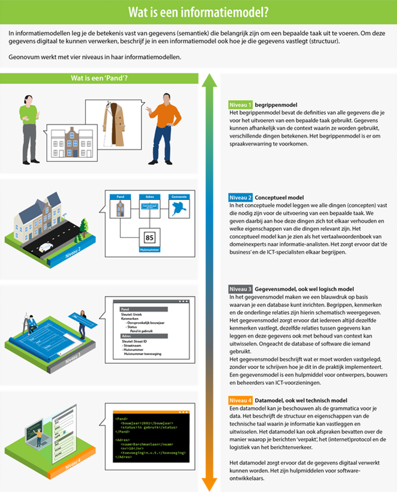
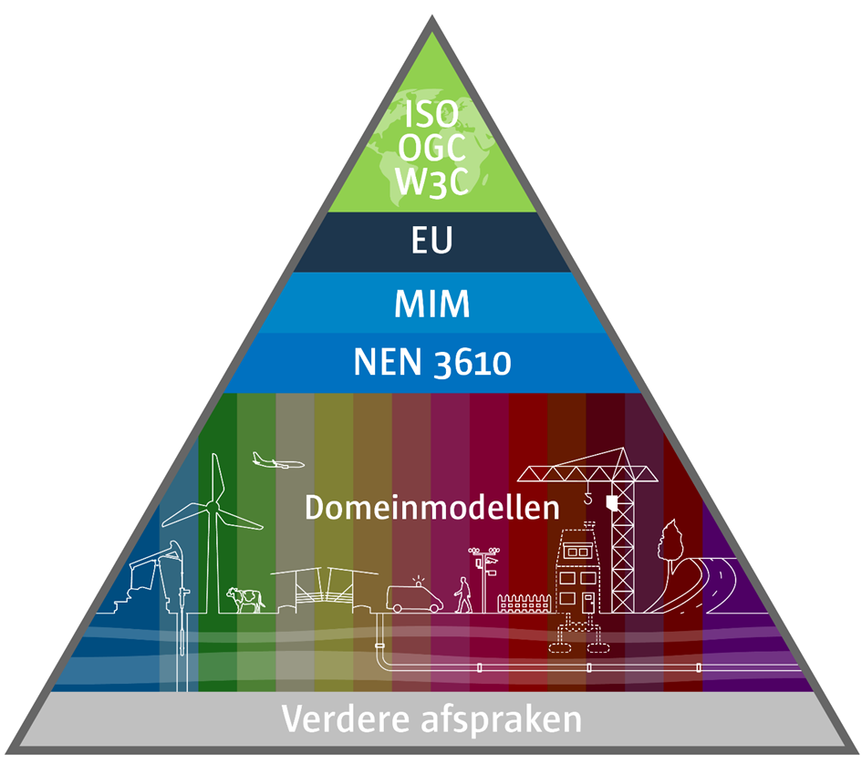
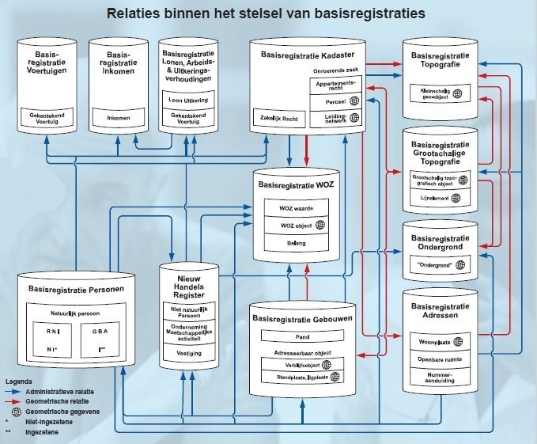
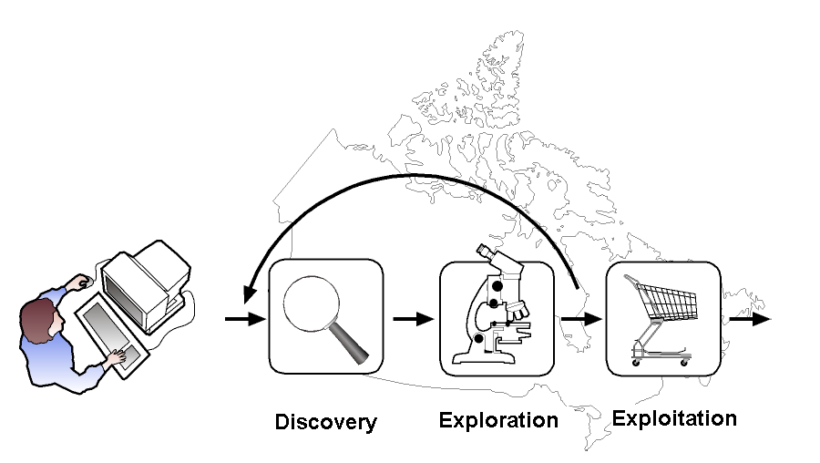

Raamwerk

Geo-Standaarden

Inhoudsopgave

Versiebeheer

Dit document is aan verandering onderhevig. Het versiebeheer van het document
geeft inzicht in wijzigen en de actualiteit ervan.

Versie Datum Status Aanpassing

1.0 Februari 2006 Vervallen Eerste versie voor discussie gemaakt door Marcel
Reuvers en Paul Smits en in kleine kring gereviewd. Deze versie was vooral
gebaseerd op de Nederlandse standaarden en het WD CEN/TC 287 Geographic
information – Standards, specifications, technical reports and guidelines,
required to implement Spatial Data Infrastructures.

1.1 Juni 2006 Vervallen Deze versie is veel meer toegeschreven naar de
Nederlandse GII door een bredere groep van auteurs en reviewers. Deze versie is
geschikt toepassing binnen deze Nederlandse GII en verzorgt ook de aansluiting
op regionale, Europese en internationale standaardisatie ontwikkelingen.

2.0 Oktober 2007 Vervallen Versie 2.0 is een directe uitwerking geworden op NORA
2.0 voor de Geo-standaarden. In deze uitwerking zijn ook verwijzingen gemaakt
naar NORA om dit Raamwerk klein en hanteerbaar te houden. Daarnaast zijn updates
en wijzigingen uitgevoerd op basis van gebruikersbehoeften en laatste informatie
INSPIRE.

2.1 Maart 2010 Vervallen Versie 2.1 is aangepast aan de actuele ontwikkelingen
zoals bijvoorbeeld tiling, INSPIRE, ISO/TC 211 en OGC aanpassingen en bijgewerkt
naar de Nederlandse situatie. Deze versie is tevens een verdiepingsdocument
waarnaar vanuit NORA 3.0 wordt verwezen. In deze versie zijn de figuren zoveel
mogelijk overeenkomstig NORA systematiek opgenomen.

2.2 Maart 2012 Vervallen Vooral een actualiseringslag. Daarnaast kleine updates
zoals: implementatie instrumenten, 3D, StUF, e.d.\`.

2.3 Januari 2014 Vervallen Actualisering, en kleine uitbreidingen voor aan te
bevelen standaarden zoals GeoJSON, ATOM feeds en linked data.

3.0 2 maart 2015

31 maart 2015 Eind-concept

Definitief Het raamwerk is teruggebracht tot een document als naslagwerk waarin
de grondbeginselen en relaties rondom de Nederlandse Geo-Standaarden zijn
vastgelegd. Actuele informatie met betrekking tot de standaarden is te
raadplegen via de Geonovum website.

Eindconcept ter review door de Programmaraad.

Eindconcept is door de Programmaraad ongewijzigd vastgesteld.

# Inleiding

Bij de opzet en ontwikkeling van een geo-informatie infrastructuur is het de
uitdaging om steeds de juiste set standaarden te kiezen. Het raamwerk van
geo-standaarden helpt daarbij. Het benoemt de internationale en nationale
standaarden die voor Nederland binnen het geo-domein van toepassing zijn voor
aansluiting met andere domeinen. Het raamwerk sluit aan op de Europese
infrastructuur en integreert het geo-domein met de elektronische overheid.

## Doel en doelgroep van het raamwerk

Het doel van het Raamwerk van geo-standaarden is om uit de grote verscheidenheid
aan standaarden de juiste set te kiezen: die standaarden die nodig zijn voor het
realiseren van een geo-informatie infrastructuur. Bij de keuzes zijn de volgende
uitgangspunten gehanteerd: internationale aansluiting, volwassenheid en openheid
van de standaarden en breed gebruik. Met de in het Raamwerk genoemde standaarden
is het mogelijk een solide infrastructuur te bouwen, die verenigbaar is met de
internationale ontwikkelingen en aansluit op de nationale e-overheid.

Het Raamwerk van geo-standaarden is geschreven voor iedereen die betrokken is
bij het toepassen van standaarden voor geo-informatie. Zoals informatiemanagers,
stuurgroepleden, beleidsmedewerkers, projectleiders, adviseurs, architecten,
IT-leveranciers, en voor personen die standaarden en specificaties implementeren
in hun organisatie en willen kunnen integreren met andere organisaties in
Nederland en Europa.

## Status van het raamwerk

Om zo breed mogelijk draagvlak voor dit Raamwerk te creëren wordt het Raamwerk
binnen de overheid formeel belegd via het Geo-Informatie Beraad , de basislijst
open standaarden en de Nederlandse Overheid Referentie Architectuur . Daarnaast
zijn de in het Raamwerk genoemde standaarden geharmoniseerd met de voor INSPIRE
geldende richtlijnen.

### GI-beraad

Gelet op het steeds toenemende belang van geo-informatie voor de publieke taken
heeft de Minister van Infrastructuur en Milieu een beraad voor de Geo-informatie
-kortweg het GI-beraad- ingesteld om de regierol van de minister van IenM waar
te kunnen maken.

Het GI-beraad is een ambtelijk adviescollege ingesteld op 2 juni 2006 en het
instellingsbesluit is in de Staatscourant gepubliceerd. In het GI-beraad zitten
vertegenwoordigers van het Ministerie van I en M, Ministerie van Economische
Zaken, Ministerie van BZK, Ministerie van Defensie, IPO, VNG, UvW, Kadaster en
TNO.

De taken van het GI-beraad zijn strategisch van aard, waarbij het GI-beraad
jaarlijks de Minister van Infrastructuur en Milieu adviseert in de vorm van een
strategische agenda over de onderwerpen, die de komende jaren aan de orde zullen
komen op het gebied van de geo-informatie.

Het GI-beraad heeft in juni 2006 het Raamwerk van geo-standaarden vastgesteld
als verplichtend voor de GI-beraad deelnemers. De programmaraad van Geonovum
stelt elke nieuwe versie van het raamwerk vast.

### Basislijst open standaarden

Het Forum en College Standaardisatie[^1] zijn de instellingen die adviseren over
het gebruik van open standaarden. Deze instellingen voeren het beheer over twee
lijsten, namelijk de lijst met open standaarden voor ‘pas toe of leg uit’ en een
lijst met gangbare open standaarden. Een aantal geo-standaarden uit het raamwerk
staan op de pas toe of leg uit lijst van het Forum Standaardisatie.

[^1]: <http://www.open-standaarden.nl/>

Voor de standaarden op de ‘pas toe of leg uit’ lijst met open standaarden geldt
dat (semi-)publieke organisaties het 'pas toe of leg uit'-principe moeten
volgen. Een aantal geo-standaarden uit 2.2 staan op de pas toe of leg uit
lijst[^2]. Deze geo-standaarden zijn te herkennen aan het volgende symbool.

[^2]: <https://lijsten.forumstandaardisatie.nl/open-standaard/geo-standaarden>

### Nederlandse Overheid Referentie Architectuur (NORA)

Kort; wat is NORA?

Het Raamwerk van geo-standaarden is het verdiepingsdocument waarnaar NORA 3.0 en
het NORA dossier geo-informatie verwijzen voor de te hanteren geo-standaarden.

### INSPIRE

Sinds 15 mei 2007 is de Europese kaderrichtlijn INSPIRE formeel van kracht. Deze
richtlijn leidt tot een Europese geo-informatie infrastructuur. De invoering van
INSPIRE is met een implementatiewet sinds 2009 in de Nederlandse wet verankerd.
In een notendop verplicht INSPIRE de Europese lidstaten geo-informatie over 34
thema's te voorzien van metadata en de data (‘as is’ en geharmoniseerd)
beschikbaar te stellen via netwerkdiensten (zoek-, view- en downloaddienst)
volgens leveringsvoorwaarden die het gebruik niet onnodig belemmeren.

De INSPIRE-richtlijn wordt in detail uitgewerkt in invoeringsregels
(‘implementing rules’), voorzien van technische richtlijnen (‘technical
guidelines’). De invoeringsregels, die zijn opgesteld voor standaarden zijn
metagegevens, data specificaties en netwerkdiensten. De INSPIRE regels zijn een
nadere invulling van de andere standaarden organisaties en de INSPIRE data
specificaties voor de thema’s hebben een duidelijke relatie met de
informatiemodellen in Nederland. Dit zijn de INSPIRE technical guidelines, ISO
of OGC standaarden die door INSPIRE zijn voorgeschreven, en Nederlandse
profielen die compliant zijn met INSPIRE. Hoewel INSPIRE formeel geen
geo-standaarden organisatie is kunnen de invoeringsregels van INSPIRE wel als
zodanig gebruikt worden. De INSPIRE regels zijn vaak een nadere invulling van de
andere standaarden organisaties en de INSPIRE data specificaties voor de thema’s
hebben een duidelijke relatie met de informatiemodellen in Nederland. De INSPIRE
geo-standaarden zijn te herkennen aan het volgende symbool.

## Standaarden documentatie

Wat is de status van de standaarden documentatie:

\- Standaard

\- Standaard (profiel)

\- Encoding

\- Handreiking

\- Praktijkrichtlijn

\- Productbeschrijving

\- Verkenning

\- Whitepaper

## Leeswijzer

Het Raamwerk van geo-standaarden is vergeleken met de vorige versie
teruggebracht naar uitgebreide vorm, waarin de samenhang van de geo-standaarden
centraal staat.

De actuele, aan wijziging onderhevige informatie is, voor zover dat nog niet zo
was, verhuisd naar de website van Geonovum.

Hoofdstuk 1 biedt achtergrondinformatie over het document, hoofdstuk 2
beschrijft de geo-standaarden in samenhang. Dit is het hoofddoel van het
document. Voor alle verdieping en actuele zaken, zoals lijsten van geldende
standaarden, bevat Hoofdstuk 2 verwijzingen naar de website. De verschillende
standaarden komen in Hoofdstuk 3 aan bod.

# Geo-standaarden in samenhang 

Het doel van het Raamwerk van geo-standaarden is om uit de grote verscheidenheid
aan standaarden die er zijn voor geo-informatie, de juiste set te kiezen. In
combinatie kunnen deze geo-standaarden worden gebruikt om een Geo-Informatie
Infrastructuur te realiseren. In een dergelijke infrastructuur spelen ze ieder
een eigen rol.

## Wat is geo-informatie?

Geo-standaarden zijn er om met geo-informatie te kunnen werken. Denk hierbij
bijvoorbeeld aan het opslaan, uitwisselen, en presenteren van geo-informatie.
Maar wat is eigenlijk geo-informatie? Geo-informatie omvat alle plaatsgebonden
kenmerken van informatieobjecten. Alle informatie waarin een ruimtelijke
component is opgenomen kan worden beschouwd als geo-informatie. Met een
ruimtelijke component of kenmerk wordt een verwijzing naar een plek op de aarde
bedoeld. Dit kan een fysiek object zijn, zoals een gebouw of kanaal, een
administratieve eenheid, zoals een gemeente of postcode gebied of een abstract
gegeven als ‘woonomgevingbeleving’. Een locatie kan statisch of dynamisch zijn;
denk bij dit laatste bijvoorbeeld aan vluchtige informatie die slechts op een
bepaald moment relevant is (bijv. een sensormeting), of aan bewegende objecten.

De laatste jaren heeft het gebruik van geo-informatie in alledaagse
webtoepassingen een hoge vlucht genomen door de komst van bijvoorbeeld Bing
Maps, Google Earth, Google Maps en OpenStreetMap.

De kracht van geo-informatie zit in het gemak waarmee op basis van locatie
verschillende typen van informatie aan elkaar gerelateerd en met elkaar
vergeleken kunnen worden. Dit helpt mensen enorm bij het verkrijgen van inzicht
op basis van informatie en zorgt ervoor dat veel effectiever beslissingen kunnen
worden genomen.

Figuur 1 Thema relaties op basis van locatie

Ruimtelijke vragen worden constant gesteld. In de vorm van ‘Waar?’ en door van
een plek of locatie informatie op te vragen:

 Waar is ruimte om een nieuwe school te plaatsen in een wijk? En staat die niet
nabij coffeeshops en cafés?

 Wat zijn de openbare voorzieningen in de nabijheid van dit koop- of huurhuis?
En is er sprake van bodemverontreiniging in de tuin?

 Waar kan ik het meest nabij mijn afval wegbrengen?

 Welk gebied wordt met overstroming bedreigd?

 Waar staan de files?

 Waar is de woonomgevingbeleving het laagst?

Sommige van deze ‘Waar?’ en ‘Wat is daar?’ vragen kunnen eenvoudig worden
beantwoord, veel anderen zijn complexer te beantwoorden en vragen de combinatie
van verschillende geo-informatiebronnen van verschillende organisaties.

Bijvoorbeeld de ‘Waar?’ vraag van de school vereist tenminste:

 De locaties van de coffeeshops en cafés;

 De woonadressen van de huidige leerlingen;

 De mogelijkheden binnen het bestemmingsplan;

 Reistijd en afstand naar school.

## De Nederlandse Geo-Informatie Infrastructuur

Voor het oplossen van de ruimtelijke vraagstukken uit de vorige paragraaf is
toegang tot de betreffende geo-informatie een vereiste. Om deze geo-informatie
zo laagdrempelig mogelijk te ontsluiten is in Nederland de afgelopen jaren
gewerkt aan een geo-informatie infrastructuur.

Voor het verwezenlijken van een infrastructuur zijn standaarden onontbeerlijk:
Zij zorgen ervoor dat het wiel niet voor een tweede keer wordt uitgevonden en
dat er bij uitwisseling overeenstemming is tussen beide partijen over het
formaat en de betekenis van de uitgewisselde gegevens. Belangrijk daarbij is dat
het open standaarden betreft. Een open standaard is voor iedereen toegankelijk
en toekomstvast omdat toegang tot de standaard en beheer van de standaard bij
een non-profit organisatie zijn belegd. De in dit Raamwerk van geo-standaarden
benoemde standaarden zijn volledig open.

Conceptplaat weer opnemen?

## De Europese geo-informatie infrastructuur?

## Geo-standaarden volgens FAIR

Pm

## Geo-standaarden in samenhang 

Voor het beantwoorden van ruimtelijke vragen zoals de voorbeelden in de vorige
paragraaf, is het meestal nodig om informatiebronnen van verschillende
organisaties met elkaar te combineren. Dit is niet mogelijk zonder standaarden.
De afgelopen twintig jaar is internationaal en nationaal gewerkt aan een set van
standaarden die het mogelijk maakt om de kracht van geo-informatie ten volle te
benutten.

Een geo-informatie infrastructuur is ervoor bedoeld om geo-informatie
beschikbaar te stellen en toegankelijk te maken voor gebruik.

Hiervoor zijn verschillende dingen nodig, zoals Figuur 2 laat zien:

 Het beschrijven van informatiebronnen met metadata, zodat de informatiebronnen
vindbaar worden.

 Het inrichten van web services, zodat geo-informatie via het web kan worden
geraadpleegd.

 Het definiëren van visualisatieregels, zodat geo-informatie op een eenduidige
manier wordt gepresenteerd aan gebruikers.

 Het beschrijven van de inhoud van informatiebronnen middels een
informatiemodel, zodat de semantiek en structuur bekend zijn.

 Het definiëren van uitwisselformaten, zodat duidelijk is in wat voor vorm de
geo-informatie wordt uitgewisseld.

 Het koppelen van geo-informatie aan een plek op het aardoppervlak met behulp
van een ruimtelijk referentiesysteem.

Voor al deze componenten van een geo-informatie infrastructuur (GII) zijn
standaarden beschikbaar.

Figuur 2 Geo-standaarden in samenhang

## Actormodel voor de GII

Welke actoren onderscheiden we en welke systeemfuncties?

### Het perspectief van de gebruiker

Om data te kunnen gebruiken, moet ik:

\- de betekenis van data kunnen begrijpen

\- data kunnen vinden en beoordelen op bruikbaarheid

\- aan kunnen sluiten op databronnen

\- data naar mij toe kunnen halen

\- data in kaartvorm kunnen begrijpen

\- data aan de juiste plek op aarde kunnen relateren

### Het perspectief van de aanbieder

Om mijn data te laten gebruiken, moet ik:

\- de betekenis van mijn data inzichtelijk maken

\- mijn data vindbaar en beoordeelbaar maken

\- mijn data toegankelijk maken

\- mijn data in voorspelbare formaten aanbieden

\- mijn data in kaartvorm eenduidig interpreteerbaar maken

\- mijn data aan de juiste plek op aarde relateren

## Verkenning

In de afgelopen tien jaar is duidelijk geworden dat data meer zijn dan het
bijproduct van specifieke werkprocessen die mogelijk geschikt zijn voor
hergebruik. Data zijn een essentiële grondstof. Dit vraagt om een frisse blik op
de mogelijkheden van onze data-infrastructuur.

Wanneer we data omzetten in informatie en informatie in kennis, dan worden data
een essentiële grondstof voor het maken van keuzes. In Europa vinden we het
daarbij belangrijk dat keuzeprocessen transparant zijn. Betrokken burgers moeten
overheidsbeleid kunnen controleren en er zelf actief aan kunnen bijdragen met
nieuwe initiatieven of alternatieven. Van een infrastructuur die laagdrempelig
toegang biedt tot individuele databronnen, verschuift de vraag naar een
infrastructuur die het kunnen combineren van data uit verschillende bronnen
ondersteunt. Het belang van zowel semantische als technische interoperabiliteit
neemt steeds verder toe.

"De Nederlandse Geo-informatie Infrastructuur is toe aan een upgrade” schreven
we in de Geonovum meerjarenvisie 2021-2023. Hoe kan de NGII een upgrade krijgen
richting een vraaggedreven infrastructuur, die de kracht van locatiedata
laagdrempelig inzetbaar maakt voor de grote maatschappelijke opgaven? Welke
(nieuwe) standaarden spelen daarbij een rol? Hoe hangen allerlei afzonderlijke
ontwikkelingen eigenlijk met elkaar samen? En hoe verhoudt de NGII 2.0 zich
bijvoorbeeld tot een Nationale Digital Twin Infrastructuur? En hoe verhouden die
ontwikkelingen zich toch Europese ontwikkelingen rond data en digitalisering? In
deze white paper zoeken we antwoorden op die vragen. En omdat die antwoorden
meer waarde hebben, wanneer ze breed gedragen worden in het werkveld, is deze
white paper ook in publieke consulatie gebracht en vervolgens aangescherpt.

Eind 2021 heeft Geonovum een visie op de Nederlandse geo-informatie
infrastructuur geschetst: [Whitepaper Visie op upgrade Nederlandse
Geo-informatie Infrastructuur
(NGII)](https://docs.geostandaarden.nl/ngii/wpungii/).

# Overzicht geo-standaarden

## Overzicht geo-standaarden

In het vorig hoofdstuk is de samenhang van geo-standaarden toegelicht. Dit
hoofdstuk geeft een overzicht van de geo-standaarden.

In Tabel 1 staan de te hanteren standaarden.

In de hoofdstukken 3 en 4 is dit overzicht voorzien van meer
achtergrondinformatie, URL’s naar de standaarden en worden, waar van toepassing,
additionele standaarden genoemd die gehanteerd kunnen worden voor specifieke
toepassingsdomeinen.

Tabel 1 – Te hanteren geo-standaarden

|                                   | **Te hanteren geo-standaarden**                                                                                                                                                                   | **Opmerkingen**                                                                                                                                                                                                                                                                                                                                                                      |
|-----------------------------------|---------------------------------------------------------------------------------------------------------------------------------------------------------------------------------------------------|--------------------------------------------------------------------------------------------------------------------------------------------------------------------------------------------------------------------------------------------------------------------------------------------------------------------------------------------------------------------------------------|
| **Uitwisseling vector**           | [./media/image8.jpeg](./media/image8.jpeg) OpenGIS Geography Markup Language (GML) Encoding Specification, version 3.1.1 OpenGIS Geography Markup Language (GML) Encoding Specification, version  | Voor ISO 19136:2007 (GML 3.2.1) is er een [simple features profile van het Open Geospatial Consortium](http://portal.opengeospatial.org/files/?artifact_id=42729) (OGC 10-100r3, 2011-05-24, version 2.0) beschikbaar dat voldoet aan de eisen en wensen van Nederland (inclusief bogen). GML 3.2.1 en GML 3.1.1 gelden waarbij GML 3.1.1 na verloop van tijd vervalt (zie website). |
| **Uitwisseling raster**           | Diversen, toepassingsafhankelijk                                                                                                                                                                  |                                                                                                                                                                                                                                                                                                                                                                                      |
| **Uitwisseling sensoren**         | Observations & Measurement - XML implementation versie 2.0                                                                                                                                        |                                                                                                                                                                                                                                                                                                                                                                                      |
| **Coördinaat referentie-systeem** | Tenminste EPSG codes:                                                                                                                                                                             | Voor Google Maps / Earth en BING Maps dient EPSG code 4326 gehanteerd te worden voor 2D data.                                                                                                                                                                                                                                                                                        |
| **Metadata**                      | [./media/image8.jpeg](./media/image8.jpeg) Nederlands profiel op ISO 19115                                                                                                                        |                                                                                                                                                                                                                                                                                                                                                                                      |
|                                   | [./media/image1.png](./media/image1.png)                                                                                                                                                          |                                                                                                                                                                                                                                                                                                                                                                                      |
| **Informatie-modellen**           | NEN 3610:2011, Basismodel Geo-                                                                                                                                                                    |                                                                                                                                                                                                                                                                                                                                                                                      |
|                                   | ISO 19156 - Observations & Measurements                                                                                                                                                           |                                                                                                                                                                                                                                                                                                                                                                                      |
| **Services**                      | [./media/image8.jpeg](./media/image8.jpeg) Nederlands profiel versie 1.0 op ISO 19128 Geographic information — Web                                                                                | Het Nederlandse WMS profiel 1.1 op OGC WMS 1.1.1 is eind 2012 vervallen.                                                                                                                                                                                                                                                                                                             |
|                                   | [./media/image1.png](./media/image1.png) Nederlands profiel op ISO 19142 Geographic information — Web Feature Service versie 1.0.1                                                                | Het Nederlandse WFS profiel 1.0 op OGC standaard WFS versie 1.1.0 vervalt na verloop van tijd (zie website).                                                                                                                                                                                                                                                                         |
|                                   | Web Coverage Service (WCS), version 2.0                                                                                                                                                           |                                                                                                                                                                                                                                                                                                                                                                                      |
|                                   | [./media/image8.jpeg](./media/image8.jpeg) Technical Guidance Discovery Services, version 3.1                                                                                                     |                                                                                                                                                                                                                                                                                                                                                                                      |
|                                   | [./media/image8.jpeg](./media/image8.jpeg) OpenGIS Styled Layer Descriptor Implementation Specification, version 1.1.0                                                                            | Zie ook: <http://www.geonovum.nl/wegwijzer/standaarden/handreiking-webcartografie-deel-1>                                                                                                                                                                                                                                                                                            |
|                                   | [./media/image8.jpeg](./media/image8.jpeg) OpenGIS Symbology Encoding Implementation Specification, version 1.1.0                                                                                 |                                                                                                                                                                                                                                                                                                                                                                                      |
|                                   | Basisregistratie Adressen en Gebouwen (BAG)                                                                                                                                                       | Alle organisaties met een publieke taak zijn vanaf 1 juli 2011 verplicht tot afname van de gegevens uit de BAG en hebben een terugmeldplicht als zij op eventuele fouten in de gegevens stuiten.                                                                                                                                                                                     |
|                                   | OGC Sensor Observation Service 1.0.0 OGC Sensor Planning Service Implementation Specification 2.0                                                                                                 |                                                                                                                                                                                                                                                                                                                                                                                      |
|                                   | [./media/image8.jpeg](./media/image8.jpeg) ATOM feeds                                                                                                                                             |                                                                                                                                                                                                                                                                                                                                                                                      |
|                                   | [./media/image8.jpeg](./media/image8.jpeg) Tiling: WMTS                                                                                                                                           |                                                                                                                                                                                                                                                                                                                                                                                      |

3.2.1 (=ISO 19136:2007)

GeoJSON

RDF

28992 (RD)

5709 (NAP)

4258 (ETRS89 (2D))

4326 (WGS84 (2D))

voor geografie, versie 1.3.1

Nederlands profiel op ISO 19119 voor services, versie 1.2.1

informatie

Map Server Interface (WMS 3.0)

##  ‘Pas toe of leg uit’ lijst met open standaarden 

De geo-standaarden, die op de pas toe of leg uit lijst staan zijn:

-   [ISO 19136:2007 Geographic information - Geography Markup Language
    (GML](http://www.iso.org/iso/iso_catalogue/catalogue_tc/catalogue_detail.htm?csnumber=32554))

-   [NEN 3610:2011 (nl) Basismodel Geo-informatie - Termen, definities, relatie
    s en algemene regels voor de uitwisseling van informatie over aan de aarde
    gerelateerde ruimtelijke
    objecten](http://www.nen.nl/web/Normshop/Norm/NEN-36102011-nl.htm)

-   [Nederlands profiel op ISO 19142 Geographic information - Web Feature
    Service, versie
    1.0.1](http://www.geonovum.nl/sites/default/files/nederlands_profiel_op_iso_19142_wfs_2.0_-_versie_1.0.1.pdf)

-   [Nederlands profiel op ISO 19128 Geographic information - Web Map Server
    Interface, versie
    1.0](http://www.geonovum.nl/sites/default/files/nederlands_profiel_op_iso_19128_wms_1.3_-_versie_1.0.pdf)

-   [Nederlands profiel op ISO 19115 voor geografie, versie
    1.2](http://www.geonovum.nl/sites/default/files/Nederlands%20metadata%20profiel%20op%20ISO%2019115%20voor%20geografie%20-%20v1%203%201%20def_0.pdf)

-   [Nederlands metadata profiel op ISO 19119 voor services, versie
    1.1](http://www.geonovum.nl/sites/default/files/Nederlands%20metadata%20profiel%20op%20ISO%2019119%20voor%20services%20-%20v1%202%201%20def.pdf)

Deze geo-standaarden zijn van primair belang in het aansluiten van
geo-informatie op de eOverheid. Bij het forum loopt een procedure om de huidige
versies op de pas toe of leg uit lijst te krijgen.

## Hiërarchie geo-standaarden

Voor nationale standaarden geldt dat deze ontwikkeld zijn op basis van Europese
en internationale standaarden met de voor Nederland geldende specifieke eisen.

In het raamwerk van geo-standaarden is dit op onderstaande manier aangegeven.

Tabel 2 - hierarchie standaarden

| **Internationale standaarden/specificaties** | **Europese profielen** | **Nederlandse profielen** |
|----------------------------------------------|------------------------|---------------------------|
|                                              |                        |                           |

Op het moment dat een nationale standaard is ontwikkeld geldt dat een nationale
standaard of specificatie leidend is. Is er geen nationale standaard, dan geldt
de Europese standaard en bij gebrek daaraan of omdat de internationale standaard
de Europese of nationale behoefte afdekt geldt een internationale, wereldwijde
standaard.

# Informatiemodellen

**In dit hoofdstuk beschrijven we de standaarden die de basis vormen van de
modellen en beschrijvingen van geo-informatie. Dit is een benadering vanuit de
geo-informatie (de data) zelf.**

**De individuele informatie-objecten in een dataset worden beschreven met behulp
van een informatiemodel. De semantiek (betekenis) en de structuur van de
informatie moet bekend zijn zodat gebruikers de informatie optimaal kunnen
benutten. Een informatiemodel, ook wel dataspecificatie genoemd, zet schematisch
de afspraken over begrippen en definities van gegevens binnen een bepaald domein
op een rij. Dit vereenvoudigt de uitwisseling van informatie.**

## Wat is een informatiemodel?

ISO 19101 is de basale standaard waarin de concepten van geo-informatie zijn
vastgelegd. ISO 19101 hanteert de volgende definitie voor een informatiemodel
(conceptual model): een formele definitie van objecten, attributen, regels in
een bepaald domein. De kern van een informatiemodel is dat het een abstractie
(het model) vormt van de werkelijkheid zoals beschreven binnen een bepaald
domein. Semantiek, of betekenis van data in het model vormt de link met de
werkelijkheid.

In een informatie-infrastructuur gaat het primair om het betekenisvol
uitwisselen van data. Om dit gestructureerd te kunnen doen is het aanbrengen van
semantiek vereist. Door het aanbrengen van semantiek ontstaat ook behoefte aan
afstemming en harmonisatie. Informatiemodellen ondersteunen daarmee een proces
van semantische harmonisatie in Nederland en over de grenzen.

**Wat is semantiek?**

Semantiek is het vastleggen van de betekenis van de in een model onderscheiden
elementen of objecten. Het is duidelijk dat als gegevens van organisatie A naar
organisatie B gestuurd worden, deze gegevens alleen goed geïnterpreteerd kunnen
worden als definities van elementen bekend zijn. Neem een informatie-element
*weg* met een attribuut ‘*wegbreedte’*. Als organisatie A een weg definieert
inclusief fiets- en voetpaden en organisatie B alleen de rijstroken tot de weg
rekent, ontstaat er een verkeerd beeld bij uitwisseling als deze betekenis
informatie, de semantiek, niet bekend is. De semantiek moet daarom mee
uitgewisseld worden, of bekend zijn.

Semantiek omvat niet alleen de definitie van objecten maar ook het gedrag,
eigenschappen en relaties tussen objecten dragen bij aan de betekenis. Semantiek
is daarmee ook een onderdeel van een informatiemodel. Dat een pand altijd een
adres hoort te hebben, dat een kruispunt van wegen gevormd wordt door minstens
twee wegen, water bergaf stroomt, etc. zijn hier voorbeelden van.

**Behoefte aan semantiek**

Voor eenduidige uitwisselingen van geo-informatie, organisatie B begrijpt wat
organisatie A bedoelt, moet de semantiek van de gegevens bekend zijn. Wordt op
dit moment nog de meeste geo-informatie vrij direct gebruikt door de mens, in de
toekomst zal ook een groot deel van de data (eerst) door machines
geïnterpreteerd en gebruikt worden alvorens met de mens te communiceren. De mens
is (meestal) nog in staat om de verschillende begrippen juist te interpreteren
door impliciet gebruik te maken van enige context informatie (welk domein
betreft het, welke leveranciers). Voor de machine is het noodzakelijk deze
kennis expliciet te maken. Zeker onze netwerk (informatie)-maatschappij, met
Internet als belangrijk communicatiemedium, zorgt ervoor dat in toenemende mate
zelfverklarende informatie noodzakelijk is. Semantiek is daarom niet alleen van
belang voor het begrijpen van informatie door mensen maar ook steeds meer voor
machines.

**Wat is een informatiemodel?**

### NEN3610 als basismodel 

Door stapeling van standaarden: NEN3610 piramide – domeinmodel wordt gemaakt
door aanscherping en uitbreiding van algemenere regels

Met het oog op semantische afstemming in Nederland en aansluiting op
internationale standaarden is het Basismodel Geo-informatie (NEN 3610)
ontwikkeld. Het Basismodel vormt het centrum van een stelsel van
geo-informatiemodellen. Als beeld gebruiken we hiervoor het piramidemodel
(Figuur 4).

*Figuur 4 - Relatie Basismodel Geo-informatie en domeinen*

In de piramide is er een gelaagdheid van generiek naar sectorspecifiek naar
organisatiespecifiek, terwijl dwars daarop de sectoren zijn onderscheiden. Het
Basismodel is in technische zin de toepassing van internationale standaarden in
de Nederlandse setting. Er zijn daarin regels vastgelegd over de methode van
modelleren en presenteren. Semantisch bevat het Basismodel de overlap tussen
meerdere of alle sectoren en vormt daarmee de gemeenschappelijke basis. Met het
Basismodel is het detailniveau te modelleren dat voor alle sectoren van belang
is. Binnen de sectormodellen is het detail uitgewerkt dat voor uitwisseling van
informatie binnen een sector van belang is.

In het onderste deel van de piramide, het hoogste detailniveau, is er alleen nog
maar sprake van uitwisseling binnen een organisatie. Standaardisatie is in dat
geval de verantwoordelijkheid van een organisatie zelf. Tussen de niveaus, van
organisatie naar sector en andersom, wordt ook informatie overgedragen. Ook in
deze uitwisseling is het van belang dat informatie eenduidig wordt overgebracht.

Het semantische domein van het Basismodel Geo-informatie wordt gevormd door het
gemeenschappelijke begrippenkader van de sectormodellen. Dit gemeenschappelijke
gebied is dynamisch en verandert onder invloed van maatschappelijke processen.
Dit is van invloed op de inhoud van de sectormodellen en op de inhoud van het
gezamenlijke Basismodel Geo-informatie. Sector- en Basismodel zullen daarom in
een voortdurend harmonisatieproces op elkaar afgestemd moeten worden. Een actief
beheer van het stelsel van informatiemodellen is daarom noodzakelijk.

Semantische harmonisatieprocessen vinden ook plaats op regionaal (cross border
projecten), Europees (INSPIRE, Eurogeographics) en mondiaal niveau (Land
Administration Domain Model, ISO 19152). Het Basismodel Geo-informatie zorgt
voor de aansluiting van nationale modellen op deze internationale
ontwikkelingen. De piramide steekt als het ware met de punt in de wolk van
internationale geo-standaarden. Internationale / Europese context

Naast de algemene internationale normen en specificaties wordt binnen Europa
hard gewerkt om te komen tot semantische afspraken. O.a gebeurt dat in het
INSPIRE-programma dat een Europese SDI neerlegt waarbij de aandacht vooral ligt
op harmonisatie van in totaal 34 thema’s. Het Drafting Team data specifications
and harmonisation stelt hier algemene standaarden/guidelines/specificaties voor
vast.

Binnen Nederland wordt door participatie van Nederland in INSPIRE geborgd dat
deze initiatieven naar de Nederlandse situatie vertaald worden (en andersom). De
NEN3610 aanpak die in Nederland al wordt gevolgd is in lijn met INSPIRE en biedt
de semantische invulling die van toepassing is op Nederland.

### Objectgericht

Het Basismodel Geo-informatie is objectgericht, dat wil zeggen dat het
informatie geeft over individueel te onderscheiden objecten binnen de beschreven
werkelijkheid. Het object is de eenheid van informatie. In het Basismodel wordt
hiervoor het begrip geo-object geïntroduceerd. De definitie hiervan is:

abstractie van een fenomeen in de werkelijkheid dat direct of indirect
geassocieerd is met een locatie relatief ten opzichte van de aarde (bijvoorbeeld
ten opzichte van het aardoppervlak)

De volgende drie termen zijn hierin belangrijk:

-   Fenomeen: Een beschrijfbaar verschijnsel.

-   Object: Een object is een abstractie van een fenomeen in de werkelijkheid.

-   Geo-object: Is een object dat direct of indirect geassocieerd is met een
    locatie relatief ten opzichte van de aarde.

Een geo-object heeft een directe associatie met een locatie door middel van
coördinaten en of een indirecte associatie door middel van een verwijzing naar
een adres, een postcode etc.

### Model beschrijving

Het Basismodel beschrijft de werkelijkheid aan de hand van een vijftiental
geo-object klassen. De hoofdklasse is de objectklasse GeoObject. In deze klasse
zijn de basiseigenschappen van een object met geo-informatie vastgelegd. Alle
andere objectklassen zijn hiervan afgeleid en erven deze basiseigenschappen. De
onderscheiden objectklassen zijn:

-   Geo-Object

-   Terrein

-   Water

-   Weg

-   Spoorbaan

-   Gebouw

-   Kunstwerk

-   Leiding

-   Inrichtingselement

-   Registratief gebied

-   Geografisch gebied

-   Functioneel gebied

-   Planologische gebied

### NEN3610 en de basisregistraties e-overheid

Naast het gebruik van de standaarden binnen het geo-domein is aansluiting op de
e-overheid van wezenlijk belang. Voor NEN3610 geldt dit vooral in relatie tot
het gebruik binnen het stelsel van basisregistraties.

In het stelsel van basisregistraties zijn meerdere standaarden van toepassing.
Voor de basisregistraties waar het aspect geo-informatie in voorkomt worden twee
standaarden voor de uitwisseling gehanteerd, namelijk StUF en NEN 3610. Door
verdere ontwikkeling van de basisregistraties als samenhangend stelsel wordt ook
de behoefte van harmonisatie van beide standaarden groter.

In Figuur 5 zijn de verschillende standaarden aangeven en in rood zijn de
relaties aangeven waarbij geometrie wordt uitgewisseld. In Figuur 5 is dit in
detail zichtbaar gemaakt door de wereldbol te hanteren waar geometrie wordt
gebruikt.

Gerealiseerd:

-   BGR Basis Gebouwen Registratie (StUF, BAG)

-   BRA Basis Registratie Adressen (StUF, BAG)

-   BRK Basisregistratie Kadaster (NEN 3610, IMKAD)

-   BRT Basisregistratie Topografie (NEN 3610, TOP10NL)

In uitvoering:

-   BGT Basisregistratie Grootschalige Topografie (NEN 3610 en StUF, IMGeo)

-   BRO Nederlandse ondergrond (NEN 3610, IMBRO)

-   WOZ Basisregistratie WOZ (StUF, WOZ)

KING en Geonovum hebben besloten om deze standaarden families van StUF en NEN
3610 te harmoniseren. Hiervoor is een uitgebreid rapport gemaakt waar ongeveer
40 harmonisatievoorstellen zijn verwoord. Deze harmonisatievoorstellen richten
zich op 2 aspecten namelijk:

1.  Informatieharmonisatie; en

2.  Harmonisatie van berichtmodellen en functionaliteit.

Uitkomst is dat de gegevensuitwisseling van administratieve en geografische
informatie in gemengde vorm kan plaatsvinden en door services een combinatie van
beide kan worden aangeboden.

Voor deze harmonisatie zijn drie plateaus van harmonisatie benoemd die de
komende jaren worden gerealiseerd. De wijzigingen uit deze harmonisatie komen
terug in het normale releasebeleid van beide standaarden families. Dit rapport
is te downloaden[^3].

[^3]: Rapport is te downloaden via
<http://www.geonovum.nl/onderwerpen/berichtenverkeer/documenten/rapport-harmonisatie-stuf-en-nen-3610>

Voor de WOZ worden de uitkomsten van de harmonisatie momenteel doorgevoerd. Voor
de BGT is dit al het geval. Het resultaat is de StUF-Geo IMGeo
berichtenstandaard die wordt gebruikt in de uitwisseling van bronhouder tot en
met landelijk distributiepunt. Via de website van Geonovum blijft u op de hoogte
van de actuele ontwikkelingen.

### NEN3610 en de linked data pyramide

Door hergebruik van referenties: Linked Data piramide – domeinmodel wordt
gemaakt door hergebruik en verwijzing naar algemenere kaders

(<https://docs.geostandaarden.nl/nen3610/nldp/media/UML-OO-en-LD.png>)

## Hoe betekenis van mijn data inzichtelijk maken voor verschillende typen betrokkenen?

**Inzichtelijk voor de business: model van begrippen**

**Inzichtelijk voor raakvlak business en ICT: conceptueel informatiemodel**

**Inzichtelijk voor ICT-ers (implementatie-onafhankelijk): logisch model**

**Inzichtelijk voor ICT-ers en machines: fysiek / technisch model**

## Hoe vastlegging van informatiemodellen inzichtelijk maken?

### Overkoepelend voor mens, zowel business als ICT: in standaarden op docs.geostandaarden.nl

Pm

### Formele vastlegging voor mens en machine van begrippen: Conceptenbibliotheek

pm

### Formele vastlegging voor ICT-er en machine: technisch register

Pm

### Hoe leg ik betekenis zo eenduidig mogelijk vast?

Informatie is een motor onder het functioneren van de overheid in Nederland. In
het kader van onderlinge samenwerking, wisselen overheidsorganisaties veel
informatie uit. Daarbij is het van groot belang dat we hetzelfde verstaan onder
de gegevens die we gebruiken en dat we gemeenschappelijke afspraken maken over
hoe we gegevens beschrijven en uitwisselen. Om alle informatiemodellen in
Nederland nog beter op elkaar aan te laten sluiten is een metamodel ontwikkeld
voor informatiemodellering; het MIM. Met het metamodel voor informatiemodellen
(MIM) hebben we een gemeenschappelijk vertrekpunt opgesteld voor het maken van
informatiemodellen. Het model bevat duidelijke afspraken over het vastleggen van
gegevensspecificaties en biedt tegelijkertijd ruimte aan de verschillende
niveaus van modellering. Bijzonder aan het model is dat de afspraken over
meerdere bestuurslagen heen gaan.

MIM is bestemd voor informatiearchitecten, die informatiemodellen maken,
informatieanalisten die willen weten wat de betekenis en definitie van
informatieobjecten is en mensen die implementaties maken op basis van het model.
Voor het werken met dit model is kennis van informatiemodellering een vereiste.
Enige kennis van UML is een pré. MIM richt zich op registraties binnen het
overheidsdomein, maar is in bredere context inzetbaar.

Het metamodel voor informatiemodellen is te vinden in het document “[MIM -
Metamodel Informatie
Modellering](https://docs.geostandaarden.nl/mim/mim/#inleiding)”.

Ook voor het beheer van MIM zijn afspraken gemaakt in het document “[MIM
beheerplan](https://geonovum.github.io/MIM-Beheerplan/)”.

## Overzicht standaarden informatiemodellen voor Nederland

Tabel 10 - Standaarden en specificaties met betrekking tot geo-objecten
(features)

| **Internationale standaarden/specificaties**                                                                                                                                                                                                                                                                                                                                                                                                                                                                                                                                                                                                                                                                 | **Europese profielen**                                                                                                                                                                                                                                                                                                                                                                                                                                                                                                                                                                                                                                                                           | **Nederlandse profielen**                                                                                                   |
|--------------------------------------------------------------------------------------------------------------------------------------------------------------------------------------------------------------------------------------------------------------------------------------------------------------------------------------------------------------------------------------------------------------------------------------------------------------------------------------------------------------------------------------------------------------------------------------------------------------------------------------------------------------------------------------------------------------|--------------------------------------------------------------------------------------------------------------------------------------------------------------------------------------------------------------------------------------------------------------------------------------------------------------------------------------------------------------------------------------------------------------------------------------------------------------------------------------------------------------------------------------------------------------------------------------------------------------------------------------------------------------------------------------------------|-----------------------------------------------------------------------------------------------------------------------------|
| ISO 19101 Geographic Information – Reference model ISO/TS 19103 Geographic Information - Conceptual schema language ISO 19108 Geographic information -Temporal Schema ISO 19109 Geographic information - Rules for application schema ISO 19110 Geographic information - Methodology for feature cataloguing ISO 19118 Geographic Information – Encoding ISO 19131 Geographic Information - Data product specification ISO 19136 Geographic Information - Geography Markup Language (GML) Observations and Measurements - Part 1 - Observation Schema 1.0.0 Observations and Measurements - Part 2 - Sampling Features 1.0.0 OpenGIS City Geography Markup Language (CityGML) Encoding Standard, version 2.0 | [./media/image8.jpeg](./media/image8.jpeg) zie [www.ec-gis.org/inspire](http://www.ec-gis.org/inspire) onder data specifications voor de laatste versie INSPIRE: Generic Conceptual Model INSPIRE: Methodology for the development of data specifications INSPIRE: Guidelines for the encoding of spatial data INSPIRE Feature Concept Dictionary INSPIRE glossary De data specificaties voor de Annex I thema’s zijn beschikbaar (protected sites, transport networks, cadastral parcels, geographical names, geographical grid systems, coordinate reference systems, administrative units, addresses en hydrography) De data specificities voor Annex II en III zijn in draft beschikbaar[^4] | [./media/image8.jpeg](./media/image8.jpeg) De norm NEN3610:2011 Basismodel Geo-informatie. Termen, definities, relaties en  |

[^4]: <http://inspire.jrc.ec.europa.eu/index.cfm/pageid/2> oetsenrden toegevoegd
(aan 3.4)en?mentation Standard 1.0.0ijs vragen.uit 2001. tistellen? en. Hierbij
hanteer ik de einddatum di

algemene regels voor de uitwisseling van informatie over aan het aardoppervlak
gerelateerde ruimtelijke objecten. NEN3610 is een toepassing van de set aan
conceptuele standaarden uit de ISO 19100 serie.

Profielen op NEN3610 zijn:

-   IMRO (planologie)

-   IMWA / (UM) Aquo (water)

-   IMKICH (cultuurhistorie)

-   IMKL (kabels en leidingen)

-   IMGeo (grootschalige topografie)

-   IMTOP (topografie: TOP10NL, TOP50NL, TOP100NL, TOP250NL en TOP1000NL)

-   IMWE (welstand, wordt onderdeel IMRO)

-   IMKAD (kadastrale percelen)

-   IMNAB (Natuurbeheer)

-   IMMetingen (Metingen)

-   IMLG (Landelijk gebied)

-   IMOOV (Openbare Orde en Veiligheid)

-   0101 (bodembeheer)

-   IMBRO (ondergrond), in ontwikkeling

-   IMSW (stedelijk water, riolering), in ontwikkeling

-   IMBOR (Beheer Openbare Ruimte), in ontwikkeling

## Kwaliteit van informatiemodellen 

Voor implementatie ondersteuning zijn de volgende hulpmiddelen ingericht:

-   Validator

>   Voor het valideren van GML databestanden aan standaarden voor sectorale
>   informatiemodellen is de generieke validator beschikbaar. Deze is te vinden
>   op <http://www.geonovum.nl/wegwijzer/validatie>

-   Conformiteittoetsing

>   Met een conformiteittoets kan men controleren of sectorale standaarden
>   technisch correct zijn toegepast. Voor de toetsen zie:
>   <http://www.geonovum.nl/wegwijzer/validatie>

# Visualisatie

Om de geo-informatie visueel te presenteren op een kaart worden er
visualisatieregels opgesteld. Denk hierbij bijvoorbeeld aan vlakvullingen,
lijnstijlen, symbologie, etc. Veel inhoudelijke domeinen hebben een standaard
visualisatie gedefinieerd voor hun informatiemodel. Deze visualisatieregels
moeten worden vastgelegd en kunnen dan bijvoorbeeld worden toegepast in een view
service.

## Wat is visualisatie?

pm

## Overzicht visualisatie standaarden

Het standaardiseren van visualisatie (vlakvullingen, lijnstijlen, symbologie,
etc.) wordt steeds belangrijker. Veel inhoudelijke domeinen overwegen het
formeel vastleggen van een standaard visualisatie voor hun informatiemodel en
zoeken een geschikte standaard om dit vast te leggen. OGC biedt een 4-tal
specificities die geen van alle direct toepasbaar zijn.

-   Styled Layer Descriptor (SLD) en Symbology Encoding (SE): Deze standaarden
    beschrijven samen de specificatie voor het beschrijven van visualisaties
    voor OGC services.

-   Web Map Context Documents (XML syntax) geeft de mogelijkheid om de status
    van een WMS client (viewer) vast te leggen. Denk aan een combinatie van een
    aantal WMS services, (subset) van een leganda, layers (styles, formats),
    inzoom schaal, etc. Deze situatie kan op een client worden opgeslagen en
    worden uitgewisseld naar andere WMS clients zodat deze dezelfde Web Map
    Context hebben.

-   KML is een XML toepassing die zich richt op geo-infomatie visualisatie,
    inclusief annotatie van kaarten en images. OGC en Google zijn overeengekomen
    om KML met GML te harmoniseren, hetzelfde geldt voor KML en SLD/SE.

-   3D visualisatie wordt steeds belangrijker. Hiervoor zijn verschillende
    desktop-applicaties beschikbaar die bijvoorbeeld CityGML, Google SketchUp en
    andere formaten veelal gecombineerd kunnen gebruiken voor visualisaties. OGC
    services hiervoor zijn nog niet als standaard(en) uitgekristalliseerd, hier
    wordt momenteel aan gewerkt. Intussen worden meestal de-facto standaarden
    toegepast. Interessante ontwikkelingen vanuit W3C zijn: XML3D[^5] en X3D[^6]
    die beiden als doel hebben 3D services op het web zonder plug-ins voor
    browsers (op basis van HTML5). Beiden komen vanuit W3C en het is nog
    onduidelijk welke richting het precies op gaat.

    [^5]: http://www.xml3d.org/

    [^6]: http://www.web3d.org/

>   KML en Collade zijn tevens prima geschikt voor 3D visualisatie.

In de onderstaande uitwerking wordt ingegaan op SLD en SE.

Styled Layer Descriptor (SLD) is een extensie op de WMS-standaard. SLD verzorgt
gecontroleerde cartografie in een WMS request. Symbology Encoding (SE) bevat
mechanismen voor legenda’s en symbolen. De standaard is vrij generiek en
daardoor deels afhankelijk van de software/provider.

Figuur 13 - SLD en SE

De layer en style kunnen van te voren gedefinieerd zijn (respectievelijk
NamedLayer en NamedStyle) of zijn door de gebruiker te definiëren
(respectievelijk UserLayer of UserStyle). Hierdoor kan de kaart vanaf de server
bestuurd worden of heeft de gebruiker cartografische mogelijkheden. De
FeatureTypeStyle geeft de mogelijkheid om de style te definiëren (bijvoorbeeld
stippellijn). Met rules kunnen objecten gegroepeerd worden of zijn bijvoorbeeld
meerdere presentaties van een object(groep) mogelijk. De filter bevat een query.
Symbology Encoding (SE) bevat de mogelijkheid om met symbolizers de
cartografische presentatie van een object(groep) te definiëren. Vijf typen
symbolisers worden onderscheiden, namelijk: PointSymbolizer, LineSymbolizer,
PolygonSymbolizer, TextSymbolizer en RasterSymbolizer.

Tabel 16 - Standaarden en specificaties voor visualisatie

| **Internationale standaarden/specificaties**                                                                                                                                                                                                                                                                                                                                               | **Europese profielen**                                                                                                                                                                                                                               | **Nederlandse profielen**                                                                                   |
|--------------------------------------------------------------------------------------------------------------------------------------------------------------------------------------------------------------------------------------------------------------------------------------------------------------------------------------------------------------------------------------------|------------------------------------------------------------------------------------------------------------------------------------------------------------------------------------------------------------------------------------------------------|-------------------------------------------------------------------------------------------------------------|
| ISO 19117 Geographic Information – Portrayal OpenGIS Styled Layer Descriptor Implementation Specification, version 1.1.0 OpenGIS Symbology Encoding Implementation Specification, version 1.1.0 Implementation Specification, Web Map Context Documents version 1.1 Corrigendum for OpenGIS Implementation Standard Web Map Context Documents – Corrigendum 1, version 1.1.0 OGC KML 2.2.0 | [./media/image8.jpeg](./media/image8.jpeg) zie [www.ec-gis.org/inspire](http://www.ec-gis.org/inspire) onder data specifications voor de laatste versie In de hoofdstukken 11 van de data specificaties is portrayal gedefinieerd volgens SLD en SE. | Handreiking webcartografie deel 1, 2 & 3: <http://www.geonovum.nl/onderwerpen/visualisatie?tab=standaarden> |

## Mijn data in kaartvorm eenduidig interpreteerbaar maken

pm

## Handreiking webcartografie?

## Toegankelijkheid & geo

# Services

## Wat zijn services?

### Wat is een Application Programming Interface?

API’s (Application Programming Interfaces) spelen een belangrijke rol op het
Internet. Met behulp van een API kan je informatie makkelijker herbruikbaar
maken voor programmeurs. Een API dient als interface tussen verschillende
softwareprogramma's. Het zorgt ervoor dat een applicatie automatisch toegang
krijgt tot bepaalde informatie en/of functionaliteiten. Een aantal aanbieders
van open data bij de overheid, ontsluiten hun gegevens al met behulp van een
API. Deze API’s leveren in veel gevallen een rechtstreekse “kopie” van de data,
met alle complexiteit van dien.

Om de geo-informatie te kunnen vinden, raadplegen, en downloaden, zijn er web
services. Er zijn verschillende soorten services, bijvoorbeeld

• de discovery service voor het vinden van geo-informatie op basis van metadata;

• de view service voor het bekijken van geo-informatie op het web;

• de download service om geo-informatie te verkrijgen.

Onderstaande indeling gaat uit van de bij de API toegepaste 'language' style:

-   Tunnel Style: XML-RPC, SOAP, gRPC, Avro

-   Resource Style: OpenAPI/Swagger, RAML, API Blueprint

-   Hypermedia Style: HAL, Siren, Atom, HATEOAS

-   Query Style: GraphQL, OData, SPARQL

-   Event-based Style: MQ, WebSub, MQTT, XMPP, AMQP, Kafka, AsyncAPI

Geostandaarden voor application programming interfaces …

## Overzicht geo-standaarden API’s

pm

## Mijn data toegankelijk maken

Een API bevragen

## Ontsluiten via web services

Web services uitleggen conform?

In deze paragraaf worden de services voor geo-informatie beschreven. Voor de
services wordt een overzicht gegeven van de te gebruiken standaarden voor
GI-services.

### Web Map Service

Een Web Map Service (WMS) is een webgebaseerde kaart-service. Het genereert een
kaartuitsnede van geo-informatie en stelt dat via het web beschikbaar. De
ge-georefereerde geo-informatie wordt in een raster formaat beschikbaar gesteld,
zoals PNG, GIF of JPEG en daarmee is het hanteerbaar in de gangbare browsers.
Indien gewenst kunnen de ‘kaarten’ ook in een vectorformaat zoals SVG
beschikbaar worden gesteld. De WMS specificatie is een eenvoudige specificatie
en daardoor ook zeer veel gebruikt.

De WMS-standaard definieert de volgende drie operaties:

-   Met de *GetCapabilities*-operatie worden de mogelijkheden van de WMS service
    gevraagd. Het antwoord wordt als een XML bericht verstuurd. Dit antwoord
    bevat bijvoorbeeld het gehanteerde coördinatensysteem en de aanwezige
    kaartlagen (layers) van de aangeboden WMS.

-   De kaart wordt verkregen met de *GetMap*-operatie. Parameters zijn onder
    andere beeldgrootte, rasterformaat, coördinatensysteem en kaartlagen
    (layers).

-   De optionele *GetFeatureInfo* dient ervoor om attribuutinformatie van een
    geo-object (feature) op te vragen. Hoewel WMS-GetMap een rasterbeeld
    oplevert kan de individuele eigenschappen van een object in de rasterkaart
    wel opgevraagd worden.

OGC heeft momenteel een aantal implementatiespecificaties van de WMS geschreven
(versies 1.0 t/m 1.3). WMS 1.3.0 is ingediend bij ISO en is gelijk aan ISO
19128. Omdat er een aantal vrijheidsgraden en een aantal specifiek landelijke
zaken zijn voor gebruik van de WMS-specificatie, is er een Nederlands profiel
ontwikkeld voor WMS. Hierin zijn zaken beschreven als: het bestandsformaat (in
ieder geval PNG) en het coördinaatstelsel (Rijksdriehoekstelsel).

De INSPIRE view service is in oktober 2009 door de EC gepubliceerd. De INSPIRE
committee heeft op 19 december 2008 de invoeringsregel voor discovery en view
services vastgesteld. De INSPIRE view service maakt gebruik van WMS versie
1.3.0. Deze versie wordt inmiddels ook in Nederland gehanteerd conform het
Nederlandse WMS profiel 1.0 op ISO 19128 (WMS 1.3.0).

Tabel 11- Standaarden en specificaties voor WMS

| **Internationale standaarden/specificaties**                                                                                                                           | **Europese profielen**                                                                                                            | **Nederlandse profielen**                                                                                                            |
|------------------------------------------------------------------------------------------------------------------------------------------------------------------------|-----------------------------------------------------------------------------------------------------------------------------------|--------------------------------------------------------------------------------------------------------------------------------------|
| OpenGIS Implementation Specification, OpenGIS® Web Map Server Implementation Specification, version 1.3.0 (= ISO 19128 Geographic Information – Web Map Service (WMS)) | Technical Guidance for the implementation of Inspire View Service op pagina: <http://inspire.jrc.ec.europa.eu/index.cfm/pageid/5> | [./media/image8.jpeg](./media/image8.jpeg) Nederlands profiel op ISO 19128 Geographic information — Web Map Server Interface versie  |

1.0,
<http://www.geonovum.nl/sites/default/files/nederlands_profiel_op_iso_19128_wms_1.3_-_versie_1.0.pdf>

### Web Feature Service

Web Feature Service (WFS) is een protocol voor het opvragen, aanleveren,
bewerken en analyseren van geografische vector data. Het maakt gebruik van
Geography Markup Language (GML) voor dataoverdracht. Het resultaat van een vraag
zijn de objecten die aan de vraagstelling voldoen in GML, dit in tegenstelling
tot WMS waarbij een image (plaatje) wordt teruggestuurd. WFS 2.0 is gelijk aan
ISO 19142.

Een WFS dient in ieder geval operaties te ondersteunen voor het opvragen van
geo-informatie. Deze operaties zijn *GetCapabilities, DescribeFeatureType* en
*GetFeature*. Hiermee kan de geo-informatie uit een database gelezen worden voor
bevragings- en analysemogelijkheden. In aanvulling hierop kan een WFS operaties
bieden om geo-informatie in de database direct te bewerken. Dit zijn de
operaties Transaction en LockFeature.

De query taal van de WFS is Filter Encoding. Met deze query taal kunnen
(ruimtelijke) vragen worden gesteld. Van een dataset met gebouwen kan
bijvoorbeeld de volgende vraag worden gesteld ‘Presenteer alle kantoorgebouwen
(building_type is office) binnen een straal van 200 meter vanaf een weg
(aanwezig als een geometrische lijn)’. De uitwerking hiervan is weergegeven in
Figuur 9.

Figuur 8 - WFS standaard basic operaties

Figuur 9 - Voorbeeld filter encoding

WFS 1.1 ondersteunt GML 3.1.1 dat momenteel door de informatiemodellen in
Nederland wordt gebruikt. WFS 2.0 (= ISO 19142) ondersteunt GML 3.2.1 en is de
WFS versie die geadviseerd wordt te gebruiken in combinatie met de hogere versie
van GML, namelijk GML 3.2.1.

WFS 1.0 ondersteunt alleen GML 2 en wordt daarom in Nederland niet
voorgeschreven.

Omdat er een aantal vrijheidsgraden en een aantal specifiek landelijke zaken
zijn voor gebruik van de WFS specificatie, is er een Nederlands profiel
ontwikkeld voor de basic WFS, gebaseerd op WFS 2.0 en WFS 1.1.

Tabel 12 - standaarden en specificaties voor WFS

| **Internationale standaarden/specificaties**                                                                                                                                                                                                                                                                                                              | **Europese profielen**                                                                                                                                                                             | **Nederlandse profielen**                                                                                                                                                                                                                                                                                                                                                                                                                              |
|-----------------------------------------------------------------------------------------------------------------------------------------------------------------------------------------------------------------------------------------------------------------------------------------------------------------------------------------------------------|----------------------------------------------------------------------------------------------------------------------------------------------------------------------------------------------------|--------------------------------------------------------------------------------------------------------------------------------------------------------------------------------------------------------------------------------------------------------------------------------------------------------------------------------------------------------------------------------------------------------------------------------------------------------|
| OpenGIS Web Feature Service (WFS) Implementation Specification, version 1.1.0 OpenGIS Web Feature Service (WFS) Implementation Specification (corrigendum 1.1.0) ISO 19142, Geographic information - Web Feature Service (= WFS 2.0) OpenGIS Filter Encoding Implementation Specification, versie 1.1 ISO 19143, Geographic information – Filter encoding | [./media/image8.jpeg](./media/image8.jpeg) Technical Guidance for the implementation of Inspire Download Services, zie <http://inspire.jrc.ec.europa.eu/index.cfm/pageid/5> voor de laatste versie | [./media/image8.jpeg](./media/image8.jpeg) Nederlands profiel op ISO 19142, <http://www.geonovum.nl/sites/default/files/nederlands_profiel_op_iso_19142_wfs_2.0_-_versie_1.0.1.pdf> Nederlands WFS Profiel 1.0 op OGC WFS 1.1.0, <http://www.geonovum.nl/wegwijzer/standaarden/nederlands-wfs-profiel-10-op-ogc-standaard-wfs-versie-110> Het Nederlandse WFS profiel 1.0 op OGC standaard WFS versie 1.1.0 vervalt na verloop van tijd (zie website). |

## Web Coverage Service

De Web Coverage[^7] Service (WCS) is het protocol voor de open uitwisseling van
geografische rasterdata, die fenomenen met ruimtelijke variabiliteit
representeren zoals bijvoorbeeld temperatuur- en hoogtemodellen. De Web Coverage
is vooral geschikt voor grote images. Voorbeelden zijn satellietbeelden,
digitale hoogte modellen (DEM) en TIN’s.

[^7]: Coverage: feature that acts as a function to return one or more feature
attribute values for any direct position within its spatiotemporal domain
[19123].

De WCS is in de praktijk nog beperkt geïmplementeerd.

Een WCS geeft toegang tot rasterdata en biedt de mogelijkheid voor bijvoorbeeld
rendering en coverages met meerdere waarden (multi-valued).

Figuur 10 - WCS operaties

  
Tabel 14 - Standaarden en specificaties voor WCS

| **Internationale standaarden/specificaties** | **Europese profielen**                                                                                                                                                                                                               | **Nederlandse profielen** |
|----------------------------------------------|--------------------------------------------------------------------------------------------------------------------------------------------------------------------------------------------------------------------------------------|---------------------------|
| Web Coverage Service (WCS), version 2.0      | [./media/image8.jpeg](./media/image8.jpeg) Technical Guidance for the implementation of Inspire Download Services using Web Coverage Services (WCS), zie <http://inspire.jrc.ec.europa.eu/index.cfm/pageid/5> voor de laatste versie |                           |

### Bulkdownloads via ATOM feeds

INSPIRE beschrijft naast WFS nog een andere manier om geografische gegevens aan
te bieden voor download: via Atom feeds.

1.  **Atom feeds: XML voor publicatie van allerlei gegevens**

De Atom standaard is een voorgestelde standaard van IETF, the [Internet
Engineering Task Force](http://www.ietf.org/#_blank). Atom is een XML-formaat om
op internet beschikbare informatie te publiceren in feeds. Deze feeds bevatten
vaak een algemeen deel en verscheidene items. Zo'n item (entry) bestaat uit
elementen die de informatie beschrijven en ernaar verwijzen. Items kunnen
bijvoorbeeld nieuwsberichten zijn, weblog posts of gepubliceerde video's. De
meeste webbrowsers ondersteunen ATOM, door aan de gebruiker een standaard pagina
te tonen met (delen van) de inhoud van de ATOM feed.

1.  **Atom en geografische gegevens**

De GeoRSS specificatie (zie [http://georss.org](http://georss.org/#_blank))
breidt feeds uit met elementen over de geografische eigenschappen van gegevens
te publiceren. Dit is bijvoorbeeld een puntlocatie of bounding box van het
gebied waar de gegevens betrekking op hebben.

De Technical Guidance Download Services
(<http://inspire.jrc.ec.europa.eu/index.cfm/pageid/5>) van INSPIRE beschrijft
hoe Atom feeds en GeoRSS als publicatiemechanisme voor geografische gegevens in
te zetten. De Atom feeds beschrijven waar de gegevens te downloaden zijn, geven
metadata, zoals op welke datum gegevens gepubliceerd zijn en contactgegevens, en
leggen relaties met volledige ISO metadata records. De aanbieder van de gegevens
bepaalt of en zo ja hoe de dataset opgedeeld wordt in bestanden; de
client/gebruiker kan dus geen eigen selecties / filters toepassen, zoals met WFS
mogelijk is. Het bestand om te downloaden mag gecomprimeerd worden, bijvoorbeeld
GML gecomprimeerd in ZIP-formaat.

Op de INSPIRE wiki van Geonovum staat meer informatie over Atom feeds:

<http://wiki.geonovum.nl/index.php/Download_Service_via_Atom_feed>

Tabel 13 - standaarden en specificaties voor ATOM Feeds

| **Internationale standaarden/specificaties** | **Europese profielen**                                                                                                                                                                             | **Nederlandse profielen** |
|----------------------------------------------|----------------------------------------------------------------------------------------------------------------------------------------------------------------------------------------------------|---------------------------|
| http://georss.org/                           | [./media/image8.jpeg](./media/image8.jpeg) Technical Guidance for the implementation of Inspire Download Services, zie <http://inspire.jrc.ec.europa.eu/index.cfm/pageid/5> voor de laatste versie |                           |

### Catalogue service for the Web (CSW)

Met Catalogue services kan in de gepubliceerde metadata van aangeboden
geo-informatie (data en services) gezocht worden. Clients kunnen in een of
meerdere catalogues zoeken.

In de huidige context geldt voor geo-informatie dat primair de focus gelegd
wordt op het kunnen vinden van een service en/of dataset. Het is aan de
gebruiker om te beoordelen of de service en/of dataset geschikt voor gebruik is.

Tabel 15 - Standaarden en specificaties voor de catalogue service

| **Internationale standaarden/specificaties**                                                                                                                                                                                                                        | **Europese profielen**                                                                                                                                    | **Nederlandse profielen** |
|---------------------------------------------------------------------------------------------------------------------------------------------------------------------------------------------------------------------------------------------------------------------|-----------------------------------------------------------------------------------------------------------------------------------------------------------|---------------------------|
| OpenGIS Catalogues Service Implementation Specification, Version 2.0.2 Revision Notes for Corrigendum for OpenGIS 07-006 : Catalogue Services, version 2.0.2 (1.0) OpenGIS Catalogue Services Specification 2.0.2 - ISO Metadata Application Profile, version 1.0.0 | Technical Guidance for the implementation of Inspire Discovery Services, zie <http://inspire.jrc.ec.europa.eu/index.cfm/pageid/5> voor de laatste versie. | Hetzelfde als INSPIRE.    |

### Sensor observatie services (SOS)

Sensor netwerken zijn netwerken van autonome draadloze sensoren die
omgevingsfactoren kunnen monitoren. Het bijzondere van deze sensor netwerken in
een GII context is dat geo-informatie vrijwel zonder tussenkomst van een
menselijke operator van de sensor naar de gebruiker kan stromen (streaming
data). Logischerwijs heeft deze real-time verwerking van gegevens behoefte aan
een speciale set standaarden.

| **Internationale standaarden/specificaties**                                                                  | **Europese profielen** | **Nederlandse profielen** |
|---------------------------------------------------------------------------------------------------------------|------------------------|---------------------------|
| OGC Sensor Observation Service Interface Standard 2.0 OGC Sensor Planning Service Implementation Standard 2.0 |                        |                           |

Voor sensoren wordt het Internet of Things (IoT) steeds belangrijker. OGC is
momenteel bezig om de sensor services ook in een IoT variant beschikbaar te
maken.

## Adres services

De Basisregistraties Adressen en Gebouwen (BAG) is een registratie waarin
gemeentelijke basisgegevens over alle gebouwen en adressen in Nederland zijn
verzameld. Het Kadaster beheert de Landelijke Voorziening BAG en stelt de
gegevens beschikbaar aan overheden, bedrijven, instellingen en burgers.

Alle organisaties met een publieke taak worden vanaf 1 juli 2011 verplicht tot
afname van de gegevens uit de BAG en hebben een terugmeldplicht als zij op
eventuele fouten in de gegevens stuiten.

Tabel 17 - Standaarden en specificaties voor adres services

| **Internationale standaarden/specificaties** | **Europese profielen** | **Nederlandse profielen**                                                                                                                                                                                |
|----------------------------------------------|------------------------|----------------------------------------------------------------------------------------------------------------------------------------------------------------------------------------------------------|
|                                              |                        | [www.kadaster.nl/bag](http://www.kadaster.nl/bag) Schema’s BAG afnemers: <http://www1.kadaster.nl/1/schemas/bag.html> Schema’s BAG bronhouders: <http://www1.kadaster.nl/1/schemas/bag_bronhouders.html> |

## Web Coordinate Transformatie service

De Web Coordinate Transformation Service is belangrijk vanuit de INSPIRE context
. Binnen Nederland zijn over het coördinatenstelsel afspraken gemaakt die worden
toegepast (zie paragraaf 3.2.2).

Coordinaattransformatie is voor Nederland vooral van belang voor INSPIRE (RD
naar ETRS89). Voor de invulling van de coordinaattransformatie zijn bijvoorbeeld
de volgende mogelijkheden beschikbaar:

1.  WPS (Web Processing Service) aangevuld met coordinaat transformatie
    (<http://inspire.jrc.ec.europa.eu/documents/Network_Services/INSPIRE_Draft_Technical_Guidance_Coordinate_Transformation_Services_(version_2%201).pdf>
    )

2.  Pre-processing met ETL (Extract, Transform en Load)-tools. Hierbij wordt de
    data al op voorhand getransformeerd naar een afgeleide database, en vanuit
    deze database geserveerd.

3.  In de data worden 2 coördinatenparen opgeslagen, bijvoorbeeld RD en ETRS89.

4.  On-the-fly transformatie bij het opvragen via een Web Feature Service.

Afhankelijk van de situatie zal 1 t/m 4 toegepast worden, waarbij mogelijkheid 2
het meest in de praktijk wordt toegepast.

Tabel 18 - Standaarden en specificaties voor coordinaat transformatie

| **Internationale standaarden/specificaties** | **Europese profielen**                                                                                                                                                                                                            | **Nederlandse profielen** |
|----------------------------------------------|-----------------------------------------------------------------------------------------------------------------------------------------------------------------------------------------------------------------------------------|---------------------------|
| OGC 05-007r7 Web Processing Service 1.0.0    | Draft Technical Guidance for INSPIRE Coordinate Transformation Services, zie <http://inspire.jrc.ec.europa.eu/documents/Network_Services/INSPIRE_Draft_Technical_Guidance_Coordinate_Transformation_Services_(version_2%201).pdf> | <http://www.rdnap.nl/>    |

## Tiling services en de praktijkrichtlijn Tiling services

De WMS standaard zorgt ervoor dat gebruikers kaarten dynamisch kunnen bevragen.
Een WMS is niet goed schaalbaar en levert daardoor onvoldoende performance bij
hoge volumes van parallelle bevraging. De oplossing hiervoor is tiling toe te
passen waarbij de ruimte wordt ingedeeld in een matrix en een aantal zoomniveaus
/ resoluties. Bij tiling worden opgeknipte kaarten (tiles) vooraf geprepareerd
(precached of het zogenaamde vullen van de cache) en op de webserver geplaatst.
Kaarten worden bij tiling dus niet meer on the fly door een mapservice
gegeneerd. Deze rekenintensieve handeling vormt daarmee geen bottleneck meer in
de levering van kaarten. Er kunnen daardoor veel meer gebruikers tegelijkertijd
worden bediend. Omdat de gebruiker bij tiling een van tevoren klaargezet plaatje
ontvang zijn de mogelijkheden om het resultaat aan de gebruiker aan te passen
wel kleiner.

De webservice wordt door de cliënt dus in principe niet meer aangesproken voor
het leveren van kaarten maar alleen voor het opvragen van feature informatie. De
kant en klare tiles worden rechtstreeks vanaf de webserver geserveerd. Voor
grote schaalniveaus (1:1 – 1:10.000) kan worden besloten tiles rechtstreeks te
genereren door een mapservice in verband met de opslagcapaciteit en
berekeningstijd die nodig is voor tilecaches. Een eenmaal door een mapservice
gegenereerde tile wordt echter direct opgenomen in de tilecache zodat deze voor

een volgende gebruiker beschikbaar is.

Tilecaches worden voor een groot aantal niveaus geprepareerd (zie Figuur 14)
zodat als de gebruiker verder inzoomt een steeds groter detailniveau kan worden
aangeboden in de vorm van tiles. De zoomniveaus liggen vast in het zogenaamde
tiling schema.

Tilecaching richt zich in eerste instantie op het precachen van statische
kaarten met een lage update frequentie (denk aan luchtfoto’s of topografische
kaarten). De technologie van mapcaching ontwikkelt zich echter snel. Zo wordt
het mogelijk om niet gehele kaarten opnieuw te precachen maar precaching slimmer
uit te voeren door slechts die delen die gewijzigd zijn opnieuw te berekenen. Op
deze manier kan ook data met een hogere update frequentie (dynamische data)
worden gecacht, omdat de berekentijd van de cache dan significant lager wordt.

Attribuut informatie wordt meestal niet gecached en wordt indien beschikbaar
geleverd via een WMS *GetFeatureInfo* operatie.

**Tile Map Service (TMS)**

TMS is een specificatie ontwikkeld door individuele personen die actief zijn in
OSGeo (Open Source Geospatial Foundation). Het is niet goedgekeurd door OSGeo,
maar verschillende implementaties van de specificatie bestaan.

URL: <http://wiki.osgeo.org/wiki/Tile_Map_Service_Specification>

**Web Map Tiling Service (WMTS)**

WMTS versie 1.0 is een standaard van de OGC. WMTS is een evoluatie van de TMS
specificatie.

URL: http://www.opengeospatial.org/standards/wmts

**Google Maps**

Google gebruikt een tiling schema in Google Maps en laat eigen tile matrix sets
toe via de Google Maps API die hetzelfde schema volgen.

URL: <http://code.google.com/intl/en-EN/apis/maps/documentation/overlays.html>

**Microsoft Virtual Earth**

Net zoals Google gebruikt Microsoft een tiling schema in Bing maps.

URL: <http://msdn.microsoft.com/en-us/library/bb259689.aspx>

**KML SuperOverlays**

KML is een OGC standard. Alhoewel KML niet perse een Tile map Map specificatie
vereist specificeert KML wel het SuperOverlay element dat de beschrijving van
een tile matrix set toelaat.

URL:
<http://code.google.com/intl/en-EN/apis/kml/documentation/kml_21tutorial.html>

**Vergelijking**

De volgende tabel geeft een overzicht met betrekking tot de technische aspecten
van de verschillende tiling aanpakken zoals hierboven benoemd.

Tabel 19 - Vergelijk tiling methoden

| *Aspect*                              | **TMS**                                                                                                                                                                | **WMTS**                                                                                                                                                                                   | **Google Maps API**                                                                                                                                                                                                       | **Microsoft Bing SDK**                                                                            | **KML SuperOverlay**                                                                                                                             |
|---------------------------------------|------------------------------------------------------------------------------------------------------------------------------------------------------------------------|--------------------------------------------------------------------------------------------------------------------------------------------------------------------------------------------|---------------------------------------------------------------------------------------------------------------------------------------------------------------------------------------------------------------------------|---------------------------------------------------------------------------------------------------|--------------------------------------------------------------------------------------------------------------------------------------------------|
| *Tile structuur*                      | Variabel. Verschillende Tile-structuren kunnen gespecificeerd worden, waaronder die van Google en Microsoft.                                                           | Op het eerste niveau is de aarde als een enkele tile gerepresenteerd. Op elke volgend niveau wordt elk tile in 4-en gedeeld.                                                               | Variabel                                                                                                                                                                                                                  |                                                                                                   |                                                                                                                                                  |
| *Coördinaat Referentie Systeem (CRS)* | Elk CRS kan ondersteund worden.                                                                                                                                        | Vooraf gedefinieerd system dat een Spherical Mercator projectie gebruikt. Deze CRS is recent toegevoegd aan het EPSG register (code 3785), maar is inmiddels al weer afgeraden.            | Tiles kunnen in principe in elk CRS gedefinieerd worden zolang de bounding box in WGS84 geografische coordinaten wordt uitgedrukt.                                                                                        |                                                                                                   |                                                                                                                                                  |
| *Tile coördinaten*                    | Level of detail, rij, kolom. De oorsprong van het tile systeem ligt beneden-links.                                                                                     | Level of detail, rij, kolom. De oorsprong van het tile systeem ligt boven-links.                                                                                                           | Level of detail, rij, kolom. De oorsprong van het tile systeem ligt boven-links.                                                                                                                                          | Quadtree nummers. De oorsprong van het Tile systeem ligt boven-links.                             | n/a                                                                                                                                              |
| *Tile size (pixel)*                   | Variabel                                                                                                                                                               | 256x256                                                                                                                                                                                    | Variabel (256x256 wordt aanbevolen)                                                                                                                                                                                       |                                                                                                   |                                                                                                                                                  |
| *Tiling metadata*                     | Specificeert een TMS-specifieke XML grammar om de matrix sets plus andere metadata van de data en service te beschrijven.                                              | Specificeert een TMS-specifieke XML grammar om de matrix sets plus andere metadata van de data en service te beschrijven.                                                                  | Niet van toepassing                                                                                                                                                                                                       | KML Super­Overlays is een beschrijving van de tile matrix set.                                    |                                                                                                                                                  |
| *Tile access mechanismen*             | RESTful interface om metadata van de tiles te benaderen.                                                                                                               | RESTful en een SOAP interface om metadata van de tiles te benaderen. Een optionele Get­Feature­Info operatie is tevens gespecificeerd.                                                     | Een URL voor elke tile.                                                                                                                                                                                                   |                                                                                                   |                                                                                                                                                  |
| *Sterke punten*                       | Ondersteuning van eigen tile structuren. Ondersteuning van kaarten in verschillende CRS (waaronder Rijksdriehoeksstelsel). TMS wordt ondersteund o.a. door OpenLayers. | Ondersteuning van eigen tile structuren. Ondersteuning van kaarten in verschillende CRS (waaronder Rijksdriehoeksstelsel). Support voor SOAP. Integratie in het OGC Web Services Raamwerk. | Door het tile schema te supporten kan geintegreerd worden met op Google Maps gebaseerd applicaties.                                                                                                                       | Door het tile schema te supporten kan geintegreerd worden met op Bing Maps gebaseerd applicaties. | Door tile matrix sets als KML SuperOverlays op te nemen kan integratie plaatsvinden met Google Earth en andere applicaties die KML ondersteunen. |
| *Belangrijke beperkingen*             | Geen standaard                                                                                                                                                         |                                                                                                                                                                                            | Beperkt tot de Spherical-Mercator-gebaseerde CRS die verschilt van de CRSs zoals voorgesteld in INSPIRE of gebruikt in Nederland (Rijksdriehoeksstelsel). Daarnaast zijn de tiling schema’s bedoeld voor global datasets. | KML en daarmee SuperOverlays gebruiken WGS84 geografische coordinaten.                            |                                                                                                                                                  |

**Te gebruiken standaarden**

Als een tile matrix set beschreven kan worden in WGS84 geografische coordinaten
dan is het gewenst om hiervoor KML SuperOverlay te gebruiken zodat de tiles van
Google Earth of soortgelijke globe browsers ondersteund kunnen worden.

Als integratie met andere map data in het Rijksdriehoeksstelsel of in andere
kaartprojecties zoals INSPIRE benodigd is dan kan TMS of WMTS gebruikt worden.

Sinds het uitkomen van WMTS 1.0 van OGC wordt deze geadviseerd en het gebruik
van TMS afgeraden. Hiervoor is een richtlijn gemaakt, zie:

<http://www.geonovum.nl/wegwijzer/standaarden/praktijkrichtlijn-tiling-11>

| **Internationale standaarden/specificaties**               | **Europese profielen**                                                                                                            | **Nederlandse profielen**                                                                                   |
|------------------------------------------------------------|-----------------------------------------------------------------------------------------------------------------------------------|-------------------------------------------------------------------------------------------------------------|
| OpenGIS Web Map Tile Service Implementation Standard 1.0.0 | Technical Guidance for the implementation of Inspire View Service op pagina: <http://inspire.jrc.ec.europa.eu/index.cfm/pageid/5> | Nederlandse richtlijn tiling 1.1 <http://www.geonovum.nl/wegwijzer/standaarden/praktijkrichtlijn-tiling-11> |

### Praktijkrichtlijn Tiling

## Registry services

Bij de verdere implementatie en groei van een Geo-informatie infrastructuur
zullen verschillende registers benodigd gaan worden om het beheer van de
infrastructuur beheersbaar te houden en te verduurzamen.

Een register bevat alle informatie die nodig is om de betekenis van een gegeven
te omschrijven. Denk hierbij aan bijvoorbeeld:

-   Feature catalogues

-   Applicatie schema’s

-   Codelijsten

-   Coördinaat referentiesystemen

-   Namespaces voor unieke objectidentificatie

-   Visualisatieregels

-   Symbolen

Deze informatie bevindt zich in ‘registers’ met een goed beschreven beheermodel
(ISO 19135). Een belangrijk kenmerk is dat elk gegeven in het register
geïdentificeerd wordt door een unieke, permanente en onveranderlijke
identificatie. De inhoud van een register is beschikbaar in de vorm van een
‘registry’.

De Registry Service is de typering van services die de toegang verzorgen tot de
informatie in een register. Deze services bieden niet alleen een query interface
voor het zoeken naar items in het register, zoals het zoeken op identificatie.
Ze omvatten daarnaast alle functionaliteit voor het beheren van een register,
zoals creëren, verwijderen, corrigeren en dateren van items.

Voor services is het belangrijk dat inzicht aanwezig is in bepaalde registers.
Hierdoor is het mogelijk om te weten welke vragen gesteld kunnen worden en welke
antwoorden mogelijk zijn. Zo’n register kan verschillende vormen hebben. Dit kan
een plek op internet zijn waar het XML-schema van bijvoorbeeld een
informatiemodel staat tot geavanceerde oplossingen in ebXML RIM.

Binnen INSPIRE spelen ook discussies over de registers waarbij ebXML RIM als
meest waarschijnlijke eindoplossing wordt gezien maar men met eenvoudige stappen
zal gaan beginnen. Voor INSPIRE zijn de registers voor de Feature Concept
Dictionary en Clossary beschikbaar
(<http://inspire-registry.jrc.ec.europa.eu/>).

In Nederland wordt vooralsnog gebruik gemaakt van een gemakkelijk benaderbare
plek op internet in plaats van geavanceerde registers zoals ebXML RIM.

De uiteindelijke keus zal afhangen van de keuze voor een standaard(en) bij OGC,
ISO/TC 211 en INSPIRE voor registers / registry services en de behoefte van
Nederland.

De kwaliteit van services kan op verschillende manieren worden uitgedrukt. Om de
kwaliteit van een service uit te drukken zijn door Inspire de volgende
gedefinieerd.

-   Reliability

>   Reliability verwijst naar de hoeveelheid gefaalde requests die een systeem
>   mag teruggeven in een afgesproken tijd.

>   Bijvoorbeeld 10 \* een gefaalde request voor een geo-service per week.

-   Beschikbaarheid

>   Beschikbaarheid meet het percentage van beschikbaarheid (uptime). Het uptime
>   percentage = uptime / (uptime + downtime).

>   Bijvoorbeeld de geo-service dient in 98% van de requests beschikbaar te
>   zijn.

-   Performance / response tijd

>   De performance uitgedrukt in response tijd.

>   Bijvoorbeeld een 800\*600 pixels image met 8bit kleuren dient een response
>   tijd te hebben van maximaal 5 seconden.

Het is van belang om als service provider hier afspraken over te maken met de
afnemers.

Deze kwaliteit komt terug in de conformiteittoetsing uit 4.16.

## Ontsluiten via open (REST) API’s

### Wat is een REST API? 

### OGC API familie 

o

### OGC API Features (OAPIF)

### OGC Sensor Things API

### OGC API Environmental Data Retrieval 

### OGC API Records 

### OGC API Tiles

**Praktijkrichtlijn Vector Tiling**

De Praktijkrichtlijn Vector Tiling formuleert eisen en aanbevelingen hoe vector
tiles te gebruiken voor Nederlandse toepassingen. De praktijkrichtlijn richt
zich op het aanbieden, publiceren en gebruiken van vector tiles in
(web)applicaties, waarbij visualisatie het hoofddoel is. Dit moet het voor
gebruikers makkelijker maken vector tiles van derden te gebruiken. Enkele van de
belangrijkste punten zijn:

-   gebruik de specificatie van Mapbox (de [Mapbox-Vector-Tile-Specification])
    om vector tiles te maken en OGC API Tiles
    ([[OGC-API-Tiles-Core](https://geonovum.github.io/praktijkrichtlijn-vector-tiling/#bib-ogc-api-tiles-core)])
    voor het publiceren en documenteren via een API.

-   biedt vector tiles aan in tenminste één van de *TileMatrixSets* voor Web
    Mercator (EPSG:3857), ETRS89 in een projectie Lambert Azimuthal Equal Area
    (EPSG:3035) of het Rijksdriehoekstelsel (EPSG:28992)

-   lever styling aan conform
    [[OGC-API-Styles](https://geonovum.github.io/praktijkrichtlijn-vector-tiling/#bib-ogc-api-styles)]
    en biedt een standaard stijl aan.

Aanvullend op de praktijkrichtlijn is er een document met [Best
practices](https://geonovum.github.io/vector-tiling-best-practices/).

## Kwaliteit van API’s

API Strategie overheid (beleid) en REST Design Rules (standaard PTOLU)

## Ontsluiten via linked data diensten

Linked Data

• RDF

• SPARQL / GeoSPARQL

• LD-profiel NEN3610

\- publiceren als onderdeel Semantic Web

## Kwaliteit van web services

De kwaliteit van services kan op verschillende manieren worden uitgedrukt. Om de
kwaliteit van een service uit te drukken zijn door Inspire de volgende
gedefinieerd.

-   Reliability

>   Reliability verwijst naar de hoeveelheid gefaalde requests die een systeem
>   mag teruggeven in een afgesproken tijd.

>   Bijvoorbeeld 10 \* een gefaalde request voor een geo-service per week.

-   Beschikbaarheid

>   Beschikbaarheid meet het percentage van beschikbaarheid (uptime). Het uptime
>   percentage = uptime / (uptime + downtime).

>   Bijvoorbeeld de geo-service dient in 98% van de requests beschikbaar te
>   zijn.

-   Performance / response tijd

>   De performance uitgedrukt in response tijd.

>   Bijvoorbeeld een 800\*600 pixels image met 8bit kleuren dient een response
>   tijd te hebben van maximaal 5 seconden.

Het is van belang om als service provider hier afspraken over te maken met de
afnemers.

Deze kwaliteit komt terug in de conformiteittoetsing.

Voor implementatie ondersteuning van services zijn de volgende hulpmiddelen
ingericht:

-   Validator

>   Voor het valideren van WMS en WFS zijn validators beschikbaar. Deze zijn te
>   vinden op <http://www.geonovum.nl/wegwijzer/validatie>

>   Met de ETF validator kan de kwaliteit van de services zoals in 4.14 benoemd
>   voor het grootste deel getoetst worden.

-   Conformiteittoetsing

>   Met een conformiteittoets controleert u of standaarden technisch correct
>   zijn toegepast. Voor de toetsen zie:
>   <http://www.geonovum.nl/wegwijzer/validatie>

# Uitwisselformaten

## Uitwisseling

Op basis van de informatiemodellen worden uitwisselformaten gedefinieerd. Waar
een informatiemodel de semantiek bepaalt, beschrijft een uitwisselformaat de
vorm of syntax waarin geo-informatie op basis van een bepaald informatiemodel
wordt uitgewisseld. Er zijn verschillende manieren om geo-informatie te
representeren en uit te wisselen. Drie manieren om geografische gegevens te
representeren worden onderscheiden: vector, raster en sensoren.

Een algemene onderverdeling is te maken in vectordata, rasterdata en sensordata.
Voor deze drie representatievormen zijn er verschillende standaard
uitwisselformaten beschikbaar.

Er zijn meer geografische datasoorten van belang (zie figuur OGC):

## Het gebruik van uitwisselformaten

Handreiking “[Geometrie in
uitwisselingsformaten](https://geonovum.github.io/geox/)”(Geonovum 2022).

## Overzicht standaarden uitwisselformaten

### Vector

De vectorrepresentatie wordt gebruikt voor het vastleggen van discrete fenomenen
waarin de geometrie van een object wordt beschreven met behulp van primitieven
zoals: punt, lijn en vlak (2D) of met volvlakken (3D). De geometrische
basistypes voor vectorgegevens worden gedefinieerd in ISO 19107 middels een
geometrie model. In deze standaard worden ook primitieven gedefinieerd voor
topologisch modelleren waarbij de onderlinge relaties tussen geografische
objecten expliciet worden vastgelegd. ISO 19107 bevat een uitgebreid scala aan
geometrische types terwijl er in de praktijk doorgaans een zeer beperkte subset
gebruikt wordt. OGC heeft een subset, simple features profile, van ISO 19107
gedefinieerd die voor vrijwel alle toepassingen voldoende is. Ook binnen
Nederland is het simple features profile een zinnige inperking van ISO 19107.
Een uitzondering moet gemaakt worden voor cirkelbogen. Historisch worden veel
geo-objecten in Nederland met cirkelbogen beschreven terwijl cirkelbogen geen
deel uitmaken van het simple feature profile 3.1.1. Voor ISO 19136:2007 (GML
3.2.1) is er een simple features profile (OGC 10-100r3, 2011-05-24, version 2.0)
beschikbaar dat wel voldoet aan de eisen en wensen van Nederland (inclusief
bogen).

Tabel 3 - Standaarden en specificaties met betrekking tot vectordata

| **Internationale standaarden/specificaties**                                                                                                                                                                    | **Europese profielen**                                                                          | **Nederlandse profielen**                                                                                                                                                                                                                                                                                                                                        |
|-----------------------------------------------------------------------------------------------------------------------------------------------------------------------------------------------------------------|-------------------------------------------------------------------------------------------------|------------------------------------------------------------------------------------------------------------------------------------------------------------------------------------------------------------------------------------------------------------------------------------------------------------------------------------------------------------------|
| ISO 19107 Geographic information - Spatial Schema OpenGIS Geography Markup Language (GML) Encoding Specification, version 3.1.1 OpenGIS Geography Markup Language (GML) Encoding standard, version 3.2.1 (=ISO  | [./media/image8.jpeg](./media/image8.jpeg) INSPIRE: Guidelines for the encoding of spatial data | Een Simple Feature profiel heeft vaak al voldoende functionaliteit en maakt het voor software ontwikkelaars een stuk eenvoudiger om te ondersteunen. Het wordt aanbevolen om het volgende Simple Feature profiel te gebruiken: Simple Features profile (OGC 10-100r3, 2011-05-24, version 2.0) op ISO 19136:2007 (GML 3.2.1). Dit profiel ondersteund ook bogen. |

19136)

OpenGIS City Geography Markup Language (CityGML) Encoding Standard, version 2.0

OGC Geopackage

W3C HTML

GeoJSON

W3C RDF

### Raster

De raster representatie wordt gebruik voor het vastleggen van fenomenen waarbij
aan ieder punt op het aardoppervlak een waarde uit een continu domein wordt
toegekend. Voorbeelden zijn de luchtdruk boven Nederland, waardes van een
schadelijke stof, temperatuurswaarden of – zoals bij een foto reflectiewaarden.
In OGC en ISO/TC 211 termen heet dit een coverage. Zo’n coverage wordt vaak
geïmplementeerd door over het terrein een regelmatig grid van punten te leggen
(het raster) en voor ieder punt een waarde op te nemen. Deze waarde is
bijvoorbeeld een hoogteaanduiding bepaald middels laser altimetrie of de
numerieke codering van een kleurenwaarde opgenomen in een satellietbeeld.

Tabel 4 - Standaarden en specificaties met betrekking tot rasterdata

| **Internationale standaarden/specificaties**                                                                                                                                                                                                                                                                                                                                                                                                                                                                                                                                                                                                                                                                                                                                                                                                                                         | **Europese profielen**                                                                          | **Nederlandse profielen**                                                                                |
|--------------------------------------------------------------------------------------------------------------------------------------------------------------------------------------------------------------------------------------------------------------------------------------------------------------------------------------------------------------------------------------------------------------------------------------------------------------------------------------------------------------------------------------------------------------------------------------------------------------------------------------------------------------------------------------------------------------------------------------------------------------------------------------------------------------------------------------------------------------------------------------|-------------------------------------------------------------------------------------------------|----------------------------------------------------------------------------------------------------------|
| Meest gebruikte: OGC Network Common Data Form (NetCDF) Core Encoding Standard version 1.0 HDF5 (bijvoorbeeld in ADAGUC) HDF-EOS, Hierarchical Data Format - Earth Observing System (http://www.nsidc.org/data/hdfeos/) GeoTIFF (Geo Tagged Image File Format) waarbij georeferentie als tags in de file is opgenomen, http://trac.osgeo.org/geotiff/ ISO Basic Image Interchange Format, BIIF, gebruikt door de Amerikaanse Nationale Imagery en Mapping Agency (NIMA), ISO/IEC 12087-5, Information technology — Computer graphics and image processing — Image Processing and Interchange (IPI) — Functional specification — Part 5: Basic Image Interchange Format (BIIF) ISO 19136 Geography Markup Language geeft een mechanisme voor het vastleggen van rasterdata JPEG2000, ISO/IEC 15444, Information technology — JPEG 2000 image coding system PNG vooral toegepast in WMS | [./media/image8.jpeg](./media/image8.jpeg) INSPIRE: Guidelines for the encoding of spatial data | ADAGUC is een Nederlands initiatief voor het uitwisselen van atmosferische data <http://adaguc.knmi.nl/> |

### Sensordata

Met sensoren worden apparaten bedoeld voor het meten van stoffen in water,
grondsamenstellingen, grondwater, luchtverontreiniging, etc. Deze sensoren
hebben ook een positie en de resultaten van de metingen dienen uitgewisseld te
kunnen worden.

Voor deze uitwisseling van observations en measurements bestaat de volgende
standaard.

Tabel 5 - Standaarden en specificaties met betrekking tot sensoren

| **Internationale standaarden/specificaties**               | **Europese profielen**                                                                          | **Nederlandse profielen** |
|------------------------------------------------------------|-------------------------------------------------------------------------------------------------|---------------------------|
| Observations & Measurement - XML implementation versie 2.0 | [./media/image8.jpeg](./media/image8.jpeg) INSPIRE: Guidelines for the encoding of spatial data |                           |

## Mijn data in voorspelbare uitwisselformaten aanbieden

We kennen in Nederland de formele geostandaarden toe voor de uitwisseling van
data:

\- GML

\- GeoPackage.

Alternatieven voor usecases waar standaarden n.v.t. zijn: keuzehulp lichtere
formaten:

\- HTML

\- GeoJSON

\- RDF

En 3D:

\- CityGML; 3D GML?

\- CityJSON als 3D GeoJSON?

### GML

**Wat is GML?**

Waar een informatiemodel de informatie-inhoud vastlegt is Geography Markup
Language (GML) een formaat voor het uitwisselen van data. GML is het bij het
Basismodel Geo-informatie behorende formaat voor uitwisseling. GML is een door
het Open Geospatial Consortium (OGC) opgestelde XML structuur voor de
representatie van geografische (ruimtelijke en plaatsgebonden) informatie. Het
definieert XML codering voor het overbrengen en opslaan van allerlei
geografische informatie zoals geometrie, topografie, coverages, sensor data,
enz. Het is bovendien te gebruiken als een modelleertaal voor geografische
objecten. Zowel de ruimtelijke als de niet-ruimtelijke eigenschappen van
geografische objecten kunnen worden beschreven. Geografische informatie heeft
als doel het representeren van de wereld in ruimtelijke zin, op een manier die
onafhankelijk is van de visualisatie van die informatie. Het gaat om het
vastleggen van de eigenschappen en geometrie van objecten uit de werkelijkheid.
Hoe we deze objecten op een kaart weergeven is hieraan ondergeschikt. Op basis
van GML is het vervolgens wel mogelijk om een kaartweergave te maken.

GML is gebaseerd op een abstract semantisch model van geografie waarin de wereld
wordt omschreven in termen van geografische entiteiten ('features'). Deze
entiteiten hebben eigenschappen en geometrie. De geometrie bestaat uit
eenvoudige bouwstenen zoals punten, lijnen, bogen en vlakken, die door middel
van coördinaten worden gerelateerd aan het aardoppervlak.

Het is mogelijk om zelf dit abstracte model concreet in te vullen in een GML
Application Schema. Dit is een toepassing van GML voor een specifiek
kennisdomein of sector, waarin bijvoorbeeld het abstracte object feature wordt
geconcretiseerd naar domeinspecifieke objecttypen zoals Gebouw. Zo is het
semantisch model van NEN3610 een toepassing van GML voor het domein van publieke
Nederlandse geo-informatie.

GML kan worden gebruikt voor bestandsuitwisseling maar ook binnen web services,
zoals de Web Feature Service. Omdat het gebaseerd is op XML, is een GML bestand
zowel leesbaar voor een mens als voor een computersysteem. Bovendien is een GML
bestand hierdoor eenvoudig controleerbaar met behulp van generieke, algemeen
beschikbare tools.

Sinds enkele jaren werken de twee belangrijkste organisaties voor standaarden
van geo-informatie ISO/TC 211 en het Open Geospatial Consortium (OGC) samen en
hebben ze hun bestaande standaarden waaronder GML geharmoniseerd.

GML is daarom gekozen als het uitwisselingsformaat van het Basismodel. De
geldende versie is GML 3.2.1. GML 3.1.1, de voorlaatste versie van GML, wordt
ook nog ondersteund, waarbij de overstap naar GML 3.2.1 gemaakt dient te worden.
GML 3.2.1, ook bekend als ISO 19136, is de versie waar de komende jaren op
gestandaardiseerd wordt. GML 3.3 bevat enkele uitbreidingen die ieder op zich
kunnen worden gebruikt in combinatie met GML 3.2.1.

GML 3.2.1 is een uitgebreide standaard, ontwikkeld door het Open Geospatial
Consortium (OGC) en biedt oplossingen voor een groot aantal situaties en
variaties voor het uitwisselen van geo-informatie. Variaties zijn er in
geometrietypen maar ook in complexiteit van datastructuren. Om verschillende
niveaus van toepassing van GML 3.2.1 mogelijk te maken zijn er door OGC
zogenaamde profielen gemaakt. De ontwikkeling van de profielen is voortgekomen
uit een behoefte van onder meer softwareleveranciers om verschillende niveaus
van complexiteit te ondersteunen. Operabiliteit kan daarmee beter gegarandeerd
worden. De profielen omvatten elk een subset van de totale GML 3.2.1 standaard.
De standaardprofielen zijn Simple Features Profile 0, Simple Features Profile 1
en Simple Features Profile 2 (afgekort tot respectievelijk SF0, SF1, en SF2).
Deze profielen hebben een toenemende complexiteit en bieden ook een toenemende
functionaliteit. SF0 is dus het eenvoudigst, en SF2 het meest uitgebreid.

Een profiel dat meer complexiteit en functionaliteit toestaat, biedt meer
mogelijkheden voor datamodellering of geometriebeschrijvingen, maar is ook
moeilijker toe te passen in software. Deze complexiteit kan de uitwisseling
tussen verschillende softwareplatforms bemoeilijken. Een eenvoudig profiel
daarentegen biedt minder mogelijkheden voor datamodellering maar is wel
eenvoudiger toe te passen in generieke software. Het is daarom van belang voor-
en nadelen tegen elkaar af te wegen.

CityGML ??????

**GML standaarden en profielen voor Nederland**

De belangrijkste GML profielen voor Nederland zijn:

\- [GML
3.2.2](https://www.geonovum.nl/geo-standaarden/geography-markup-language-gml/opengisr-gml-encoding-standard-321) is
gestandaardiseerd bij het OGC en, daar OGC en ISO met elkaar samenwerken, ook
gestandaardiseerd als ISO 19136:**2020**. Inhoudelijk is dit dezelfde standaard.
De [ISO variant](https://www.iso.org/standard/75676.html) is opgenomen als
nationale standaard in
de [Pas-toe-of-leg-uit-lijst](https://www.forumstandaardisatie.nl/lijst-open-standaarden) van
het Forum Standaardisatie.

\- De** **[GML Encoding Standard
3.3](https://www.geonovum.nl/geo-standaarden/geography-markup-language-gml/opengisr-gml-encoding-standard-33)** **is
een uitbreiding op deze versie. De diverse onderdelen uit de 3.3 versie zijn
modulair toe te passen en backwards compatible met versie 3.2.1

\- Het [GML Simple Features
Profile](https://www.geonovum.nl/geo-standaarden/geography-markup-language-gml/opengisr-gml-simple-features-profile) beschrijft
de verschillende levels van GML. In Nederland hanteren we als profiel op de
GML-standaard het GML Simple Feature Profile **level 2**.

**-** [GML
3.1.1](https://www.geonovum.nl/geo-standaarden/geography-markup-language-gml/opengisr-gml-311)** **is
een oude versie van de GML standaard die nog wel ondersteund wordt omdat CityGML
2.0 er gebruik van maakt en daarmee het BGT\|IMGeo model.

Om de toepassing van GML te ondersteunen, stellen we verschillende tools
beschikbaar.

**Handreiking Geometrie in model en GML**

De handreiking ‘[Geometrie in model en
GML](https://docs.geostandaarden.nl/nen3610/gimeg/)’ beschrijft de toepassing
van geometrie in informatiemodellering en de implementatie daarvan in GML. Het
is een hulpmiddel bij de toepassing van NEN 3610 en GML. De handreiking licht
toe welke geometrieën er zijn en gaat in op Simple feature profielen en
transformatieregels voor het kunnen generen van GML uit UML.

**Validatie GML**

Geonovum biedt twee GML validators aan. Met de **GML3.2 Simple Features
validator** kan je controleren of een GML 3.2 bestand voldoet aan het GML 3.2
Simple Feature profile, level 2. Dit betekent dat slechts een deel van alle
geometrietypen die GML kent, zijn toegestaan. Deze validator controleert niet op
conformiteit van de geometrieën zelf tegen ISO 19107 (Spatial Schema). Daarvoor
kan je de validator voor 2D geometrie gebruiken.

De **validator voor GML 2D geometrie** controleert of de 2D geometrieën in een
GML 3.x bestand conform ISO 19107 (Spatial Schema) zijn. Deze validator maakt
gebruik van de Java Topology Suite. Voor de specificaties hiervan
zie [http://www.vividsolutions.com/jts/doc.htm. ](http://www.vividsolutions.com/jts/doc.htm.%C2%A0)

[GML 3.2 Simple Feature
validator](http://validatie.geostandaarden.nl/gml/simple-features)

[GML 2D geometrie](http://validatie.geostandaarden.nl/gml/geometrie-2d)

We hebben geen validator voor controle tegen het algemene GML schema. De reden
hiervoor is dat het GML schema abstract is. Er is altijd een GML Application
Schema vereist waarin de regels voor een specifiek domein worden
geïmplementeerd. Op dat niveau kan je dan valideren. Dat gebeurt bijvoorbeeld in
deIMGeo GML validator en de RO standaarden validator. Er is ook geen validator
voor Simple Features in combinatie met de eerdere versie van GML, 3.1.x, omdat
het Open Geospatial Consortium hier geen schema voor biedt.

### GeoPackage

**Wat is Geopackage?**

Geopackage is een op SQLite gebaseerde internationale open standaard waarmee je
geografische informatie kunt uitwisselen. In 2019 is deze standaard opgenomen op
de Nederlandse Pas-toe-of-leg-uit-lijst. Dit betekent dat Nederlandse
overheidsorganisaties bij het aanbieden van een download van hun data naast GML
ook het GeoPackage formaat moeten kunnen leveren. GeoPackage biedt het voordeel
dat het makkelijk en zonder veel achtergrondkennis te gebruiken is. Hiermee
brengt het de toepassing van geografische informatie binnen bereik van een
grotere groep gebruikers. Zie ook de animatie: [Wat is
GeoPackage?](https://www.youtube.com/watch?v=9WwGN4UIztQ&feature=emb_logo)

**Geopackage standaarden voor Nederland**

De Geopackage standaard voor Nederland is:

Om de toepassing van GML te ondersteunen, stellen we verschillende tools
beschikbaar.

### HTML

pm

### GeoJSON

JSON is een codering voor gegevens in een op JavaScript gebaseerd formaat. Vaak
wordt JSON als alternatief voor XML gebruikt om gestructureerd gegevens te
coderen en te versturen.

GeoJSON gebruikt JSON om geografische gegevens te coderen. GeoJSON kent naast
verschillende geometrietypes ook FeatureCollections en Features, enigszins
vergelijkbaar met GML.

GeoJSON is ontstaan als informele community standaard, opgesteld in een internet
werkgroep. Ondersteuning voor GeoJSON is vrij breed aanwezig in geografische
databases, softwarepakketten, bibliotheken en in web APIs van bijvoorbeeld
Google, Yahoo en Twitter.

JSON is een codering voor gegevens in een op JavaScript gebaseerd formaat. Vaak
wordt JSON als alternatief voor XML gebruikt om gestructureerd gegevens te
coderen en te versturen.

GeoJSON gebruikt JSON om geografische gegevens te coderen. GeoJSON kent naast
verschillende geometrietypes ook FeatureCollections en Features, enigszins
vergelijkbaar met GML. Een voorbeeld van gegevens in GeoJSON staat hieronder,
ontleend aan <http://geojson.org/geojson-spec.html>.

{ "type": "FeatureCollection",

"features": [

{ "type": "Feature",

"geometry": {"type": "Point", "coordinates": [102.0, 0.5]},

"properties": {"prop0": "value0"}

},

{ "type": "Feature",

"geometry": {

"type": "LineString",

"coordinates": [

[102.0, 0.0], [103.0, 1.0], [104.0, 0.0], [105.0, 1.0]

]

},

"properties": {

"prop0": "value0",

"prop1": 0.0

}

},

{ "type": "Feature",

"geometry": {

"type": "Polygon",

"coordinates": [

[ [100.0, 0.0], [101.0, 0.0], [101.0, 1.0],

[100.0, 1.0], [100.0, 0.0] ]

]

},

"properties": {

"prop0": "value0",

"prop1": {"this": "that"}

}

}

]

}

De specificatie is te vinden op <http://geojson.org/>. De specificatie is
opgesteld in een internet werkgroep (niet door het OGC). Ondersteuning voor
GeoJSON is vrij breed aanwezig in geografische databases, softwarepakketten,
bibliotheken en in web APIs van bijvoorbeeld Google, Yahoo en Twitter (zie o.a.
<http://wiki.geojson.org/Users>).

Zie ook

de GeoJSON specificatie.

De GeoJSON Wikipedia page

More than you ever wanted to know about GeoJSON

Tools, voorbeelddata etc.: awesome GeoJSON

### RDF

Linked Data is een essentieel onderdeel van het semantische web. Door Tim
Berners-Lee in 2006 al beschreven als een component van web 3.0. Web 3.0 is de
derde fase in de ontwikkeling van het World Wide Web, gebaseerd op het idee dat
internet de verschillende opgeslagen informatie ‘begrijpt’ en daardoor logische
connecties kan maken tussen informatie. Door deze connecties (links) te
gebruiken en hierop te vertrouwen is het niet meer nodig om data continue te
kopiëren op het web. Dit is de basis van het semantisch web.

Linked Data, Semantisch web, web 3.0 worden weleens als synoniemen gebruikt,
alhoewel linked data gebruikt wordt als term voor een methode voor het
publiceren van data in een structuur zodat het linkbaar en bruikbaar wordt.

Als je in een willekeurige webbrowser naar ‘s Gravenhage zoekt, vind je geen
resultaten waarin 'Den Haag' voorkomt, terwijl beide woorden naar dezelfde stad
verwijzen. Dat komt doordat webdocumenten met elkaar verlinkt zijn, maar de
inhoud zelf niet. Een zoekmachine kan zo alleen maar op woorden zoeken. Linked
Data biedt een oplossing voor dit probleem door woorden als concepten uniek te
maken en te beschrijven in één of liefst meerdere subject – predicaat –
objectrelaties. Een stad wordt daarmee een concept en kan meerdere attributen
krijgen, waarvan elk attribuut ook weer een eigen concept is. Zowel subject, als
predicaat en object zijn dus op zichzelf weer unieke concepten. Elk concept wint
aan betekenis naarmate er meer beschrijvingen aan gelinkt worden. Op deze manier
wordt de inhoud van webdocumenten betekenisvol en worden zoekresultaten
nauwkeuriger. Uiteindelijk bereik je zo taalonafhankelijkheid omdat het dus niet
meer uitmaakt of je naar 'The Hague' of 'Den Haag' zoekt.

Een combinatie van het type [x relatie y] heet een triple. Een triple bestaat
altijd uit drie onderdelen: een subject (x in het voorbeeld), een eigenschap
(benoemt de aard van de relatie, bijvoorbeeld is de schrijver van), en een
waarde (y in het voorbeeld). De triples worden gecodeerd volgens het RDF model
(Resource Description Framework). RDF is een W3C standaard voor het vastleggen
en uitwisselen van gegevens.

| SUBJECT      | EIGENSCHAP | WAARDE       |              |                     |
|--------------|------------|--------------|--------------|---------------------|
| J.K. Rowling | bedacht    | Harry Potter |              |                     |
|              |            | Harry Potter | komt voor in | De steen der Wijzen |
|              |            | SUBJECT      | EIGENSCHAP   | WAARDE              |

In dit voorbeeld is Harry Potter een waarde in de eerste triple, maar het
subject in de volgende triple. Op deze manier kunnen concepten aan elkaar
gekoppeld worden, en zo ontstaat een ‘web’ van gerelateerde begrippen. Dit web
kan eenvoudig worden uitgebreid met nieuwe concepten en relaties, zolang ze maar
geformuleerd zijn in RDF.

De drie onderdelen van een triple krijgen elk een unieke naam in de vorm van een
URI: een Uniform Resource Identifier. Deze URI geeft niet alleen een unieke naam
aan een concept, maar bevat ook informatie over de herkomst van de data, d.w.z.
uit welke dataset het concept afkomstig is.

In aanvulling op RDF kan RDFS gebruikt worden. Met behulp van RDFS kunnen
‘klassen’ van resources aangemaakt worden, en tevens beperkingen gelegd worden
op de verschillende relaties die mogelijk zijn tussen instanties van deze
klassen. Hiermee zou je bijvoorbeeld vast kunnen leggen dat de relatie (lees:
predicate) ‘is getrouwd met’ alleen gelegd kan worden tussen twee resources van
het type ‘persoon’.

Gelukkig hoeven we het wiel niet opnieuw uit te vinden. Er zijn al veel
standaard definities beschikbaar van resource- en relatietypes. Deze zijn
vastgelegd in zogenaamde ontologieën.

Een ontologie is typisch een datastructuur die alle relevante entiteiten en hun
onderlinge relaties en regels binnen een domein bevat, en kunnen gebruikt worden
als vocabulaire. Voorbeelden van veelgebruikte ontologieën zijn SKOS (Simple
Knowledge Organization System) voor het opstellen van vocabulaires en thesauri,
en FOAF (Friend-of-a-friend). SKOS bevat zaken als ‘broader’, ‘narrower’ en
‘alternative label’. FOAF bevat zaken als ‘Person’ en ‘email’.

De geo-informatie heeft een gestructureerde manier in het beschrijven van de
informatie (informatiemodellen) waardoor het zeer geschikt is voor publicatie in
linked data.

RDF beschrijft het algemene principe achter triples, en schrijft bijvoorbeeld
het gebruik van URI’s voor. Het technische formaat (de syntax) waarin triples
worden vastgelegd en uitgewisseld wordt echter vrijgelaten. Hiervoor zijn
verschillende technische formaten beschikbaar zoals RDF/XML, Turtle, N3 en
(Geo)JSON. Met elk van deze formaten kunnen triples vastgelegd worden. De
formaten verschillen enerzijds in syntax, en anderzijds in een aantal
toevoegingen bovenop RDF. Triples kunnen ook opgeslagen worden in een database,
ook wel ‘triple store’ genoemd. Om een triple store te bevragen is een speciale
taal ontwikkeld (analoog aan SQL voor relationele database): SPARQL (SPARQL
Protocol and RDF Query Language).

Linked Data moet aan de volgende vier principes (vrij naar Tim Berners Lee)
voldoen (REF11):

1.  Gebruik URI’s om dingen te identificeren.

2.  Gebruik HTTP URI’s zodat er naar deze dingen kan worden verwezen en dat ze
    kunnen worden opgezocht door zowel mensen als machines.

3.  Leg de informatie over het concept vast in een ‘triple’ (subject-predicaat-
    objectrelatie) en leg die triple vast en maak het beschikbaar op basis van
    standaarden zoals RDF en SPARQL.

4.  Neem links naar andere, gerelateerde, open data concepten op in de
    beschrijving om het ontdekken van gerelateerde informatie op het web te
    verbeteren.

Een URI betekent in feite het toekennen van een unieke string om data-objecten
uniek identificeerbaar te maken. Doormiddel van HTTP URI’s wordt er verwezen
naar een unieke plek op het internet waardoor informatie over het object
vindbaar wordt. Linked Data zijn datasets in RDF-formaat, met URI's en met links
tussen de datasets.

Linked data is een grote belofte als zijnde de manier om data op het web te
publiceren. Om deze reden is er een pilot Linked Data geweest. Zie:
<http://www.geonovum.nl/onderwerpen/linked-en-open-data>.

In deze pilot is kennis en ervaring opgedaan met Linked Data en zijn de volgende
zaken ontwikkeld en onderzocht die van belang zijn voor het raamwerk van
geo-standaarden:

-   URI-strategie Nederland

>   Op basis van de URI-strategie UK, URI-strategie Inspire en bevindingen pilot
>   is een URI-strategie ontwikkeld voor Nederland. Bij het publiceren van
>   Linked Data dient deze gehanteerd te worden. Zie:
>   <http://www.geonovum.nl/onderwerpen/linked-en-open-data/linked-open-data-uri-strategie>

-   Is GeoSPARQL[^8] nader onderzocht. Met GeoSPARQL kunnen ruimtelijke vragen
    aan RDF worden gesteld.

    [^8]: <http://www.opengeospatial.org/standards/geosparql>

De pilot heeft veel gebracht maar een aantal zaken zijn nog niet afgerond of
onduidelijk. Denk hierbij aan:

-   Dient de GeoSPARQL uitwerking van OGC geen onderdeel te zijn van SPARQL
    zoals vastgelegd bij W3C?,

>   hiermee wordt GeoSPARQL door alle partijen ondersteund ipv een beperkt
>   aantal geo-partijen

-   Dient RDF niet uitgebreid te worden met een standaard aantal geometrie typen
    (zoals punten, lijnen, vlakken)?,

>   dit is nu niet gedefinieerd waardoor iedere data eigenaar dit op zijn eigen
>   manier implementeert en nog steeds geen ruimtelijke vragen mogelijk zijn
>   over meerdere triples van verschillende eigenaren.

Dit zijn issues die in de 2e fase van de pilot worden opgepakt (november 2013 -
juni 2014).

### CityGML en CityJSON (3D)

Om het toepassen van 3D geo-informatie gemakkelijker te maken, hebben het
Kadaster, de Nederlandse Commissie voor Geodesie (NCG), het toenmalig Ministerie
van Infrastructuur en Milieu en Geonovum in 2010 het initiatief genomen tot een
3D standaard voor geo-informatie.

De internationale standaard voor de opslag en uitwisseling van 3D geo-informatie
is OpenGIS® CityGML. In 2012 is deze internationale standaard in Nederland
geïntegreerd in het Informatiemodel voor Geografie (IMGeo). Hierdoor is het
mogelijk IMGeo-objecten in 2.5D- en 3D uitwisselen. In de [Gegevenscatalogus
IMGeo](https://docs.geostandaarden.nl/imgeo/catalogus/imgeo/) vind je een
technische uitleg over de integratie tussen CityGML en IMGeo. Geonovum beheert
de BGT\|IMGeo standaard met daarin de 3D componenten.

De ervaringen in de 3D Pilot[^9] toonden al snel de noodzaak aan voor een 3D
geo-informatie standaard die aansluit op het Nederlandse standaardenstelsel en
internationale 3D standaarden. Na een vergelijk van de belangrijkste 3D GIS en
CAD standaarden (DXF, SHP, VRML, X3D, KML, Collada, IFC[^10], CityGML en 3D PDF)
bleek dat de OGC standaard CityGML het beste uitgangspunt is voor de 3D
standaard NL. CityGML biedt de beste ondersteuning voor wat betreft semantiek,
objecten, attributen, georeferentie en gebruik via het Web.

[^9]: <http://www.geonovum.nl/onderwerpen/3d-geo-informatie>

[^10]: IFC is geschikt voor gebouw informatiemodellen (BIM) en CityGML voor
stads/omgevingsmodellen

CityGML is een rijke standaard en vanuit data opgebouwd in CityGML is het
daarmee ook eenvoudig om bijvoorbeeld KML (een minder rijke standaard) data te
genereren voor visualisatie.

De OGC standaard CityGML kent zijn oorsprong als uitwisselingsformaat. Maar het
is ook - en vooral - een informatiemodel voor het weergeven van 3D-ruimtelijke
objecten. CityGML onderscheidt zowel op geometrisch als semantisch niveau
thematische concepten (gebouwen, vegetatie, water, landgebruik, straatmeubilair
etc.). Daarnaast ondersteunt CityGML verschillende detailniveaus per object, de
zogenaamde Levels of Detail (LODs). Een gebouw-object kan bijvoorbeeld variëren
van een eenvoudig blok model (LOD1), met dakvormen (LOD2), met ramen, deuren en
andere uiterlijke kenmerken (LOD3) tot een volledig gedetailleerd interieur
model (LOD4) met of zonder textuur informatie.

CityGML is gebaseerd op GML en heeft daarmee dezelfde geometriemogelijkheden als
GML. Veel informatiemodellen voor geo-informatie definiëren hun geometrie
volgens GML, maar beperken zich tot de geometrieën gerepresenteerd door alleen
x,y coördinaten. GML bevat echter klassen voor 0D tot 3D geometrische
primitieven die dan ook in CityGML worden ondersteund. Dit zijn 1D-3D “composite
geometries” zoals *CompositeSurface* (surfaces verbonden langs
gemeenschappelijke grenzen) en 0D-3D “geometry aggregates” (niet verbonden en
dus zonder samenhang) zoals *MultiSurface* of *MultiSolid*.

Door de integratie van IMGeo met CityGML is een optionele uitbreiding naar 2.5D
en 3D representaties van IMGeo objecten mogelijk gemaakt. In deze integratie is
IMGeo gecodeerd als extensie van CityGML. Hierdoor wordt 3D IMGeo-data
ondersteund in software die voldoet aan de CityGML standaard en is IMGeo
optimaal geprepareerd voor 3D. Deze methode kan ook gebruikt worden voor de
andere informatiemodellen.

<http://www.geonovum.nl/onderwerpen/3d-geo-informatie>

IFC is geschikt voor gebouw informatiemodellen (BIM) en CityGML voor
stads/omgevingsmodellen

### CityJSON

pm

## Welk formaat kan ik het beste aanbieden?

**GML en GeoPackage naast elkaar op de pas-toe-leg-uit lijst**

GeoPackage staat naast GML als uitwisselformaat op de Pas-toe-leg-uit lijst.
Voordelen van het uitwisselen van data in GeoPackage is dat je een GeoPackage
direct kunt openen, zonder de data te converteren. Ook is de bestandsomvang
kleiner dan een GML bestand. De ondersteuning van GeoPackage in verschillende
softwarepakketten is ook goed. Door de beperkte bestandsomvang en snelheid is
een GeoPackage voor dataleveringen aan derden of aan PDOK vaak een praktischer
formaat dan een GML.

GML is daarentegen het optimale formaat als het gaat om validatie en
specialistische uitwisseling van data zoals 3D geometrie. Daar waar het gaat om
het uitwisselen van data tussen bronhouder en een landelijke voorziening is het
van belang dat het uitwisselformaat validatie mogelijk maakt. In zo’n geval
blijft GML (en de bijbehorende xsd-schema’s) het meest geschikte formaat.
GeoPackage is dus geen vervanging van de berichtenuitwisseling op basis van GML
of anderszins tussen bijvoorbeeld gemeenten en landelijke voorzieningen zoals
StufGeo berichten. Bekijk de standaard
op [Geopackage.org](http://www.geopackage.org/).

# Metadata

**Allereerst moet de informatie, die via de infrastructuur wordt verspreid,
beschreven worden. Dit gebeurt op twee niveaus: het niveau van de dataset en het
niveau van de individuele informatie-objecten. Karakteristieken van datasets,
zoals de eigenaar en de actualiteit, worden beschreven met behulp van metadata.
Metadata wijst de weg in onze informatiehuishouding, voorkomt dubbele inwinning
en beheer van data en zorgt ervoor dat geo-informatie snel kan worden
gevonden.**

## Wat is metadata?

De groeiende informatiebehoefte heeft geleid tot een veelvoud aan geografische
datasets en services met een grote diversiteit aan onderwerpen, thema’s en
benaderingen. Gevolg van dit groeiende aanbod van geografische datasets
(schatting voor Nederland ongeveer 200.000) is dat het voor gebruikers van
geografische datasets steeds moeilijker wordt de juiste informatie te vinden.
Zowel op nationaal niveau als ook binnen grote (overheids-)organisaties als
provincies, waterschappen en gemeenten.

Middels metadata worden de karakteristieken van geo-informatie beschreven.
Metadata of meta-informatie is niet uniek voor geo-informatie, maar bij
geo-informatie is het wel vergevorderd. Zo wordt de toegang tot de beschikbare
geo-informatie van andere organisaties via een zoekmogelijkheid in een catalogus
van metadata gerealiseerd. Of deze wijze ziet men welke geo-informatie
beschikbaar is, waar die is te vinden en hoe actueel of betrouwbaar deze
informatie is. Met de groei van het gebruik van geo-informatie wordt het nog
belangrijker om de geo-informatiehuishouding op orde te hebben. Metadata wijst
de weg in onze informatiehuishouding en zorgt ervoor dat geo-informatie snel kan
worden gevonden.

Met metadata wordt de geografische dataset op zo’n manier beschreven dat
zoekopdrachten gericht kunnen worden op vragen als ‘wie, wat, waar, wanneer,
waarom en hoe’. De metadata bevat details over de eigenaar van de geografische
data, kwaliteit, thema, etc., en hoe het kan worden benaderd en gebruikt. Het
gaat hier niet over de beschrijving van de geografische dataset zelf, dit wordt
in paragraaf 3.4 verwoord.

Gebruik van metadata kan verschillende doelen dienen. Om duidelijkheid te
krijgen in het doel waarvoor metadata gebruikt wordt zijn mechanismen gekoppeld
aan doelstellingen. De volgende mechanismen van metadata worden internationaal
onderkend:

-   Discover Resources

>   De eerste stap in het discovery van resources is het zoeken van geografische
>   data en services. Dit zoeken gebeurt in catalogues waarin resources met
>   behulp van metadata zijn beschreven.

-   Exploration Resources

>   Zodra een gebruiker een resource heeft gevonden is de volgende stap om deze
>   resource te evalueren en te kijken of de resource de behoefte invult. Dit
>   gebeurt door de aanvullende metadata te onderzoeken.

-   Exploitation Resources

>   Zodra gebruikers de gewenste resource hebben gevonden en geëvalueerd zijn er
>   verschillende manieren om de resource te benaderen en gebruiken. Denk
>   hierbij aan downloading, bestellen via e-mail, telefonische bestelling, etc.
>   Wanneer deze resource via een SDI benaderd wordt zal voor de exploitation
>   fase gebruik moeten worden gemaakt van informatiemodellen en services zoals
>   beschreven in hoofdstuk 4 en 5 van dit framework.

Iedere doelstelling heeft haar eigen mechanisme en maakt gebruik van een ander
meta informatie niveau. Discovery metadata is de minimale hoeveelheid van
informatie die verstrekt moet worden om tijdens verzoek de aard en inhoud van de
databron te kunnen beoordelen.

Synoniemen:

-   voor exploration wordt vaak de term evaluatie (evaluation) gebruikt

-   voor exploitation worden vaak de termen gebruik (use) en toegang (access)
    gebruikt

In een NGII is een discovery mechanisme een online service die providers en
gebruikers samenbrengt. Discovery mechanismen bieden gebruikers de mogelijkheid
om geografische informatie, in de vorm van datasets, dataset series and services
te vinden (discovery), te beoordelen (exploration) en te verkrijgen
(exploitation). Gebruikers stellen een vraag waarbij het discovery mechanisme de
resource(s) vindt. De gebruiker kan de resource benaderen op de manier die de
provider aanbiedt voor dit product.

Figuur Gradaties in metadata

In een geo-informatie infrastructuur (GII/SDI) wordt deze metadata naar een
catalogus gepubliceerd. Een catalogus biedt de mogelijkheid om gedistribueerde
geografische resources zoals datasets en services te kunnen vinden, managen en
beheren. De catalogus wordt beschreven in paragraaf 4.5.

## Overzicht metadata standaarden

Er zijn verschillende niveaus waarvoor metadata aangemaakt kunnen worden.
Metadata van data, beschrijft de dataset of dataset reeks. Metadata van
services, beschrijft de dataservice (WMS,WFS) waarmee (een) ruimtelijke
dataset(s) wordt ontsloten. Internationaal gelden de ISO metadata normen, ISO
19115 voor data en ISO 19119 voor services en waar relevant de OGC
specificaties. Binnen Europa werkt CEN/TC 287 bovendien aan een Europees profiel
op de ISO standaarden voor discovery. Dit profiel komt terug in de standaarden
van de Europese INSPIRE richtlijn.

In Nederland passen we het Nederlands metadataprofiel voor datasets en services
toe. Dit is een uitbreiding op de Europese INSPIRE kernset, gebaseerd op
specifieke behoeften van de gebruikers in Nederland. Pas je de Nederlandse
profielen toe, dan voldoe je dus ook aan de INSPIRE profielen voor metadata. In
de Nederlandse profielen is ook de aansluiting op data.overheid.nl meegenomen.

Sectoren in Nederland kunnen een eigen uitbreiding op het Nederlandse profiel
ontwikkelen. Voorwaarde is dan wel dat de Nederlandse kernset metadata onderdeel
is van het sectorale metadata profiel. De sectorale uitbreidingen moeten ook
onderdeel zijn van ISO 19115.

**De Nederlandse profielen**

De huidige profielen zijn:

\- datasets: Nederlands metadataprofiel op ISO 19115 voor geografie

\- services: Nederlands metadataprofiel op ISO 19119 voor services

\- Europese INSPIRE profiel

Meer informatie over de INSPIRE standaard voor metadata vind je op de website
van het Joint Research Centre: INSPIRE profielen voor metadata

**Of ….**

3.3.3 Internationale / Europese context

Internationaal gelden de ISO/TC 211 metadata normen en waar relevant de OGC
specificaties.

Het INSPIRE Drafting Team metadata heeft gewerkt aan de Implementing Rule
Metadata en de implementatie van de Implementing Rule in de Technical Guidelines
voor ISO 19115 en ISO 19119. Deze Implementing Rule voor metadata bevat een
Europese set voor discovery en een eerste mogelijkheid voor evaluation. De
Implementing Rule is per december 2008 van kracht.

plaatst de Nederlandse metadata standaarden in zijn mondiale, Europese en
sectorale context. De ISO-kernset is de kleinste eenheid, een selectie uit ISO
19115:2003, die de verplichte internationale metadata elementen aangeeft.

Profiel voor specifieke sectoren

Binnen Nederland is de Europese kernset uitgebreid met de specifieke behoeften
van de gebruikers in Nederland en is de aansluiting op www.overheid.nl verzorgd.

Sectoren in Nederland kunnen een eigen uitbreiding op het Nederlandse profiel
ontwikkelen. Voorwaarde is dat de Nederlandse kernset metadata onderdeel is van
het sectorale metadata profiel. Deze sectorale uitbreidingen kunnen onderdeel
zijn van ISO 19115:2003. Ook is het mogelijk eigen abstracte klassen met
metadata elementen te creëren.

3.3.4 Te gebruiken standaarden voor Nederland

Het gebruik van standaarden kenmerkt zich door gebruik van abstracte
(semantische) standaarden en implementatie specificaties. De beschreven
standaarden en specificaties worden internationaal gebruikt. Om deze standaarden
Europees en nationaal toepasbaar te maken, wordt vaak een profiel ontwikkeld.
Dit profiel kan bestaan uit een extensie (aanvulling) en/of een restrictie
(beperking) op de standaard.

Binnen Nederland zijn momenteel twee nationale profielen ontwikkeld. De
Nederlandse metadata standaard voor geografie is een profiel op ISO 19115. Deze
nationale metadata standaard richt zich op de semantische beschrijving van
metadata elementen om geografische datasets te beschrijven. De gebruikte
standaarden hiervoor zijn in deze Nederlandse metadata profiel op ISO 19115 voor
geografie vastgelegd.

De Nederlandse metadata standaard voor services richt zich op de semantische
beschrijving van metadata elementen om geografische services te beschrijven. De
gebruikte standaarden hiervoor zijn in de Metadata standaard voor services op
ISO 19119 vastgelegd.

Figuur 3 - Metadata standaarden

Bovenstaande profielen maken gebruik van de internationale standaarden en de
INSPIRE Implementing Rule voor metadata.

De e-overheid heeft in de vorm van Advies Overheid.nl een nationale metadata
standaard ontwikkeld op basis van Dublin Core . Om te borgen dat de
geo-standaarden ‘gemapt’ kunnen worden op de nationale metadata
e-overheidstandaard is Geonovum hierbij betrokken. De metadata standaarden in
Tabel 9 zijn afgestemd op de richtlijnen van Advies Overheid. Het metadata
profiel op ISO 19115 voor geografie heeft een mapping tabel naar de nationale
metadata standaard. Hierdoor is bij toepassing van de Nederlandse metadata
standaarden voor geo-informatie zowel de mondiale en Europese geo-aansluiting,
alswel de nationale e-overheid aansluiting afgedekt.

Tabel 9 - Standaarden en specificaties met betrekking tot metadata standaarden

| **Internationale standaarden/specificaties**                                                                                                                                                                                                                                                                                                                                                                                                                                                                                                                                                                                                                                | **Europese profielen**                                                                                                                                                                                                                                                                                                                                                              | **Nederlandse profielen**                                                                                                       |
|-----------------------------------------------------------------------------------------------------------------------------------------------------------------------------------------------------------------------------------------------------------------------------------------------------------------------------------------------------------------------------------------------------------------------------------------------------------------------------------------------------------------------------------------------------------------------------------------------------------------------------------------------------------------------------|-------------------------------------------------------------------------------------------------------------------------------------------------------------------------------------------------------------------------------------------------------------------------------------------------------------------------------------------------------------------------------------|---------------------------------------------------------------------------------------------------------------------------------|
| ISO 19115:2005, Geographic information - Metadata1 ISO 19115/Cor.1:2006, Geographic information – Metadata, Technical Corrigendum 1 ISO 19115-2:2009, Geographic information – Metadata – Part 2: Extensions for imagery and gridded data ISO 19119:2005, Geographic information – Services ISO 19119:2005/Amd 1:2008, Extensions of the service metadata model ISO/TS 19139:2007, Geographic information - Metadata – XML Schema Implementation CSW2 AP ISO, OpenGIS Catalogue Services Specification 2.0.2 - ISO Metadata Application Profile, Version 1.0.0, OGC 07-045, 2007 ISO 15836: 2004, Information and documentation – The Dublin Core metadata element set DCAT | Implementing Rule INSPIRE – Metadata: <http://eur-lex.europa.eu/LexUriServ/LexUriServ.do?uri=OJ:L:2008:326:0012:01:NL:HTML> corrigendum to metadata regulation: <http://eur-lex.europa.eu/LexUriServ/LexUriServ.do?uri=OJ:L:2009:328:0083:01_REG_2008_1205_83:NL:HTML> Deze Implementing Rule is vertaald in een Technical Guideline die voor INSPIRE geïmplementeerd moet worden.  | Zie: <http://www.geonovum.nl/onderwerpen/metadata?tab=standaarden> Nederlands profiel op ISO 19115 voor geografie, versie 1.3.1 |

Onderstaande link is de laatste versie (1.2) van de Technical Guidelines based
on EN ISO 19115 and EN ISO 19119:
<http://inspire.jrc.ec.europa.eu/documents/Metadata/INSPIRE_MD_IR_and_ISO_v1_2_20100616.pdf>

GeoDCAT-AP Good practise document.
<https://inspire.ec.europa.eu/good-practice/geodcat-ap>

Nederlands profiel op ISO 19119 voor services, versie 1.2.1

## Mijn metadata vastleggen en beschikbaar stellen

## Metadata gebruiken via catalogi en zoekmachines

Metadata kan je ontsluiten via een catalogus. Dit kan binnen een organisatie,
maar ook nationaal of internationaal. Zo maak je het mogelijk om de metadata
doorzoekbaar te maken en de te tonen. De nationale catalogus is het nationaal
georegister (zie www.nationaalgeoregister.nl). Hierin is metadata van
verschillende organisaties in Nederland opgenomen. Via het nationaal georegister
kan iemand data zoeken, raadplegen en in een aantal gevallen ook direct
verkrijgen.

Het gebruik van metadata vindt in de drie opeenvolgende stappen plaats (zie
figuur ?):

1. Zoeken (discovery)

De eerste stap in discovery van databronnen is het zoeken van geografische data
en services. Dit zoeken gebeurt op discovery metadata, de minimale hoeveelheid
van informatie die de gebruiker moet opgeven om het resultaat van de
zoekopdracht op aard en inhoud van de databron te kunnen beoordelen. Dit zoeken
gebeurt in een online service (catalogue) die providers en gebruikers
samenbrengt. Nederland gebruikt als online service het nationaal georegister.

2. Beoordelen (exploration, evaluation)

Zodra een gebruiker een databron heeft gevonden, is de volgende stap om deze
databron nader te onderzoeken (evaluation) en te bekijken of de databron
voorziet in de behoefte van de gebruiker. Dit gebeurt door de aanvullende
metadata te beoordelen.

3. Verkrijgen (exploitation, access, use)

Zodra gebruikers de gewenste databron hebben gevonden en geëvalueerd, zijn er
verschillende manieren om de databron te benaderen en gebruiken. Denk hierbij
aan het downloaden of bestellen via e-mail of telefoon. Wanneer deze databron
via een geo-informatie infrastructuur (GII/SDI) wordt benaderd zal er gebruik
moeten worden gemaakt van uitwisselingsstandaarden middels informatiemodellen
en/of services.

Om te kunnen beoordelen of een dataset of service bruikbaar is, wil je graag een
aantal dingen van die dataset weten. Dat geldt zowel voor mensen als voor
computers. Met behulp van metadata maak je een dataset of dataservice vindbaar
en herbruikbaar. Hoe beter de kwaliteit van je metadata, hoe gemakkelijker je
het de gebruiker maakt.

Metadata zorgt ervoor dat je - zonder een databestand te bekijken of downloaden
- kunt nagaan of het de informatie, nauwkeurigheid en actualiteit bevat die jij
nodig hebt. Metadata wordt toegankelijk gemaakt door ze op te nemen in een
register: een catalogue service. Met behulp van Catalogue Services kan je in de
metadata van aangeboden geo-informatie (data en services) zoeken, raadplegen en
in veel gevallen ook direct downloaden. Voorbeelden van portalen die gebruik
maken van een Catalogue Service, zijn het nationaal georegister in Nederland en
het Europese INSPIRE portaal.

Metadata standaarden spelen een belangrijke rol binnen de geodata
infrastructuur. Zij maken het zoeken, vinden, bekijken en downloaden van geodata
mogelijk.

Handreiking Metadata

In de Handreiking Metadata staan de grondbeginselen van metadatering beschreven.

Data wordt toegankelijk gemaakt door de metadata over data op te nemen in een
catalogus (register) en/of kenbaar te maken bij zoekmachines op het internet.
Hoe dat werkt leggen we hier kort uit.

**Zoeken en vinden van data via catalogi en registers**

een catalogue service. Met behulp van Catalogue Services kan je in de metadata
van aangeboden geo-informatie (data en services) zoeken, raadplegen en in veel
gevallen ook direct downloaden. Voorbeelden van portalen die gebruik maken van
een Catalogue Service, zijn het nationaal georegister in Nederland en het
Europese INSPIRE portaal.

Nationaal georegister

Met het www.nationaalgeoregister.nl kunnen datasets met metadata worden
ontsloten.

Open data portaal

Europees geoportaal

**Zoeken en vinden van data met zoekmachines**

Pm

## Kwaliteit van metadata

**Handleiding Metadatakwaliteit**

In het Geo-informatie beraad, de strategische adviesraad voor de minister op het
gebied van geo-informatie, is beleid vastgesteld voor metadata kwaliteit. Dit
kwaliteitsbeleid is vastgelegd in de Handleiding metadatakwaliteit. Met behulp
van de handleiding kan je aan de hand van 26 elementen die in de
metadata-standaarden zijn beschreven, de kwaliteit van je metadata beoordelen.

**Validatie**

Voor het toetsen van metadata zijn er validators beschikbaar. Deze validators
controleren de correcte toepassing van het Nederlands metadata profiel voor
datasets of voor services. Voor metadata van datasets of services die voor
INSPIRE zijn aangemerkt, gelden er specifiekere vereisten. Gebruik daarvoor
naast de Nederlandse validator ook de Europese INSPIRE validator om die metadata
te valideren.

Validatie Nederlands metadataprofiel op ISO 19115 (datasets) en op ISO 19119
(dataservices)Europese INSPIRE validator

Voor metadata voor geografie en metadata voor services zijn validators
beschikbaar. Deze zijn te vinden op http://www.geonovum.nl/wegwijzer/validatie

**Wiki**

Over metadata is trainingsmateriaal ontwikkeld en vastgelegd in een wiki.
Trainers en consultants kunnen dit materiaal gebruiken om cursussen en
opleidingen mee in te vullen. Van metadata is hetzelfde trainingsmateriaal
beschikbaar op een Nederlandstalige wiki en een Engelstalige wiki (zie
http://wiki.geonovum.nl/index.php/2_Metadata en voor Inspire:

http://wiki.geonovum.nl/index.php/Metadata en

<http://wiki.geonovum.nl/index.php/Metadata_van_services_maken>)

**Conformiteittoetsing?**

Met een conformiteittoets controleert u of standaarden technisch correct zijn
toegepast. De inhoudelijke kwaliteit en het interne proces dat ten grondslag
ligt aan de implementatie, vallen buiten de conformiteittoets. De
conformiteittoetsen zijn in een vast format beschikbaar met alle testcases en de
verwachte resultaten. De conformiteittoetser vult het format in met de
resultaten. U kunt het testverslag bijvoorbeeld gebruiken om te toetsen of het
aan de gestelde eisen voldoet alvorens u tot acceptatie overgaat, of u gebruikt
een testverslag om aan te tonen dat u voldoet aan de gestelde eisen (denk
hierbij aan Service Level Agreement constructies).

Voor de formats zie: http://www.geonovum.nl/wegwijzer/validatie

## Verkenning

**Verkenning Toekomstbeelden Metadata**

Methoden en technieken om data te zoeken, vinden en ontsluiten staan niet stil.
In de Verkenning Toekomstbeelden Metadata kijken we naar de rol van Metadata in
de nabije toekomst.

Op basis van deze verkenning wordt in een volgende stap gekeken in hoeverre het
Nationaal Georegister voldoet aan dit beeld om op basis daarvan een
handelingsperspectief op te stellen voor de opdrachtgevers van de verkenning:
het ministerie van BZK en PDOK.

In de verkenning tekent zich een ontwikkeling af naar meer samenhang en
verbinding tussen verschillende werelden. Aansluiting op generieke standaarden
en het leggen van relaties tussen data, modellen, begrippen en datacatalogi is
daarom van belang. Ook het beter verbinden van data-aanbieder en data-gebruiker
is een aandachtsgebied. Daarnaast valt op dat vanuit beleid meer samenhang in
sturing wordt verwacht.

# Ruimtelijke referentiesystemen

**Geo-informatie is direct gekoppeld aan locaties op aarde. De wijze waarop dat
gebeurt wordt beschreven in het ruimtelijk-referentie systeem. Er zijn meerdere
methoden om de locatie van objecten vast te leggen. De meest bekende methode is
coördinaat referentie waarbij coördinaten van een locatie worden vastgelegd. Een
alternatieve methode is het lineair referentie systeem. Maar ook kan de locatie
van een object indirect beschreven zijn. Er zijn meerdere standaard
referentiesystemen beschikbaar.**

## Wat is een ruimtelijk referentiesysteem?

Geo-informatie is direct gekoppeld aan locaties op aarde. Er zijn meerdere
methoden om de locatie van objecten vast te leggen. De meest bekende methode is
coördinaat referentie waarbij coördinaten van een locatie worden vastgelegd,
Daarnaast is er een methode die lineair referentie systeem heet.

### Meetkundige referentie: coördinaat referentiesystemen 

Coördinaatsystemen nemen de vorm van de aarde als uitgangspunt om de locaties
vast te leggen. Maar niets is zo ingewikkeld als meten op een bol met de
bedoeling dit in een plat vlak (kaart) weer te geven. Zeker niet als die bol
niet een exacte bol is.

**Ellipsoïdes: Het benaderen van de aardbol**

Bij een grove benadering is de aarde een bol. Maar de aarde is bij de polen
afgeplat, en een driedimensionale ellips, een zogenaamde ellipsoïde, is een
betere benadering. Maar ook dan is de vorm van het aardoppervlak, met al zijn
bergen en dalen, onmogelijk perfect wiskundig te beschrijven.

Een ellipsoïde voor wereldwijd gebruik heeft tot doel het gehele aardoppervlak
zo goed mogelijk te beschrijven. Er kunnen echter ook ellipsoïdes gedefinieerd
worden met een iets ander middelpunt, een iets andere oriëntatie en een iets
andere vorm, die zo goed mogelijk bij een bepaald gedeelte van het aardoppervlak
passen. Zo is voor Nederland is in de negentiende eeuw de Bessel-ellipsoïde
gedefinieerd. Een voorbeeld van een wereldwijde ellipsoïde is de
WGS84-ellipsoïde, van het GPS-systeem (satellietnavigatie).

Coördinaten op zo’n wiskundig lichaam (de benadering van de aardbol) zijn
geografische coördinaten. Een punt op aarde wordt daarbij beschreven door een
lengtegraad en een breedtegraad ten opzichte van de nulmeridiaan door Greenwich
respectievelijk de evenaar.

Het omrekenen tussen verschillende ellipsoïdes heet datumtransformatie.

**Kaartprojecties: De aarde plat slaan**

CRS-en nemen vaak de vorm van de aarde als uitgangspunt om locaties vast te
leggen. Maar het is ingewikkeld om de vorm van de aarde exact te beschrijven en
om de werkelijkheid van het gekromde aardoppervlak in een plat vlak (kaart) weer
te geven. Voor het weergeven van geo-informatie in een plat vlak worden
kaartprojecties gebruikt. De weergave in het platte vlak is niet mogelijk zonder
vervormingen, die afhankelijk zijn van de keuze van de kaartprojectie. Een
kaartprojectie kan hoekgetrouw, afstandsgetrouw en/of oppervlakte getrouw zijn,
maar niet alle drie eigenschappen tegelijk hebben. Een kaartprojectie bevat dus
altijd minimaal een vervorming in hoeken, afstanden of oppervlakten. Dat wil
zeggen dat gelijke hoeken, afstanden of oppervlakten in werkelijkheid op de
kaart niet allemaal gelijk aan elkaar zijn.

Hoe beeld je de bolle aarde af op een plat vlak zoals een kaart of een
beeldscherm? De bolle aarde volledig correct verbeelden in een platte kaart is
onmogelijk. Welke projectiemethode er ook gebruikt wordt, de werkelijkheid wordt
altijd geweld aangedaan. In een kaart kunnen niet tegelijkertijd met de
werkelijkheid overeenkomende maten voor hoeken, afstanden en oppervlaktes worden
gemeten. Hoe groter het gebied is dat wordt afgebeeld, hoe groter de
vervormingen in het kaartvlak zijn. Een bekend voorbeeld is de vroeger populaire
kaart en nog steeds bekende Mercator-projectie van de wereld. Daarbij wordt
Groenland als een enorm eiland afgebeeld, terwijl het in het echt qua
oppervlakte overeenkomt met het Arabische schiereiland. Maar de vorm van de
landen is wel correct.

In de loop der tijd zijn er diverse methodes bedacht om geografische coördinaten
(van de ellipsoïde) naar coördinaten in een plat vlak om te rekenen. Doel was
steeds om de vervormingen zo klein mogelijk te maken. Deze rekenkundige methodes
worden kaartprojecties genoemd. Welke kaartprojectie het meest geschikt is,
hangt af van de toepassing en van de grootte, de vorm en de positie op aarde van
het af te beelden gebied. Maar kaartprojecties zonder enige vervorming bestaan
niet.

De vraag welke projectie het meest geschikt is, hangt af van de beoogde
toepassing. Meer achtergrondinformatie is te vinden in 'Een kleine introductie
in GIS', onderdeel van de documentatie van het Open Source GIS programma QGIS,
o.a. dit stuk over kaartprojecties.

**Nederlandse kaartprojecties en ellipsoïdes**

In de Nederlandse situatie wordt veel gebruik gemaakt van het stelsel van de
Rijksdriehoeksmeting (RD) en de bijbehorende stereografische projecties. Het RD
is in principe alleen geschikt voor Nederland. De Universal Transverse Mercator
(UTM) kaartprojectie en coördinatensysteem is voor plaatsbepaling op de
Noordzee. Met de komst van INSPIRE en andere grensoverschrijdende samenwerkingen
krijgen we in Nederland ook te maken met andere kaartprojecties.

Daarnaast wordt er in Nederland gebruik gemaakt van WGS84 (World Geodetic System
1984). Voor precisie plaatsbepaling in Europa wordt het ETRS89 gebruikt. De
continenten van de aarde zijn niet star. A.g.v. de platentektoniek schuiven de
aardschollen over de aarde. Europa (en Azie) verschuift zo’n 2 centimeter per
jaar. Daardoor verschuiven in Europa de coördinaten van een bepaald punt op het
werkelijke aardoppervlak in het WGS84 systeem elk jaar. Bij het centimeter
nauwkeurig meten gebruikt men dan ook het Europese ETRS89, dat meebeweegt met de
Euraziatische plaat.

**Transformeren**

Een van de speciale eigenschappen van GIS- en CAD-systemen is het goed kunnen
omgaan met de verschillende kaartprojecties. Daarbij is het mogelijk
geo-informatie te transformeren van en naar verschillende kaartprojecties (via
de noodzakelijke datumtransformaties) in statische vorm of ‘on the fly’.

Het populaire gebruik van Google Maps en Bing Maps in mashup webapplicaties
maakt het verschil tussen kaartprojecties duidelijk. Google en Microsoft werken
globaal en hanteren niet de lokale gedetailleerde kaartprojecties. Daardoor zijn
er verschillen van enkele meters tussen de positie van objecten als huizen en
straten in Nederland en de officiële kaarten (geo-informatie bestanden) van
overheidsorganisaties.

Meetkundige referentie: Lineaire referentie

Bij een lineair referentie systeem (ISO 19148) wordt de afstand tot een bekend
punt in een netwerk vastgelegd.

Bijvoorbeeld een netwerk dat bestaat uit alle wegonderdelen. Elk wegonderdeel
heeft een unieke codering en een lengte. Van objecten die een deel van het
wegonderdeel betreft (bijvoorbeeld een weglaagvak) hoeft alleen maar het begin-,
eindpunt en de code van het betreffende wegonderdeel geadministreerd te worden.
Van puntobjecten, zoals verkeersborden, hoeft alleen maar het punt en de code
van het betreffende wegonderdeel vastgelegd te worden. Uiteraard worden van de
wegonderdelen wel de X- en Y-coördinaten van begin-, eindpunt en knikpunten
vastgelegd. Het is van belang te realiseren dat van objecten die gelokaliseerd
worden met een lineaire referentie niet de absolute positie wordt weergegeven.
De relatieve positie is bekend t.o.v. de wegonderdelen, maar niet de absolute
positie t.o.v. de aarde.

### Indirect ruimtelijke referenties

Naast het gebruik van een directe ruimtelijke referentie met coördinaten zoals
hiervoor beschreven kan de locatie van een object ook indirect beschreven zijn.
Voor het gebruik van indirecte ruimtelijke referenties of geografische
identificaties zijn veel mogelijkheden. De basisregistratie adressen (als
onderdeel van de BAG) zal hierin een belangrijke functie gaan vervullen. Immers
daarin zijn de adressen (straatnamen en huisnummers) opgenomen en hun locatie.
Daardoor kan er eenvoudig verwezen worden naar een BAG-adres of een BAG-straat
vanuit een ander informatieobject, om zodoende toch de locatie te weten van het
informatieobject.

Er bestaan ook een hele groep geografische namen die niet expliciet geduid zijn.
Zo kent de ‘Utrechte Heuvelrug’ geen formele begrenzing, maar weet iedereen wel
ongeveer waar het ligt. Die worden als toponiemen weergegeven op de
topografische kaarten van Nederland.

Bij het georefereren naar geografische identificaties, is de context weer van
belang. Als van een informatieobject de locatie indirect wordt vastgelegd moet
ook gekeken worden wat er gebeurt als de geometrie van de gegeorefereerde
geografische identificatie verandert. Zo kan een bodemvervuilinglocatie
vastgelegd worden op basis van het kadastrale perceel, maar dat kadastrale
perceel kan later gescheiden worden. De wijk de Berggierslanden in Meppel ligt
in een voormalig stuk van de gemeente Staphorst en provincie Overijssel.
Hierdoor zijn de algemene bepalingen van de gemeente Staphorst niet meer van
kracht op dit gebied. Maar verleende vergunningen voor bedrijfsactiviteiten
binnen dit gebied vallen nu wel onder de gemeente en woonplaats Meppel. Indien
bij het georefereren geen rekening gehouden is met het effect van dergelijke
wijzigingen, dan kan een verleende vergunning voor een bedrijfspand in principe
niet meer gevonden worden.

Geografische identificaties kunnen ook opgenomen worden bij de metadata van
ongestructureerde informatieobjecten zoals documenten. In de Dublin Core
standaard is daartoe dc.Spatial opgenomen.

## Gebruik van coördinaat-referentiesystemen

De standaarden gaan over de coördinaatreferentiesystemen. Deze standaarden zijn
hier van belang te benoemen vanwege hun relatie met de andere aspecten van de
geo-informatie infrastructuur. De belangrijkste CRS-en, die worden gebruikt in
geo-informatie en GIS, zijn opgenomen in de handreiking “Gebruik
coördinaatreferentiesystemen bij uitwisseling en visualisatie van
geo-informatie”.

De handreiking gaat hierbij onder andere in op aandachtspunt bij:

\- CRS-keuze voor informatiemodellen zoals:

\- het meegeven van informatie over CRS-en in informatiemodellen en metadata;

\- eenduidige naamgeving van CRS-en;

\- eenduidige coördinaattransformaties;

\- ondersteuning van CRS-en in uitwisselingsformaten en software(bibliotheken).

## Standaarden voor coördinaatreferentiesystemen

Geo-informatie is direct gekoppeld aan een locatie op aarde. De wijze waarop die
koppeling wordt gelegd, wordt beschreven in het coördinaatreferentiesysteem
(CRS) waarin coördinaten van een locatie worden vastgelegd. RD, ETRS89 en WGS84
zijn bekende voorbeelden van CRS-en.

Het is in GML verplicht iedere geometrie te voorzien van een verwijzing naar het
coördinaat referentiesysteem waarin de coördinaten van de geometrie beschreven
zijn. Coördinaat referentiesystemen moeten voldoen aan ISO 19111 en bestaan uit
een horizontaal en verticaal coördinaat referentiesysteem. Een coördinaat
referentiesysteem is op zijn beurt weer opgebouwd uit een datum (horizontaal /
verticaal) en een coördinaatsysteem.

Voor INSPIRE geldt dat coördinaten herleidbaar moeten zijn tot het European
Terrestrial Reference System 1989 (ETRS89)[^11]. De dagelijkse praktijk is dat
coördinaten veelal worden gemeten en opgeslagen in andere coördinaat
referentiesystemen.

[^11]: Geonovum is als procesbegeleider samen met de voor de Nederlandse
geodetische infrastructuur op land en zee verantwoordelijke overheidspartijen
(het Kadaster, Rijkswaterstaat en de Dienst der Hydrografie) een verkenning
gestart rond een mogelijke overstap van het RD-stelsel (Rijksdriehoeksmeting)
naar European Terrestrial Reference System 1989 (ETRS89).

Binnen de Nederlandse kustlijnen wordt vrijwel altijd gebruik gemaakt van het RD
(Rijksdriehoeks) coördinaat referentiesysteem. Hiervoor geldt dat de gebruikte
horizontale datum Bessel 1841 is met de stereografische projectie. Als verticaal
datum wordt het NAP vlak gebruikt. Hoewel toepassing van andere coördinaat
referentiesystemen dan ETRS89 niet wordt uitgesloten is het belangrijk steeds
aan te geven welke coördinaat conversie en coördinaat transformatie noodzakelijk
zijn om van de in de GML gehanteerde coördinaten te komen tot coördinaten in het
ETRS89.

ISO 19111 geeft een uitgebreide beschrijving welke parameters in bovenstaande
gevallen uitgewisseld moeten worden. Hiervoor kunnen de zogenaamde EPSG[^12]
codes gebruikt worden. Veel gebruikte stelsels binnen Nederland en hun
bijbehorende EPSG code zijn:

[^12]: <http://www.epsg.org/>

Tabel 6 - EPSG codes coordinaat referentiesystemen voor Nederland

| **Stelsel**                       | **EPSG**  **code** | **Coördinaat systeem**                                      |
|-----------------------------------|--------------------|-------------------------------------------------------------|
| *Binnen de kustlijnen (onshore)*  |                    |                                                             |
| RD                                | 28992              | x, y in meters volgens RDNAPTransTM                         |
| RD + NAP                          | 7415               | x, y, H in meters tov NAP volgens RDNAPTransTM              |
| NAP                               | 5709               | H in meters tov NAP                                         |
| *Buiten de kustlijnen (offshore)* |                    |                                                             |
| ED50                              | 4230               | Lengte, breedte in °                                        |
| UTM 31N (ED50)                    | 23031              | E, N in meters met UTM projectie, zone 31                   |
| UTM 32N (ED50)                    | 23032              | E, N in meters met UTM projectie, zone 32                   |
| *Europees*                        |                    |                                                             |
| ETRS89 (2D)                       | 4258               | Lengte, breedte in °                                        |
| ETRS89 (3D)                       | 4937               | Lengte, breedte in °, hoogte in meters tov ellipsoide       |
| ETRS89 + EVRF2000                 | 7409               | Lengte, breedte in °, hoogte in meters tov EVRF2000 (≈ NAP) |
| LCC (ETRS89)                      | 3034               | E, N in meters met Lambert projectie                        |
| LAEA (ETRS89)                     | 3035               | E, N in meters met Equal Area projectie                     |
| TMzn (ETRS89)                     | xxxx               | E, N in meters met Transverse Mercator Projection           |
| *Wereldwijd en voor GPS gebruik*  |                    |                                                             |
| WGS84 (2D)                        | 4326[^13]          | Lengte, breedte in °                                        |
| WGS84 (3D)                        | 4979               | Lengte, breedte in °, hoogte in meters tov ellipsoide       |
| UTM 31N (WGS84)                   | 32631              | E, N in meters met UTM projectie, zone 31                   |
| UTM 32N (WGS84)                   | 32632              | E, N in meters met UTM projectie, zone 32                   |

[^13]: Dit is ook de EPSG code die Google gebruikt voor 2D, zie OGC KML, version
2.2.0

### Relatie referentiesysteem – hoogte / dieptemetingen

Vaak worden geografische informatie systemen ontwikkeld als ‘2.5D’ systeem.
Hierbij wordt de geometrie in een tweedimensionaal (vlak) coördinaatsysteem
vastgelegd in bijvoorbeeld X en Y coördinaten en wordt diepte / hoogte
informatie los toegevoegd als eigenschap van een object.

Een andere vorm van beperkte 3D toepassing is die waarin 2D objecten
gerepresenteerd worden in een 3D ruimte. In dat geval kan een coördinaatsysteem
uit de EPSG lijst (zie hiervoor) worden geselecteerd dat 3 dimensies beschrijft
zoals bijvoorbeeld EPSG 7415 (RD + NAP).

Volledige 3D toepassingen onderscheiden ook volume of volvlaks objecten. Dit
heeft echter geen effect op gekozen 3D referentiesystemen.

Bij het uitwisselen van hoogte / diepten die als eigenschap (attribuut) worden
uitgewisseld zoals bijvoorbeeld metingen gelden andere oplossingen. Er kan
worden gekozen om bijvoorbeeld de diepte weer te geven ten opzichte van een
waterspiegel of sensor waarvan de coördinaten in 3 dimensies zijn bepaald. In
dit geval ontstaat dus een meetpunt of plaatswaarde met een 3 dimensionale
positie volgens het coördinaat referentiesysteem waaraan een specifieke
meetwaarde zoals bijvoorbeeld diepte is gekoppeld.

Tabel 7 - Veelgebruikte referentievlakken voor diepten / hoogten

| **Code** | **Omschrijving**                              |
|----------|-----------------------------------------------|
| EVRF2000 | hoogte in meters tov EVRF2000 (≈ NAP)         |
| OLA      | t.o.v. Overeengekomen Lage Afvoer             |
| ASTNMH   | t.o.v. astronomisch getij                     |
| BODM     | t.o.v. de bodem                               |
| LLWS1980 | t.o.v. Laag Laag Water Spring 1980.0          |
| LLWS1985 | t.o.v. Laag Laag Water Spring 1985.0          |
| LLWS1992 | t.o.v. Laag Laag Water Spring 1992.0          |
| MAAIVD   | t.o.v. maaiveld                               |
| HAT      | t.o.v. Highest Astronomical Tide              |
| LAT      | t.o.v. Lowest Astronomical Tide               |
| MSL      | t.o.v. Mean Sea Level                         |
| NAP      | t.o.v. Normaal Amsterdams Peil                |
| OLR1982  | t.o.v. Overeengekomen Lage Rivierstand 1982.0 |
| OLW1972  | t.o.v. Overeengekomen Lage Waterstand 1972.0  |
| OLW1982  | t.o.v. Overeengekomen Lage Waterstand 1982.0  |
| OLW1991  | t.o.v. Overeengekomen Lage Waterstand 1991.0  |
| WATSGL   | t.o.v. waterspiegel                           |

Met behulp van het coördinaat referentiesysteem kan worden aangegeven ten
opzichte van welk referentievlak de positie van de sensor / het meetpunt is
bepaald.

### Te gebruiken standaarden voor Nederland

In de volgende tabel zijn de standaarden en specificaties benoemd die van
toepassing zijn op de geo-referentie systemen voor Nederland.

Tabel 8 - Standaarden en specificaties met betrekking geo-referentie systemen

| **Internationale standaarden/specificaties**                                                                                                                                                                                                                                                                                                                                                                                                                                                                                                                                                                                    | **Europese profielen**                                                                                       | **Nederlandse profielen**                                                                                                                                                                              |
|---------------------------------------------------------------------------------------------------------------------------------------------------------------------------------------------------------------------------------------------------------------------------------------------------------------------------------------------------------------------------------------------------------------------------------------------------------------------------------------------------------------------------------------------------------------------------------------------------------------------------------|--------------------------------------------------------------------------------------------------------------|--------------------------------------------------------------------------------------------------------------------------------------------------------------------------------------------------------|
| ISO 3166 Countries and subdivisions ISO 6709 Standard representation of geographic location by coordinates ISO 19111 Geographic Information – Spatial Referencing by Coordinates (Coordinaten) ISO 19112 Geographic Information – Spatial Referencing by Geographic Identifiers (plaatsnamen en locatieaanduidingen) ISO/TS 19127 Geographic Information – Geodetic codes and parameters ISO 19148 Geographic Information - Linear Referencing EPSG database & CRS Ids Beschikbaar als online repository ([www.epsg-registry.org](http://www.epsg-registry.org)) and relationele database ([www.epsg.org](http://www.epsg.org)) | zie [www.ec-gis.org/inspire](http://www.ec-gis.org/inspire) onder data specifications voor de laatste versie | Tabel 6 - EPSG codes coordinaat referentiesystemen voor Nederland Tabel 7 - Veelgebruikte referentievlakken voor diepten / hoogten Grondslagen BAG ([www.kadaster.nl/bag](http://www.kadaster.nl/bag)) |

INSPIRE specification on Geographical Grid Systems – Guidelines

INSPIRE specification on Coordinate Reference Systems – Guidelines

## Kwaliteit en transformeren van coordinaat ….

Pm

## Verkenning

N.v.t.

# Data-uitwisseling met andere informatiedomeinen

## GII, datastelsels en informatiedomeinen

OBDO 2021 document over “Toekomstbeeld stelsel van basisregistraties”:
NL-datafederatie

## Koppelsleutels?

## Overzicht koppelsleutels

Identifiers (UOI)

Geometrie als koppelsleutel?

Topologie als koppelsleutel?

Linked data

# Toegang en beveiliging

## Toegang (access) tot services

Naast dataservices (voor het leveren van geo-informatie) bestaan er ook services
voor toegang. Denk hierbij aan:

-   Gebruikers authenticatie (ben jij het werkelijk),

-   Autorisatie (ben je bevoegd om dit te doen)

-   Betaling (heb je hiervoor betaald, of heb je nog steeds krediet)

Voor deze standaarden wordt zoveel mogelijk gebruik gemaakt van de eOverheid
standaarden.

# Aanvullende afspraken NGII

## Aanmerking INSPIRE Wet

## NGR als INSPIRE catalogue service 

## Licentieafspraken voor datadelen

## Beheer registers

pm

# Organisatie(s) van geo-standaarden

**Om zo breed mogelijk draagvlak voor dit Raamwerk te creëren wordt het Raamwerk
binnen de overheid formeel belegd via het GI-Beraad, de basislijst open
standaarden en de NORA. Tevens vindt afstemming plaats over de geo-standaarden
in nationaal en internationaal verband. Dat lichten we in dit hoofdstuk toe.**

## Nationaal

**GI-beraad**

Gelet op het steeds toenemende belang van geo-informatie voor de publieke taken
heeft de Minister van Infrastructuur en Milieu een beraad voor de Geo-informatie
-kortweg het GI-beraad- ingesteld om de regierol van de minister **van IenM**
waar te kunnen maken.

Het GI-beraad is een ambtelijk adviescollege ingesteld op 2 juni 2006 en het
instellingsbesluit is in de Staatscourant gepubliceerd. In het GI-beraad zitten
vertegenwoordigers van het Ministerie van I en M, Ministerie van Economische
Zaken, Ministerie van BZK, Ministerie van Defensie, IPO, VNG, UvW, Kadaster en
TNO.

De taken van het GI-beraad zijn strategisch van aard, waarbij het GI-beraad
jaarlijks de Minister van Infrastructuur en Milieu adviseert in de vorm van een
strategische agenda over de onderwerpen, die de komende jaren aan de orde zullen
komen op het gebied van de geo-informatie.

Het GI-beraad heeft in juni 2006 het Raamwerk van geo-standaarden vastgesteld
als verplichtend voor de GI-beraad deelnemers.

**Nederlandse Samenwerking Geodetische Infrastructuur (NSGI)**

Het Kadaster, Rijkswaterstaat en de Dienst der Hydrografie van de Koninklijke
Marine werken samen in de Nederlandse Samenwerking Geodetische Infrastructuur
(NSGI). Zij zorgen voor het tot stand komen, onderhouden en publiceren van
elementen van de geodetische infrastructuur waarin de afspraken en standaarden
voor de coördinaat-referentiesystemen worden gemaakt en beheerd.

**Geonovum**

Rol van Geonvum

Opdrachtgever: BZK

De programmaraad stelt elke nieuwe versie van het raamwerk vast.

Consultatieproces!

**NEN werkgroep NEN3610 opnemen?**

**Forum en College Standaardisatie: basislijst open standaarden**

Het Forum en College Standaardisatie zijn de instellingen die adviseren over het
gebruik van open standaarden. Deze instellingen voeren het beheer over twee
lijsten, namelijk de lijst met open standaarden voor ‘pas toe of leg uit’ en een
lijst met gangbare open standaarden.

Voor de standaarden op de ‘pas toe of leg uit’ lijst met open standaarden geldt
dat (semi-)publieke organisaties het 'pas toe of leg uit'-principe moeten
volgen. Een aantal geo-standaarden staan op de pas toe of leg uit lijst . Deze
geo-standaarden zijn te herkennen aan het volgende symbool.

**NORA (Nederlandse Overheid Referentie Architectuur)**

Dit raamwerk van geo-standaarden is het verdiepingsdocument waarnaar NORA 3.0 en
het NORA dossier geo-informatie verwijzen voor de te hanteren geo-standaarden.

<http://www.geonovum.nl/sites/default/files/nora3.0.pdf>

<http://www.geonovum.nl/sites/default/files/nora_dossier_geo-informatie.pdf>

## Internationaal

Voor Nederland zijn de ISO/TC 211, Open Geospatial Consortium (OGC) en CEN/TC
287 van belang. Deze drie standaardisatie organisaties maken technische
geo-standaarden die Nederland semantisch invult. Deze geo-standaarden
organisaties hebben uiteraard weer liaisons met de algemene ICT-standaardisatie
organisaties zoals W3C, OASIS en OMG. Geonovum participeert namens Nederland
actief in deze internationale geo-standaarden organisaties. Hieronder worden de
geo-standaarden organisaties beknopt beschreven.

**ISO TC/211**

De International Organisation for Standardisation / Technical committee 211
(ISO/TC 211) is een internationale Technische Commissie voor geo-informatie. Het
ISO/TC 211-werk richt zich op het ontwikkelen van een gestructureerde reeks van
normen (ISO 19100 serie van normen) voor informatie van fenomenen die direct of
indirect zijn gerelateerd aan de aarde. Deze normen specificeren voor
geo-informatie methoden, tools en services voor datamanagement (inclusief
definitie en beschrijving), -verwerving, -processing, -analyse, -toegang,
-presentatie en -overdracht in digitaal/elektronisch formaat tussen
verschillende gebruikers, systemen en locaties. Het werk sluit waar mogelijk aan
op standaarden voor algemene ICT en stelt een kader voor de ontwikkeling van
sectorspecifieke toepassingen die geo-informatie gebruiken.

[www.isotc211.org](http://www.isotc211.org)

**Open Geospatial Consortium**

Het Open Geospatial Consortium, Inc. (OGC) is een internationale non-profit
organisatie die is opgericht om interoperabiliteit voor geografische
gegevensverwerking te bevorderen, door ontwikkeling van open en uitbreidbare
standaarden voor interfaces en data uitwisseling voor GIS en andere
technologieën. Leden (ruim 400) van het OGC zijn zowel overheidsinstellingen als
de industrie en onderwijsinstellingen.

Het OGC ontwikkelt specificaties die bij voldoende volwassenheid worden
aangeboden aan ISO/TC 211. OGC ontwikkelt deze specificaties door veelvuldig
gebruik te maken van jaarlijkse grote testbeds. OGC ontwikkelt vooral technische
implementatie standaarden gerelateerd aan services.

[www.opengeospatial.org](http://www.opengeospatial.org)

**CEN/TC 287**

CEN/TC 287 definieert standaarden en toepassingsdocumenten daarvan voor
geo-informatie op Europees niveau. Dit werk wordt uitgevoerd in nauwe
samenwerking met ISO/TC 211 om dubbel werk te vermijden. CEN/TC 287 evalueert en
accordeert de ISO/TC 211 standaarden voor Europese toepassing. Het worden dan
CEN-ISO normen. CEN-normen zijn verplicht om als nationale norm te worden
gepubliceerd. Een land mag geen nationale standaarden hebben die conflicteren
met de CEN-norm.

www.gistandards.eu ????

**W3C, OASIS en OMG**

*World Wide Web Consortium (W3C)*

Het World Wide Web Consortium (W3C, <http://www.w3.org/>) is in oktober 1994
opgericht met als doel het Web tot zijn volle potentieel te ontwikkelen,
gemeenschappelijke protocollen te ontwikkelen, die de groei van het Web
bevorderen en interoperabiliteit garanderen. Een van de doelstellingen van W3C
is overeenkomst bereiken over (toekomstige) standaarden op internet – zoals HTML
en XML. W3C is neutraal en alle grote spelers op het gebied van internet zijn
erbij betrokken.

*Object Management Group (OMG)*

De Object Management Group is een open ledenconsortium zonder winstbejag. Het
consortium produceert en onderhoudt computerspecificaties voor interoperabele
toepassingen ten behoeve van ondernemingen. De OMG richt zich als organisatie
zonder winstoogmerk op de ontwikkeling en het onderhoud van standaarden – zoals
CORBA, UML, MOF, CWM en XMI – voor de software-industrie.

# Beheer van geo-standaarden

## BOMOS

## Proces

# Roadmap geo-standaarden

# Potentiële onderwerpen van aandacht

Ter overweging: toevoegen voor vraaggericht?

\- de betekenis van data kunnen begrijpen

o welke IM’s zijn er allemaal?

\- data kunnen vinden en beoordelen op bruikbaarheid

o NGR

o PDOK (als website)

\- aan kunnen sluiten op databronnen

o PDOK

o API portalen, o.a. DSO

\- data naar mij toe kunnen halen

\- data in kaartvorm kunnen begrijpen

\- data aan de juiste plek op aarde kunnen relateren

## Minimum Interoperability Mechanisms (MiMs) en Pivotal Point of Interoperability (PPI)

## Cloud-native geostandaarden

>   Wat is Cloud-native?

>   Parquet en Geoparquet?

##  Verrijken van data (IMmodellen uitbreiden)
