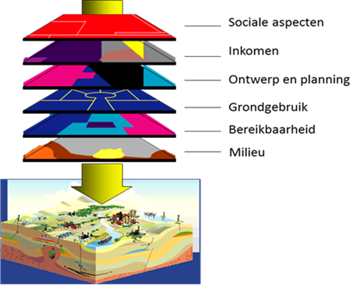
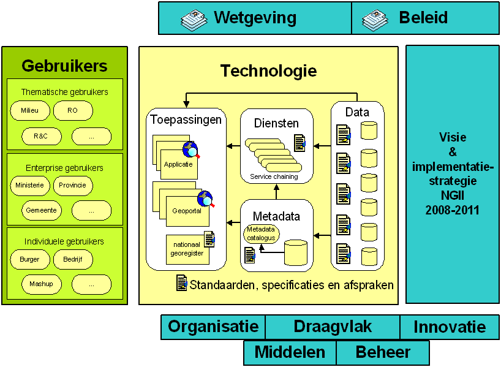
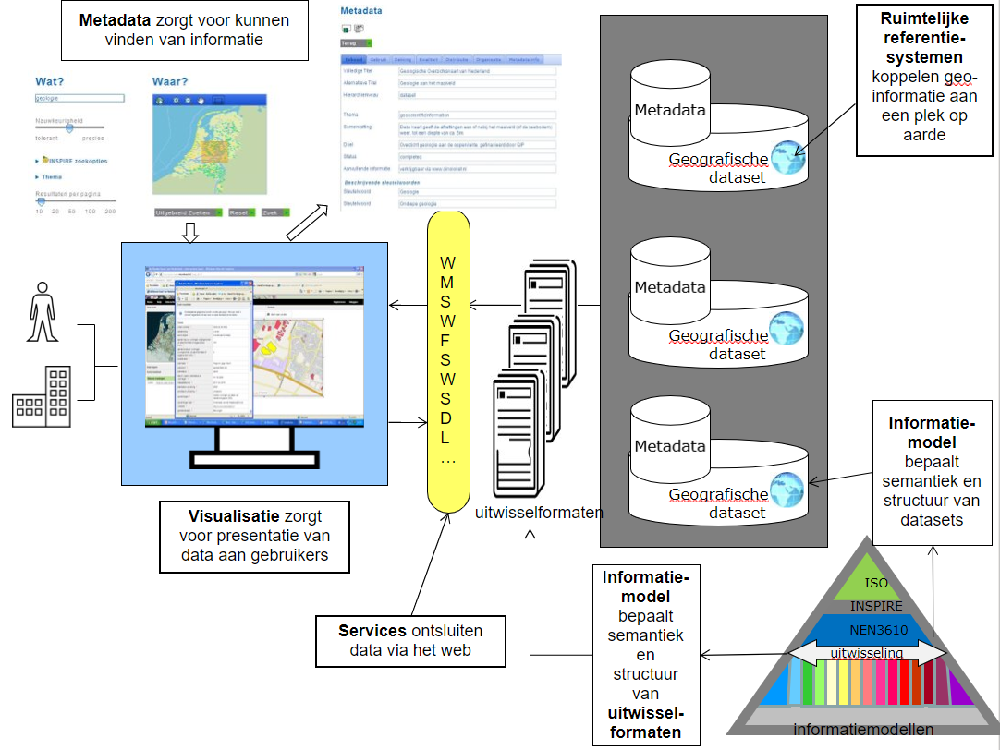
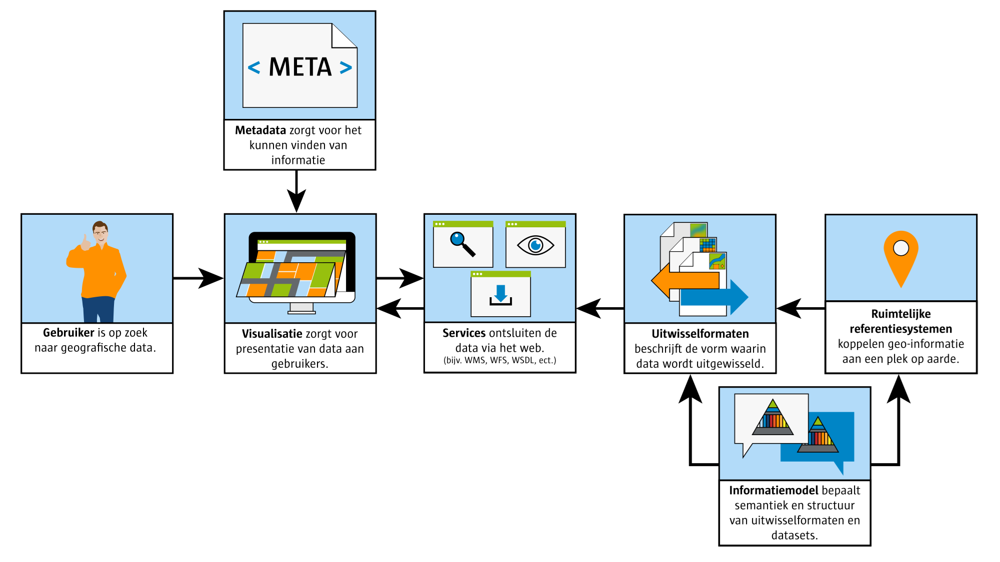

# Geo-standaarden in samenhang

Het doel van het Raamwerk van geo-standaarden is om uit de grote verscheidenheid
aan standaarden die er zijn voor geo-informatie, de juiste set te kiezen. In
combinatie kunnen deze geo-standaarden worden gebruikt om een Geo-Informatie
Infrastructuur te realiseren. In een dergelijke infrastructuur spelen ze ieder
een eigen rol.

## Wat is geo-informatie?

Geo-standaarden zijn er om met geo-informatie te kunnen werken. Denk hierbij
bijvoorbeeld aan het opslaan, uitwisselen, en presenteren van geo-informatie.
Maar wat is eigenlijk geo-informatie? Geo-informatie omvat alle plaatsgebonden
kenmerken van informatieobjecten. Alle informatie waarin een ruimtelijke
component is opgenomen kan worden beschouwd als geo-informatie. Met een
ruimtelijke component of kenmerk wordt een verwijzing naar een plek op de aarde
bedoeld. Dit kan een fysiek object zijn, zoals een gebouw of kanaal, een
administratieve eenheid, zoals een gemeente of postcode gebied of een abstract
gegeven als ‘woonomgevingbeleving’. Een locatie kan statisch of dynamisch zijn;
denk bij dit laatste bijvoorbeeld aan vluchtige informatie die slechts op een
bepaald moment relevant is (bijv. een sensormeting), of aan bewegende objecten.

De laatste jaren heeft het gebruik van geo-informatie in alledaagse
webtoepassingen een hoge vlucht genomen door de komst van bijvoorbeeld Bing
Maps, Google Earth, Google Maps en OpenStreetMap.

De kracht van geo-informatie zit in het gemak waarmee op basis van locatie
verschillende typen van informatie aan elkaar gerelateerd en met elkaar
vergeleken kunnen worden. Dit helpt mensen enorm bij het verkrijgen van inzicht
op basis van informatie en zorgt ervoor dat veel effectiever beslissingen kunnen
worden genomen.

Figuur 1 Thema relaties op basis van locatie

Ruimtelijke vragen worden constant gesteld. In de vorm van ‘Waar?’ en door van
een plek of locatie informatie op te vragen:

 Waar is ruimte om een nieuwe school te plaatsen in een wijk? En staat die niet
nabij coffeeshops en cafés?

 Wat zijn de openbare voorzieningen in de nabijheid van dit koop- of huurhuis?
En is er sprake van bodemverontreiniging in de tuin?

 Waar kan ik het meest nabij mijn afval wegbrengen?

 Welk gebied wordt met overstroming bedreigd?

 Waar staan de files?

 Waar is de woonomgevingbeleving het laagst?

Sommige van deze ‘Waar?’ en ‘Wat is daar?’ vragen kunnen eenvoudig worden
beantwoord, veel anderen zijn complexer te beantwoorden en vragen de combinatie
van verschillende geo-informatiebronnen van verschillende organisaties.

Bijvoorbeeld de ‘Waar?’ vraag van de school vereist tenminste:

 De locaties van de coffeeshops en cafés;

 De woonadressen van de huidige leerlingen;

 De mogelijkheden binnen het bestemmingsplan;

 Reistijd en afstand naar school.

## De Nederlandse Geo-Informatie Infrastructuur

Voor het oplossen van de ruimtelijke vraagstukken uit de vorige paragraaf is
toegang tot de betreffende geo-informatie een vereiste. Om deze geo-informatie
zo laagdrempelig mogelijk te ontsluiten is in Nederland de afgelopen jaren
gewerkt aan een geo-informatie infrastructuur.

Voor het verwezenlijken van een infrastructuur zijn standaarden onontbeerlijk:
Zij zorgen ervoor dat het wiel niet voor een tweede keer wordt uitgevonden en
dat er bij uitwisseling overeenstemming is tussen beide partijen over het
formaat en de betekenis van de uitgewisselde gegevens. Belangrijk daarbij is dat
het open standaarden betreft. Een open standaard is voor iedereen toegankelijk
en toekomstvast omdat toegang tot de standaard en beheer van de standaard bij
een non-profit organisatie zijn belegd. De in dit Raamwerk van geo-standaarden
benoemde standaarden zijn volledig open.

Conceptplaat weer opnemen?

## De Europese geo-informatie infrastructuur?

## Geo-standaarden volgens FAIR

Pm

## Geo-standaarden in samenhang

Voor het beantwoorden van ruimtelijke vragen zoals de voorbeelden in de vorige
paragraaf, is het meestal nodig om informatiebronnen van verschillende
organisaties met elkaar te combineren. Dit is niet mogelijk zonder standaarden.
De afgelopen twintig jaar is internationaal en nationaal gewerkt aan een set van
standaarden die het mogelijk maakt om de kracht van geo-informatie ten volle te
benutten.

Een geo-informatie infrastructuur is ervoor bedoeld om geo-informatie
beschikbaar te stellen en toegankelijk te maken voor gebruik.

Hiervoor zijn verschillende dingen nodig, zoals Figuur 2 laat zien:

 Het beschrijven van informatiebronnen met metadata, zodat de informatiebronnen
vindbaar worden.

 Het inrichten van web services, zodat geo-informatie via het web kan worden
geraadpleegd.

 Het definiëren van visualisatieregels, zodat geo-informatie op een eenduidige
manier wordt gepresenteerd aan gebruikers.

 Het beschrijven van de inhoud van informatiebronnen middels een
informatiemodel, zodat de semantiek en structuur bekend zijn.

 Het definiëren van uitwisselformaten, zodat duidelijk is in wat voor vorm de
geo-informatie wordt uitgewisseld.

 Het koppelen van geo-informatie aan een plek op het aardoppervlak met behulp
van een ruimtelijk referentiesysteem.

Voor al deze componenten van een geo-informatie infrastructuur (GII) zijn
standaarden beschikbaar.

Figuur 2 Geo-standaarden in samenhang

## Actormodel voor de GII

Welke actoren onderscheiden we en welke systeemfuncties?

### Het perspectief van de gebruiker

Om data te kunnen gebruiken, moet ik:

\- de betekenis van data kunnen begrijpen

\- data kunnen vinden en beoordelen op bruikbaarheid

\- aan kunnen sluiten op databronnen

\- data naar mij toe kunnen halen

\- data in kaartvorm kunnen begrijpen

\- data aan de juiste plek op aarde kunnen relateren

### Het perspectief van de aanbieder

Om mijn data te laten gebruiken, moet ik:

\- de betekenis van mijn data inzichtelijk maken

\- mijn data vindbaar en beoordeelbaar maken

\- mijn data toegankelijk maken

\- mijn data in voorspelbare formaten aanbieden

\- mijn data in kaartvorm eenduidig interpreteerbaar maken

\- mijn data aan de juiste plek op aarde relateren

## ‘Pas toe of leg uit’ lijst met open standaarden

De geo-standaarden, die op de pas toe of leg uit lijst staan zijn:

-   [ISO 19136:2007 Geographic information - Geography Markup Language
    (GML](http://www.iso.org/iso/iso_catalogue/catalogue_tc/catalogue_detail.htm?csnumber=32554))
-   [NEN 3610:2011 (nl) Basismodel Geo-informatie - Termen, definities, relatie
    s en algemene regels voor de uitwisseling van informatie over aan de aarde
    gerelateerde ruimtelijke
    objecten](http://www.nen.nl/web/Normshop/Norm/NEN-36102011-nl.htm)
-   [Nederlands profiel op ISO 19142 Geographic information - Web Feature
    Service, versie
    1.0.1](http://www.geonovum.nl/sites/default/files/nederlands_profiel_op_iso_19142_wfs_2.0_-_versie_1.0.1.pdf)
-   [Nederlands profiel op ISO 19128 Geographic information - Web Map Server
    Interface, versie
    1.0](http://www.geonovum.nl/sites/default/files/nederlands_profiel_op_iso_19128_wms_1.3_-_versie_1.0.pdf)
-   [Nederlands profiel op ISO 19115 voor geografie, versie
    1.2](http://www.geonovum.nl/sites/default/files/Nederlands%20metadata%20profiel%20op%20ISO%2019115%20voor%20geografie%20-%20v1%203%201%20def_0.pdf)
-   [Nederlands metadata profiel op ISO 19119 voor services, versie
    1.1](http://www.geonovum.nl/sites/default/files/Nederlands%20metadata%20profiel%20op%20ISO%2019119%20voor%20services%20-%20v1%202%201%20def.pdf)

Deze geo-standaarden zijn van primair belang in het aansluiten van
geo-informatie op de eOverheid. Bij het forum loopt een procedure om de huidige
versies op de pas toe of leg uit lijst te krijgen.

## Hiërarchie geo-standaarden

Voor nationale standaarden geldt dat deze ontwikkeld zijn op basis van Europese
en internationale standaarden met de voor Nederland geldende specifieke eisen.

In het raamwerk van geo-standaarden is dit op onderstaande manier aangegeven.

Tabel 2 - hierarchie standaarden

| **Internationale standaarden/specificaties** | **Europese profielen** | **Nederlandse profielen** |
|----------------------------------------------|------------------------|---------------------------|
|                                              |                        |                           |

Op het moment dat een nationale standaard is ontwikkeld geldt dat een nationale
standaard of specificatie leidend is. Is er geen nationale standaard, dan geldt
de Europese standaard en bij gebrek daaraan of omdat de internationale standaard
de Europese of nationale behoefte afdekt geldt een internationale, wereldwijde
standaard.

## 

## Verkenning

In de afgelopen tien jaar is duidelijk geworden dat data meer zijn dan het
bijproduct van specifieke werkprocessen die mogelijk geschikt zijn voor
hergebruik. Data zijn een essentiële grondstof. Dit vraagt om een frisse blik op
de mogelijkheden van onze data-infrastructuur.

Wanneer we data omzetten in informatie en informatie in kennis, dan worden data
een essentiële grondstof voor het maken van keuzes. In Europa vinden we het
daarbij belangrijk dat keuzeprocessen transparant zijn. Betrokken burgers moeten
overheidsbeleid kunnen controleren en er zelf actief aan kunnen bijdragen met
nieuwe initiatieven of alternatieven. Van een infrastructuur die laagdrempelig
toegang biedt tot individuele databronnen, verschuift de vraag naar een
infrastructuur die het kunnen combineren van data uit verschillende bronnen
ondersteunt. Het belang van zowel semantische als technische interoperabiliteit
neemt steeds verder toe.

"De Nederlandse Geo-informatie Infrastructuur is toe aan een upgrade” schreven
we in de Geonovum meerjarenvisie 2021-2023. Hoe kan de NGII een upgrade krijgen
richting een vraaggedreven infrastructuur, die de kracht van locatiedata
laagdrempelig inzetbaar maakt voor de grote maatschappelijke opgaven? Welke
(nieuwe) standaarden spelen daarbij een rol? Hoe hangen allerlei afzonderlijke
ontwikkelingen eigenlijk met elkaar samen? En hoe verhoudt de NGII 2.0 zich
bijvoorbeeld tot een Nationale Digital Twin Infrastructuur? En hoe verhouden die
ontwikkelingen zich toch Europese ontwikkelingen rond data en digitalisering? In
deze white paper zoeken we antwoorden op die vragen. En omdat die antwoorden
meer waarde hebben, wanneer ze breed gedragen worden in het werkveld, is deze
white paper ook in publieke consulatie gebracht en vervolgens aangescherpt.

Eind 2021 heeft Geonovum een visie op de Nederlandse geo-informatie
infrastructuur geschetst: [Whitepaper Visie op upgrade Nederlandse
Geo-informatie Infrastructuur
(NGII)](https://docs.geostandaarden.nl/ngii/wpungii/).
