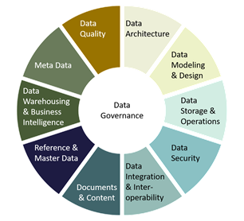
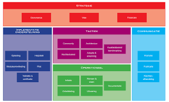
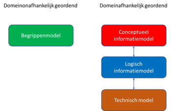
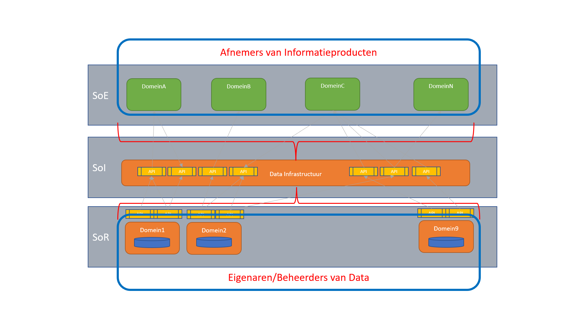
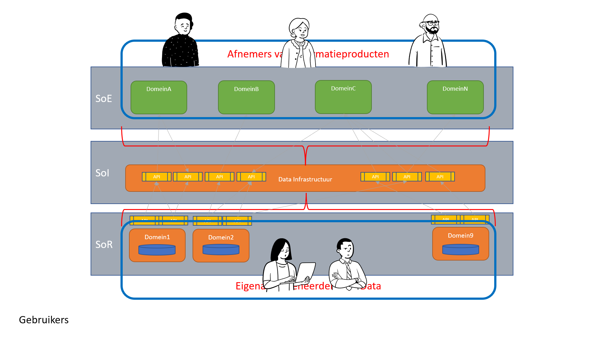
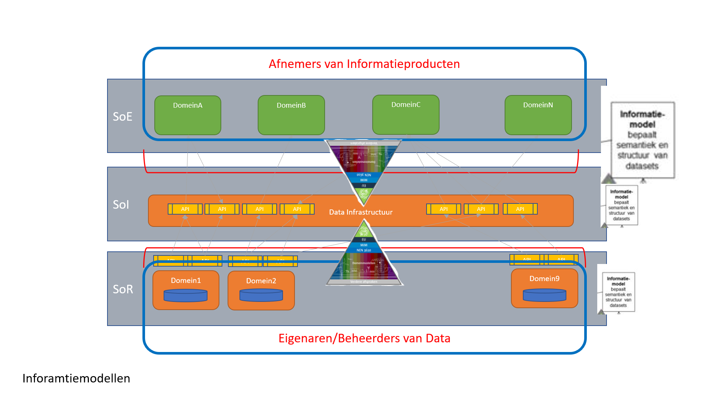
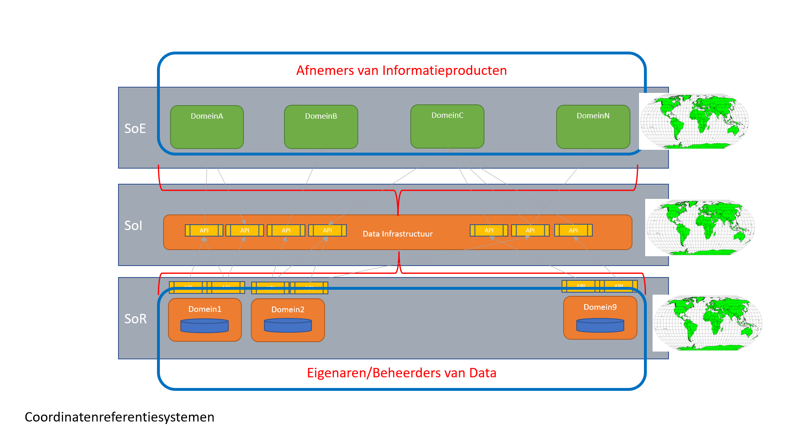
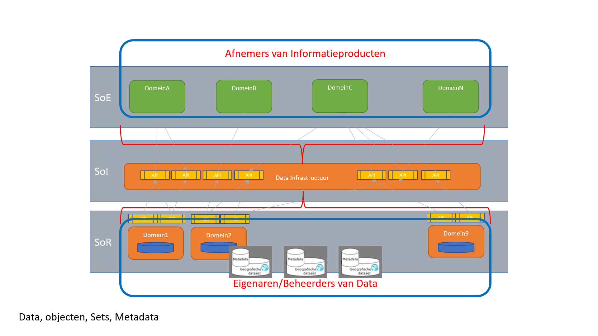
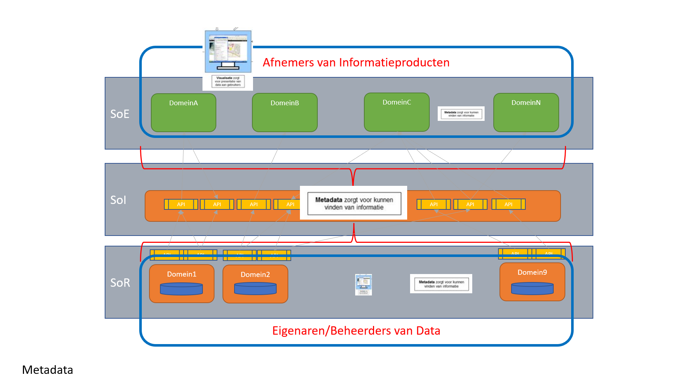
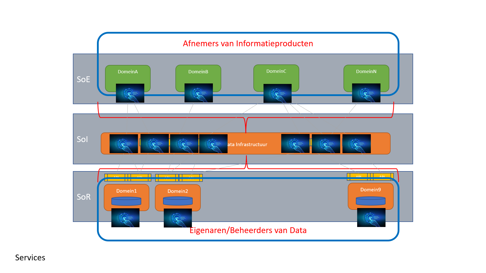

# Geo-standaarden in samenhang

Het doel van het Raamwerk van geo-standaarden is om uit de grote verscheidenheid aan standaarden die er zijn voor geo-informatie, de juiste set
te kiezen. In combinatie kunnen deze geo-standaarden worden gebruikt om **'onder Architectuur'** een Geo-Informatie Infrastructuur te realiseren. In een dergelijke infrastructuur speelt elke standaard een eigen rol, maar uiteraard wel in samenhang met de andere standaarden.

## Internationale standaarden
Voor onze nationale (geo)standaarden geldt dat deze ontwikkeld zijn op basis van Europese en internationale standaarden met de voor Nederland geldende specifieke eisen.

Op het moment dat een nationale standaard is ontwikkeld geldt dat een nationale standaard of specificatie leidend is. Is er geen nationale standaard, dan geldtde Europese standaard en bij gebrek daaraan of omdat de internationale standaardde Europese of nationale behoefte afdekt geldt een internationale, wereldwijde
standaard.

Internationaal zijn voor Nederland de [ISO/TC 211  Geographic information/Geomatics](https://www.iso.org/committee/54904.html), het [Open Geospatial Consortium](https://www.ogc.org/) (OGC) en het [World Wide Web Consortium](https://www.w3.org/) (W3C) van groot belang. ISO/TC211 en het OGC maken als standaardisatie organisaties technische geo-standaarden, die Nederland semantisch en technisch invult. Deze geo-standaarden organisaties hebben
uiteraard weer liaisons met de algemene ICT en Internet standaardisatie organisaties zoals het W3C. Geonovum participeert namens Nederland actief in deze internationale geo-standaarden organisaties.

De Europese profielen zijn opgesteld op basis van internationale standaarden en zijn verankerd in de Europese [INSPIRE](https://inspire.ec.europa.eu/) kaderrichtlijn. De Europese profielen zijn een nadere invulling van de andere standaarden organisaties en de INSPIRE data specificaties voor de thema’s hebben een duidelijke relatie met de informatiemodellen in Nederland. Dit zijn de INSPIRE technical guidelines, ISO of OGC standaarden die door INSPIRE zijn voorgeschreven, en Nederlandse profielen die compliant zijn met INSPIRE. Hoewel INSPIRE formeel geen geo-standaarden organisatie is, worden de invoeringsregels van INSPIRE wel als zodanig gebruikt in Nederland.

Tot slot, zijn Nederlandse profielen te onderscheiden, die ook gebaseerd zijn of opgelijnd zijn met de internationale en Europese profielen. Een deel van de Nederlandse geo-standaarden profielen heeft een aparte positie op de ['pas toe of leg uit'](https://www.forumstandaardisatie.nl/open-standaarden) lijst van open standaarden van de Nederlandse digitale overheid. Deze geo-standaarden zijn van primair belang in het aansluiten van geo-informatie op de digitale overheid (voorheen e-overheid).

## NORA - Nederlandse Overheids Referentie Architectuur
De geo-standaarden moeten passen binnen de architectuur van organisaties.
Aangezien dat meestal overheden zijn, kunnen en willen wij niet om de Nederlandse
Overheids Referentie Architectuur (NORA) heen. 

NORA onderkent 5 lagen:
- De [Grondslagenlaag](https://www.noraonline.nl/wiki/Grondslagenlaag)
- De [Organisatorische laag](https://www.noraonline.nl/wiki/Organisatorische_laag)
- De [Informatielaag](https://www.noraonline.nl/wiki/Informatielaag)
- De [Applicatielaag](https://www.noraonline.nl/wiki/Applicatielaag)
- De [Netwerklaag](https://www.noraonline.nl/wiki/Netwerklaag)

De [NORA](https://www.noraonline.nl/) is een architectuur raamwerk is een verzameling van [10 basisprincipes](https://www.noraonline.nl/wiki/Basisprincipes_totaaloverzicht) die, als je ze ziet, al heel herkenbaar zijn voor ons. Principes als Vindbaarheid, Toegankelijkheid, Transparantie en Standaard zijn principes die wij van nature al toepassen op onze producten. NORA stelt de “[pas-toe-of-leg-uit](https://www.forumstandaardisatie.nl/open-standaarden)” lijst van het Forum Standaardisatie verplicht. Overheden zijn daarmee verplicht om bij aanschaf van IT systemen eerst op die lijst te kijken. Onze standaarden staan deels ook op die lijst (de basisset generiek geo-standaarden), en daarmee geven we via de grondslagenlaag van NORA o.a. invulling aan het “verankeren” uit ons missie statement (verkent, verbindt, verankert).

## Architectuur principes

### FAIR Principes

Op eenduidige manieren samenwerken om informatie zo beter te kunnen beveiligen,
makkelijker uit te wisselen en toegankelijker te maken voor iedereen. Dat is hoe
open standaarden de samenwerking bevorderen tussen de overheid, burger en het
bedrijfsleven. De [FAIR Principes](https://www.go-fair.org/fair-principles/)
zijn een hulpmiddel daarin: het doel van de principes is het hergebruik van
waardevolle data mogelijk maken. De FAIR Principes dwingen geen standaarden af,
maar moedigen communities aan om data en diensten vindbaar, toegankelijk,
interoperabel en herbruikbaar te maken.

De geo-standaarden maken geo-informatie FAIR: De verbindende kracht van standaardisatie in vindbare, toegankelijke, uitwisselbare en herbruikbare geo-informatie.

**Findable** (vindbaar). De eerste stap bij het (her)gebruiken van data is om de
data te vinden. Metadata en data moeten gemakkelijk te vinden zijn voor zowel
mensen als computers. Machine-readable metadata zijn essentieel voor het ontdekken van data.

**Accessible** (toegankelijkheid). Zodra de gebruiker de benodigde data heeft
gevonden, moet hij/zij weten hoe deze kunnen worden geraadpleegd, inclusief authenticatie en autorisatie.

**Interoperable** (interoperabel). De data moeten meestal worden geïntegreerd met
andere gegevens. Bovendien moeten de gegevens samenwerken met applicaties of workflows voor analyse, opslag en verwerking.

**Reusable** (herbruikbaar), Het uiteindelijke doel van FAIR is het hergebruik van
data te optimaliseren. Om dit te bereiken moeten metadata en data goed worden beschreven, zodat ze in verschillende situaties kunnen worden gerepliceerd en/of gecombineerd.

### DAMA DMBOK Principes

Er is veel (geo)data beschikbaar binnen de overheid. Zaak dus dat deze data goed wordt gemanaged. Rondom datamanagement is [DAMA](https://www.dama.org/cpages/mission-vision-purpose-and-goals) opgericht. DAMA International is een non-profit, leverancieronafhankelijke, wereldwijde vereniging van technische en zakelijke professionals die zich toelegt op het bevorderen van de concepten en praktijken van informatie- en gegevensbeheer.

De DAMA Cirkel onderkent een aantal gebieden die van belang zijn om data en informatie goed te kunnen managen. Zaken als data-kwaliteit, Data Integratie en Interoperabiliteit staan uiteraard in deze cirkel.

### BOMOS Principes

Hoort BOMOS ook in dit rijtje thuis? Jazeker, immers een niet beheerde standaard is geen standaard! Op levende standaarden komen wijzigingsverzoeken binnen, en juist omdat het om eenstandaard gaat moet die wijziging met de nodige zorg worden gedaan. [BOMOS](https://www.logius.nl/diensten/bomos) biedt daarvoor overzicht, modellen, handreikingen en praktische tips.

Hoe wij binnen Geonovum BOMOS gebruiken staat beschreven in onze [beheerdocumentatie](https://docs.geostandaarden.nl/gbd/gsb/)

### MIM Principes

 

Wanneer we informatie over bepaalde onderwerpen willen inwinnen, registreren of uitwisselen, dan is het van belang om deze informatie eerst goed te beschrijven. We doen dit zodat het voor eenieder die met de informatie aan de slag gaat helder en eenduidig is

MIM onderkent 4 lagen:
- [Model van begrippen](https://www.noraonline.nl/wiki/MIM_conceptueel_framework#Model_van_begrippen)
- [Conceptueel Informatiemodel](https://www.noraonline.nl/wiki/MIM_conceptueel_framework#Conceptueel_informatiemodel)
- [Logisch model (ook wel gegevensmodel)](https://www.noraonline.nl/wiki/MIM_conceptueel_framework#Logisch_informatie-_of_gegevensmodel)
- [Datamodel (ook wel Fysiek of Technisch model)](https://www.noraonline.nl/wiki/MIM_conceptueel_framework#Fysiek_of_technisch_gegevens-_of_datamodel) 

### NGII Principes

Voor het oplossen van de ruimtelijke vraagstukken is toegang tot de betreffende geo-informatie een vereiste. Om deze geo-informatie zo laagdrempelig mogelijk te ontsluiten is in Nederland de afgelopen jaren gewerkt aan een Nationale Geo-Informatie infrastructuur (NGII). De NGII als concept is het geheel van geo-informatie(bronnen), metadata, standaarden, voorzieningen, netwerkdiensten, organisatie en afspraken voor de efficiënte uitwisseling van en toegang tot geo-informatie. 

Belangrijke eigenschappen (inrichtingsprincipes) van de NGII zijn:
**1 Bron, 1 Waarheid** Hiermee wordt bedoeld dat data slechts 1 maal wordt opgeslagen, en op meervoudig gebruikt wordt. 

**Scheiding applicaties, voorzieningen en data** Data hoort niet opgesloten te zitten in applicaties. Data is veel belangrijker dan applicaties, en bestaat ook langer dan de meeste applicaties. Een applicatie gaat gemiddeld 10 tot 15 mee, terwijl sommige data meer dan 100 jaar oud is. 

**Uitwisseling en presentatie via open standaarden** Het uitwisselen van data moet zoveel mogelijk met open standaarden worden gedaan. Daarmee wordt de kans dat data ontoegankelijk wordt omdat een standaard niet meer beschikbaar is een heel stuk kleiner.

## Het 3-laags pacelayer model

Een model waarin de bovenstaande principes worden gebruikt is het 3-laags pacelayermodel. Dit model ontkoppelt data en applicaties, data-silo's komen in het model niet voor, er wordt een duidelijk onderscheid gemaakt tussen data en informatie, en het bijhouden van data, het bewerken van data tot informatie en het gebruiken van de informatieprodcuten. De 3 lagen in dit model zijn Het System of Records, het System of Integration en het System of Engagement. 

**SoR - System of Records**
In het System of Records vind de registratie van (geo)data plaats. Bij registreren is het datakwaliteit heel belangrijk. Om die kwaliteit te borgen werken standaarden, informatiemodellen en applicaties nauw samen. De data-eigenaar (uit DAMA) heeft een belangrijke rol, immers hij/zij bepaalt welke data wordt geregistreerd bij een obect, en aan welke kwaliteitseisen de data moet voldoen.

**SoI - System of Integration**
In de laag boven de SoR wordt data gecombineerd en/of verwerkt tot informatieprodcuten. Op die manier ontstaat een geintegreerd beeld van de verschillenden objecten. Ook hier speelt de data-eigeaar een belangrijke rol. Immers de data eigenaar bepaalt wat er met de data kan en mag gebeuren. Daarbij zijn principes als datakwalitiet belangrijk, maar ook is (data) privacy en (data)security hier belangrijk.

**SoE - System of Engagement**
In de laag boven de SoI worden de informatieproducten uit de SoI gebruikt en gepresenteerd aan de afnemers van die informatieproducten. 

**API's**
Om een echte ontkoppeling tussen data en applicaties te bewerkstelligen vind alle 'transport' van data en informatie plaats via API's - Application Programming Interface's. Er is een [API-Strategie voor de Nederlandse Overheid](https://docs.geostandaarden.nl/api/API-Strategie/)

## Het raamwerk Geostandaarden geplot op het pacelayermodel
In deze paragraaf worden de verschillende onderdelen van de NGII 'geplot' op het pacelayermodel. Dat geeft meteen een indicatie van 'waar' in het landschap een bepaalde component een rol speelt. Verderop in het document wordt dan op de individuiele componenten ingegaan.

### Gebruikers

De gebruikers, de belangrijkste 'componenten' van de architectuurplaat! Immers daar doen we het allemaal voor. De Architectuur en alle componenten zijn erop gericht om een goede informatieverstrekking te kunnen doen. Informatie waarop beslissingen worden gebaseerd. Gebruikers kunnen op allerlei verschillende manieren toegang krijgen tot de informatie. Denk hierbij aan viewers, dashboards, rapportages enz. Het medium maakt niet uit, zolang er maar dezelfde informatie wordt gegeven.

Gebruikers zijn in te delen in verschillende categorieen. Die catgorieen passen op de 3 lagen van het pacelayermodel.

**Gebruikers in het SoR**
Geplot op de 3 lagen zitten in het SoR de 'producenten' van data. Gebruikers in de SoR hebben vaak specialistische applicaties waarmee de data wordt ingevoerd. Alles is gericht op een snelle en foutloze invoer van data. Opslag en Uitwissel formaten van data zijn ook gericht op kwaliteit.

**Gebruikers in het SoE**
Gebruikers in het SoE zijn echte afnemers van informatie. Data wordt door hen niet bewerkt. Denk aan de gebrikers van een viewer, of de lezers van een rapport.

**Gebruikers in het SoI**
In het SoI wordt data verwerkt tot informatie. Data uit één of meerdere bronnen wordt gevalidideerd, gecombineerd, gefilterd, geaggregeerd, er vinden berekeningen plaats, er zijn modellen. Het resultaat is een informatieproduct. Gebruikers in het SoI zijn data-analisten, data-scientists, leveranciers, enz 

### Informatiemodellen

Informatiemodellen zorgen ervoor dat iedereen elkaar begrijpt. Het begint bij een gemeenschappelijke begrippenlijst. 

Lees meer over [Informatiemodellen](#informatiemodellen-0)

### Coordinaatreferentie systemen

Coorddinaatreferentie systemen (CRS) komen in alle 3 de pacelayers voor. Er wordt data geregistreerd in een bepaald CRS, bijvoorbeeld het RD stelsel. Data wordt getransformeerd naar een CRS, bijvoorbeeld WGS84 of ETRS89. Data wordt geserveerd in een bepaald CRS. Dát er in verschillende CRS'en wordt geregistreerd is helemaal niet erg, zolang er maar wel gebruik gemaakt wordt van een standaard omrekening. Bijvoorbeeld RDNAPTRANS.

Lees meer over [Coordinaatreferentie systemen](#coordinaat-referentiesystemen)

### Data

### MetaData

Lees meer over [Metadata](l#metadata-0)

### API's

Lees meer over [API's](l#application-programming-interfaces-api-s)

## Verkenning NGII

In de afgelopen tien jaar is duidelijk geworden dat data meer zijn dan het
bijproduct van specifieke werkprocessen die mogelijk geschikt zijn voor
hergebruik. Data zijn een essentiële grondstof. Dit vraagt om een frisse blik op
de mogelijkheden van onze data-infrastructuur.

Wanneer we data omzetten in informatie en informatie in kennis, dan worden data
een essentiële grondstof voor het maken van keuzes. In Europa vinden we het
daarbij belangrijk dat keuzeprocessen transparant zijn. Betrokken burgers moeten
overheidsbeleid kunnen controleren en er zelf actief aan kunnen bijdragen met
nieuwe initiatieven of alternatieven. Van een infrastructuur die laagdrempelig
toegang biedt tot individuele databronnen, verschuift de vraag naar een
infrastructuur die het kunnen combineren van data uit verschillende bronnen
ondersteunt. Het belang van zowel semantische als technische interoperabiliteit
neemt steeds verder toe.

"De Nederlandse Geo-informatie Infrastructuur is toe aan een upgrade” schreven
we in de Geonovum meerjarenvisie 2021-2023. Hoe kan de NGII een upgrade krijgen
richting een vraaggedreven infrastructuur, die de kracht van locatiedata
laagdrempelig inzetbaar maakt voor de grote maatschappelijke opgaven? Welke
(nieuwe) standaarden spelen daarbij een rol? Hoe hangen allerlei afzonderlijke
ontwikkelingen eigenlijk met elkaar samen? En hoe verhoudt de NGII 2.0 zich
bijvoorbeeld tot een Nationale Digital Twin Infrastructuur? En hoe verhouden die
ontwikkelingen zich toch Europese ontwikkelingen rond data en digitalisering? In
deze white paper zoeken we antwoorden op die vragen. En omdat die antwoorden
meer waarde hebben, wanneer ze breed gedragen worden in het werkveld, is deze
white paper ook in publieke consulatie gebracht en vervolgens aangescherpt.

Eind 2021 heeft Geonovum een visie op de Nederlandse geo-informatie
infrastructuur geschetst: [Whitepaper Visie op upgrade Nederlandse
Geo-informatie Infrastructuur
(NGII)](https://docs.geostandaarden.nl/ngii/wpungii/).
