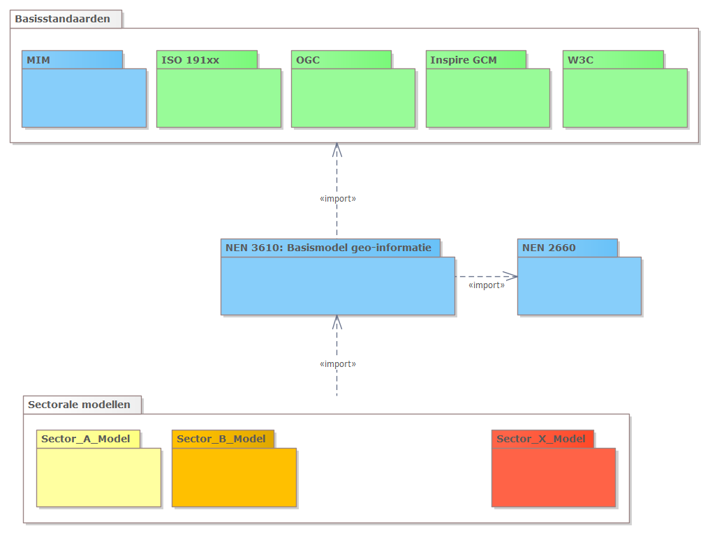
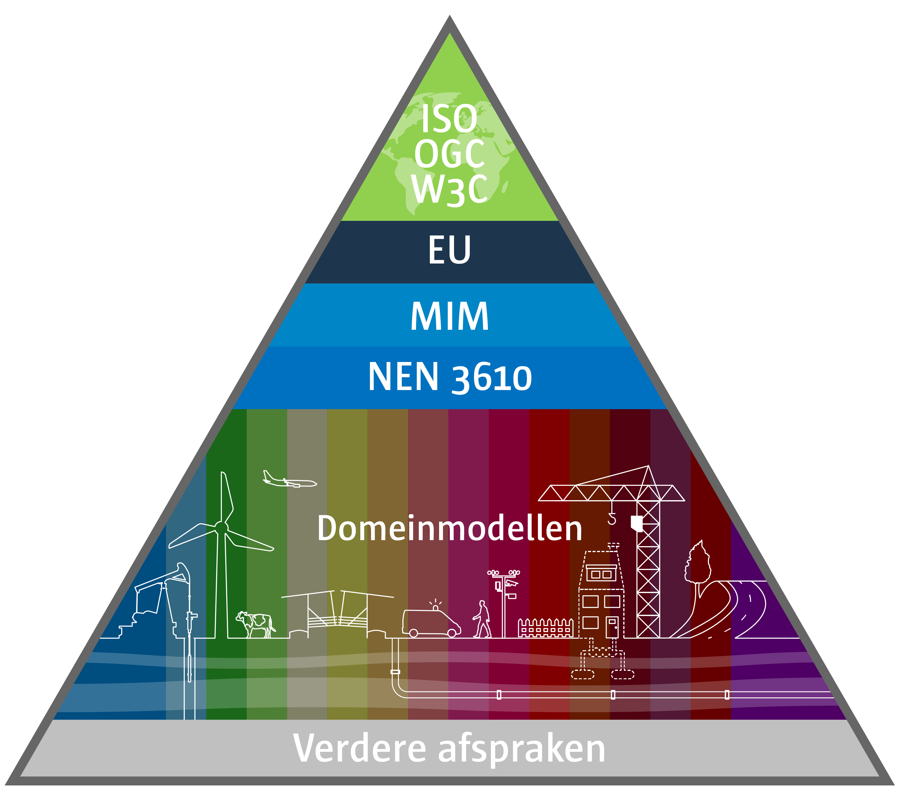

# Informatiemodellen

**Een informatiemodel, ook wel dataspecificatie genoemd, zet schematisch de
afspraken over begrippen en definities van gegevens binnen een bepaald domein op
een rij. Dit vereenvoudigt de uitwisseling en hergebruik van informatie. In dit hoofdstuk
beschrijven we de geostandaarden die de basis vormen van de modellen en
beschrijvingen van geo-informatie.**

## NEN 3610 - Stelsel van informatiemodellen

Informatiemodellen specificeren de informatieinhoud van dataproducten die middels de NGII worden gepubliceerd. Dataproducten zijn daarbij de datasets of dataservices die binnen de context van sectorale domeinen worden aangeboden. Het informatiemodel en de daarop gebaseerde data zijn altijd een representatie van de werkelijkheid. De data of de registraties daarvan hebben als doel die werkelijkheid beter te kunnen begrijpen te beheren en of te sturen. Het is voor de semantische - en technische interoperabiliteit van belang dat informatiemodellen wat betreft methode en inhoud op elkaar zijn afgestemd. Het NEN 3610 - Stelsel van informatiemodellen heeft dat als doel. NEN 3610:2022 is de basisstandaard voor het opstellen van informatiemodellen en geeft regels voor het eenduidig beschrijven, uitwisselen en op het web publiceren van geo-informatie binnen de NGII. NEN 3610 bekijkt deze infrastructuur vanuit het informatieperspectief door middel van informatiemodellen.

De focus ligt op semantische interoperabiliteit. Semantische interoperabiliteit wordt gerealiseerd door het harmoniseren van termen en definities gehanteerd door verschillende sectoren en door een gemeenschappelijke reeks van regels, concepten en modelleerpatronen voor het modelleren van de geografische werkelijkheid. NEN 3610 biedt een basis voor verdere uitwerking in sectorale modellen waardoor interoperabiliteit mogelijk wordt voor uitwisseling van geo-informatie binnen en tussen sectoren.

NEN 3610 positioneert informatiemodellen in het bredere kader van een open en toegankelijke semantische architectuur bestaande uit begrippenkaders, informatiemodellen, ontologieën en daarvoor ontworpen registers.

De gebruiker is de informatiearchitect en informatiemodelleur die georegistraties en bijbehorende informatiemodellen ontwerpen.

NEN 3610 is afgestemd met internationale standaarden en gebruikt als metamodel de de Nederlandse standaard voor
meta-informatiemodelering, het MetaMetamodel Informatiemodellering [MIM]. NEN 3610 heeft een relatie met de NEN 2660:2022 - Regels voor informatiemodellering van de gebouwde omgeving. Beide zijn op elkaar afgestemd. Onderstaand figuur geeft schematische de relaties tussen overkoepelende standaarden, NEN 3610 en sectorale informatiemodellen weer.

<figure id="Figuur_x">

<figcaption>UML Packagediagram van relatie tussen nationale normen – internationale normen – NEN 3610 – sectorale modellen</figcaption>
</figure>

<figure id="Figuur_x">

<figcaption>Vorige figuur weergegeven in de 'NEN 3610 - piramide'</figcaption>
</figure>

## Overzicht standaarden informatiemodellen voor Nederland

NEN 3610 heeft zijn toepassing in een groeiende aantal sectorale informatiemodellen en omvat
circa 25 Nederlandse informatiemodellen, zoals voor de toepassingsdomeinen water
(IMWA), openbare ruimte (IMBOR, IMSW), milieu (IMGeluid, IMAER), natuurbeheer
(IMNA), verkeer en vervoer (IMWV,) kabels en leidingen (IMKL) en openbare orde
en veiligheid (IMOOV, IMDBK, IMEV). Ook maken enkele basisregistraties voor de
e-overheid deel uit in de NEN 3610 familie, zoals de basisregistraties adressen
en gebouwen (BAG/IMBAG), grootschalige topografie (BGT/IMGEO), topografie
(TOP10NL/IMTOP), kadastrale percelen, (BRK/IMKAD) en ondergrond (BRO/IMBRO). Elk van deze informatiemodellen fungeert als een informatiestandaard voor het uitwisselen van geo-informatie binnen die sector of domein.

De Europese informatiestandaarden en informatiemodellen daarin – vnl. afkomstig uit de INSPIRE Richtlijn – zijn een toepassing van de ISO 19100 serie van geo-standaarden. Doordat NEN 3610 hier ook aan conformeert is de structuur en opbouw van de Europese infromatiestandaarden vergelijkbaar met het Nederlandse stelsel. De Europese informatiestandaarden zijn geïmplementeerd aan de aan hand 34
inhoudelijke thema’s, waarvoor data specificaties zijn opgesteld. Nederlandse
datasets worden conform deze Europese data specificaties in de Europese
geo-informatie infrastructuur beschikbaar gesteld.

*Tabel 1 - Standaarden en specificaties met betrekking tot informatiemodellen in Nederlandse en internationale context*

| **Internationale standaarden/specificaties**                                                                                                     | **Europese profielen**                                                   | **Nederlandse profielen**                             |
|--------------------------------------------------------------------------------------------------------------------------------------------------|--------------------------------------------------------------------------|-------------------------------------------------------|
| ISO 19101 Geographic Information – Reference model **[ISO19101]**                                                                                | INSPIRE: Generic Conceptual Model **[INSGCM]**                           | MIM - Metamodel Informatie Modellering **[MIM]**
NEN 3610:2022 Basismodel Geo-informatie. **[NEN3610]**      |
| ISO/TS 19103 Geographic Information - Conceptual schema language **[ISO19103]** ISO 19108 Geographic information -Temporal Schema **[ISO19108]** | INSPIRE: Methodology for the development of data specifications [INSMDS] | MIM - Metamodel Informatie Modellering **[MIM]** NEN 3610:2012 Basismodel Geo-informatie. **[NEN3610]** |
| ISO 19107 Geographic information - Spatial Schema **[ISO19107]** | | NEN 3610:2022 Basismodel Geo-informatie. **[NEN3610]** [Geometrie in model en
    GML](https://docs.geostandaarden.nl/nen3610/gimeg/) |
| ISO 19108 Geographic information - Temporal Schema **[ISO19108]** | INSPIRE: Methodology for the development of data specifications [INSMDS] | |
| ISO 19109 Geographic information - Rules for application schema **[ISO19109]**                                                                   | INSPIRE: Guidelines for the encoding of spatial data **[INSGEN]**        |  MIM - Metamodel Informatie Modellering **[MIM]**
NEN 3610:2022 Basismodel Geo-informatie. **[NEN3610]**                    |
| ISO 19110 Geographic information - Methodology for feature cataloguing **[ISO19110]**                                                            | INSPIRE Feature Concept Dictionary **[INSFCD]**                          |                                                       |
| ISO 19118 Geographic Information – Encoding **[ISO19118]**                                                                                       | INSPIRE glossary **[INSG]**                                              |                                                       |
| ISO 19131 Geographic Information - Data product specification **[ISO19131]**                                                                     | INSPIRE Data specifications **[INSDS]**                                  |                                                       |
| ISO 19136 Geographic Information - Geography Markup Language (GML) **[ISO19136]**                                                                |                                                                          |                                                       |
| Observations and Measurements - Part 1 - Observation Schema 1.0.0 **[OaM1]**                                                                     |                                                                          |                                                       |
| Observations and Measurements - Part 2 - Sampling Features 1.0.0 **[OaM1]**                                                                      |                                                                          |                                                       |
| OpenGIS City Geography Markup Language (CityGML) Encoding Standard, version 2.0 **[CityGML]**                                                    |                                                                          |                                                       |

## Semantische samenhang

Afstemming tussen begrippenkaders verhoogt de effectiviteit van informatievoorzieningen. Er zijn een aantal mechanismen om die afstemming te sturen.
- NEN 3610 heeft een semantisch model dat de werkelijkheid indeeld naar generieke begrippen (of UML superklassen) van reëel object en virtuele ruimte, met daaronder een verdeling naar bijvoorbeeld bodem, water, begroeiing, functionele ruimte, juridische ruimte. Sectorale modellen zijn verplicht om hun begrippen hieraan te koppelen.
- Informatiemodellen publiceren hun begrippen in registers. Registers worden via het web ontsloten. De door Geonovum ingerichte [conceptenbibliotheek](https://definities.geostandaarden.nl/nl/) is daar een voorbeeld van.
- Samenwerking en afstemming tussen secorale modellen.
- Knowledge graphs worden ontwikkeld om begrippenkaders aan elkaar te verbinden.

## Kwaliteit van informatiemodellen

Informatiemodellen zijn nog geen data en kunnen daarom alleen op conceptueelniveau op kwaliteit beoordeeld worden. Er zijn een aantal mechanismen om de kwaliteit te borgen.

-	NEN 3610 conformiteit. NEN 3610 bevat een abstracte testsuite voor het testen van de conformiteit van een informatiemodel aan NEN 3610. De regels en aanbevelingen van NEN 3610 zijn daarin vertaald naar conformiteitsklassen.

-	Er is een NEN 3610 template beschikbaar voor UML modellering in Enterprise Architect.

-	Publicatie en implementatie van een NEN 3610 model in implementatie schema's wordt ondersteund door tooling. In de tooling zit een test op MIM conformiteit.

-   [Handreiking Geometrie in model en
    GML](https://docs.geostandaarden.nl/nen3610/gimeg/)

    Er is een handreiking [Geometrie in model en
    GML](https://docs.geostandaarden.nl/nen3610/gimeg/) beschikbaar. Deze
    handreiking beschrijft de toepassing van geometrie in informatiemodellering
    en de implementatie daarvan in GML. Het is daarmee een ondersteuning voor de
    toepassing van het basismodel geo-informatie (NEN3610) en GML. De
    handreiking geeft onder meer uitleg over welke geometrieën er zijn, Simple
    feature profielen en transformatieregels voor het kunnen genereren van GML
    uit UML.
