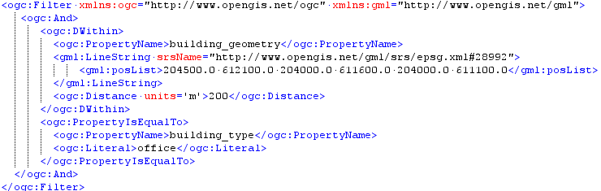
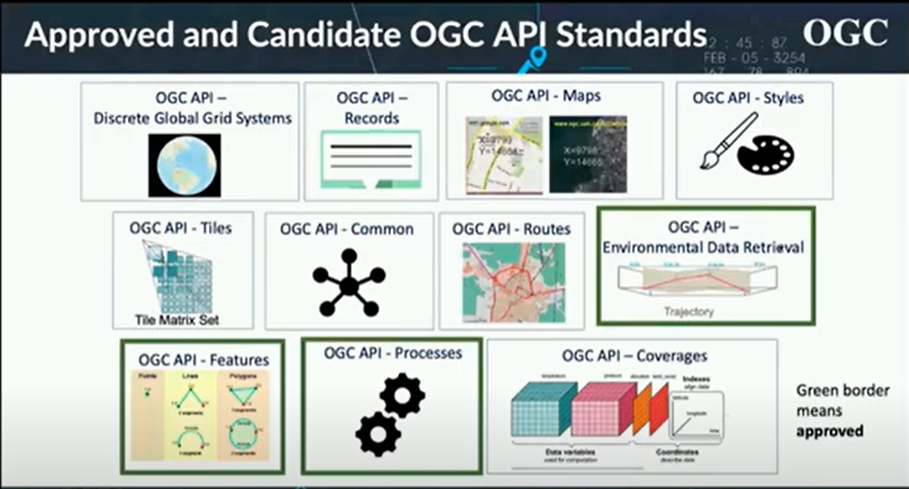

# Services

## Wat zijn services?

### Wat is een Application Programming Interface?

API’s (Application Programming Interfaces) spelen een belangrijke rol op het
Internet. Met behulp van een API kan je informatie makkelijker herbruikbaar
maken voor programmeurs. Een API dient als interface tussen verschillende
softwareprogramma's. Het zorgt ervoor dat een applicatie automatisch toegang
krijgt tot bepaalde informatie en/of functionaliteiten. Een aantal aanbieders
van open data bij de overheid, ontsluiten hun gegevens al met behulp van een
API. Deze API’s leveren in veel gevallen een rechtstreekse “kopie” van de data,
met alle complexiteit van dien.

Om de geo-informatie te kunnen vinden, raadplegen, en downloaden, zijn er web
services. Er zijn verschillende soorten services, bijvoorbeeld

• de discovery service voor het vinden van geo-informatie op basis van metadata;

• de view service voor het bekijken van geo-informatie op het web;

• de download service om geo-informatie te verkrijgen.

Onderstaande indeling gaat uit van de bij de API toegepaste 'language' style:

-   Tunnel Style: XML-RPC, SOAP, gRPC, Avro

-   Resource Style: OpenAPI/Swagger, RAML, API Blueprint

-   Hypermedia Style: HAL, Siren, Atom, HATEOAS

-   Query Style: GraphQL, OData, SPARQL

-   Event-based Style: MQ, WebSub, MQTT, XMPP, AMQP, Kafka, AsyncAPI

Ook de geo-standaarden voor API’s kennen een diverse oorsprong en ‘taal’. Zo treffen we in het overzicht van de API geo-standaarden nagenoeg alle API taalstijlen aan: tunnelstijl (OGC WMS en OGC WFS), resource style met de OGC API Features enzo, hypermedia style (INSPIRE ATOM feeds voor bulkdownload), Query style (geoSPARQL) en Even-based APi zoals de SensorThings API die MQTT ondersteunt (INSPIRE good practise). In de volgende paragraaf zijn de verschillende API geo-standaarden kort (functioneel) toegelicht.

## Overzicht geo-standaarden API’s

pm

## Mijn data toegankelijk maken

Een API bevragen

## Ontsluiten via web services

Web services uitleggen conform?

In deze paragraaf worden de services voor geo-informatie beschreven. Voor de
services wordt een overzicht gegeven van de te gebruiken standaarden voor
GI-services.

### Web Map Service

Een Web Map Service (WMS) is een webgebaseerde kaart-service. Het genereert een
kaartuitsnede van geo-informatie en stelt dat via het web beschikbaar. De
ge-georefereerde geo-informatie wordt in een raster formaat beschikbaar gesteld,
zoals PNG, GIF of JPEG en daarmee is het hanteerbaar in de gangbare browsers.
Indien gewenst kunnen de ‘kaarten’ ook in een vectorformaat zoals SVG
beschikbaar worden gesteld. De WMS specificatie is een eenvoudige specificatie
en daardoor ook zeer veel gebruikt.

De WMS-standaard definieert de volgende drie operaties:

-   Met de *GetCapabilities*-operatie worden de mogelijkheden van de WMS service
    gevraagd. Het antwoord wordt als een XML bericht verstuurd. Dit antwoord
    bevat bijvoorbeeld het gehanteerde coördinatensysteem en de aanwezige
    kaartlagen (layers) van de aangeboden WMS.

-   De kaart wordt verkregen met de *GetMap*-operatie. Parameters zijn onder
    andere beeldgrootte, rasterformaat, coördinatensysteem en kaartlagen
    (layers).

-   De optionele *GetFeatureInfo* dient ervoor om attribuutinformatie van een
    geo-object (feature) op te vragen. Hoewel WMS-GetMap een rasterbeeld
    oplevert kan de individuele eigenschappen van een object in de rasterkaart
    wel opgevraagd worden.

OGC heeft momenteel een aantal implementatiespecificaties van de WMS geschreven
(versies 1.0 t/m 1.3). WMS 1.3.0 is ingediend bij ISO en is gelijk aan ISO
19128. Omdat er een aantal vrijheidsgraden en een aantal specifiek landelijke
zaken zijn voor gebruik van de WMS-specificatie, is er een Nederlands profiel
ontwikkeld voor WMS. Hierin zijn zaken beschreven als: het bestandsformaat (in
ieder geval PNG) en het coördinaatstelsel (Rijksdriehoekstelsel).

De INSPIRE view service is in oktober 2009 door de EC gepubliceerd. De INSPIRE
committee heeft op 19 december 2008 de invoeringsregel voor discovery en view
services vastgesteld. De INSPIRE view service maakt gebruik van WMS versie
1.3.0. Deze versie wordt inmiddels ook in Nederland gehanteerd conform het
Nederlandse WMS profiel 1.0 op ISO 19128 (WMS 1.3.0).

Tabel 11- Standaarden en specificaties voor WMS

| **Internationale standaarden/specificaties**                                                                                                                           | **Europese profielen**                                                                                                            | **Nederlandse profielen**                                                                                                            |
|------------------------------------------------------------------------------------------------------------------------------------------------------------------------|-----------------------------------------------------------------------------------------------------------------------------------|--------------------------------------------------------------------------------------------------------------------------------------|
| OpenGIS Implementation Specification, OpenGIS® Web Map Server Implementation Specification, version 1.3.0 (= ISO 19128 Geographic Information – Web Map Service (WMS)) | Technical Guidance for the implementation of Inspire View Service op pagina: <http://inspire.jrc.ec.europa.eu/index.cfm/pageid/5> | [./media/image8.jpeg](./media/image8.jpeg) Nederlands profiel op ISO 19128 Geographic information — Web Map Server Interface versie  |

1.0,
<http://www.geonovum.nl/sites/default/files/nederlands_profiel_op_iso_19128_wms_1.3_-_versie_1.0.pdf>

### Web Feature Service

Web Feature Service (WFS) is een protocol voor het opvragen, aanleveren,
bewerken en analyseren van geografische vector data. Het maakt gebruik van
Geography Markup Language (GML) voor dataoverdracht. Het resultaat van een vraag
zijn de objecten die aan de vraagstelling voldoen in GML, dit in tegenstelling
tot WMS waarbij een image (plaatje) wordt teruggestuurd. WFS 2.0 is gelijk aan
ISO 19142.

Een WFS dient in ieder geval operaties te ondersteunen voor het opvragen van
geo-informatie. Deze operaties zijn *GetCapabilities, DescribeFeatureType* en
*GetFeature*. Hiermee kan de geo-informatie uit een database gelezen worden voor
bevragings- en analysemogelijkheden. In aanvulling hierop kan een WFS operaties
bieden om geo-informatie in de database direct te bewerken. Dit zijn de
operaties Transaction en LockFeature.

De query taal van de WFS is Filter Encoding. Met deze query taal kunnen
(ruimtelijke) vragen worden gesteld. Van een dataset met gebouwen kan
bijvoorbeeld de volgende vraag worden gesteld ‘Presenteer alle kantoorgebouwen
(building_type is office) binnen een straal van 200 meter vanaf een weg
(aanwezig als een geometrische lijn)’. De uitwerking hiervan is weergegeven in
Figuur 9.

Figuur 8 - WFS standaard basic operaties

Figuur 9 - Voorbeeld filter encoding

WFS 1.1 ondersteunt GML 3.1.1 dat momenteel door de informatiemodellen in
Nederland wordt gebruikt. WFS 2.0 (= ISO 19142) ondersteunt GML 3.2.1 en is de
WFS versie die geadviseerd wordt te gebruiken in combinatie met de hogere versie
van GML, namelijk GML 3.2.1.

WFS 1.0 ondersteunt alleen GML 2 en wordt daarom in Nederland niet
voorgeschreven.

Omdat er een aantal vrijheidsgraden en een aantal specifiek landelijke zaken
zijn voor gebruik van de WFS specificatie, is er een Nederlands profiel
ontwikkeld voor de basic WFS, gebaseerd op WFS 2.0 en WFS 1.1.

Tabel 12 - standaarden en specificaties voor WFS

| **Internationale standaarden/specificaties**                                                                                                                                                                                                                                                                                                              | **Europese profielen**                                                                                                                                                                             | **Nederlandse profielen**                                                                                                                                                                                                                                                                                                                                                                                                                              |
|-----------------------------------------------------------------------------------------------------------------------------------------------------------------------------------------------------------------------------------------------------------------------------------------------------------------------------------------------------------|----------------------------------------------------------------------------------------------------------------------------------------------------------------------------------------------------|--------------------------------------------------------------------------------------------------------------------------------------------------------------------------------------------------------------------------------------------------------------------------------------------------------------------------------------------------------------------------------------------------------------------------------------------------------|
| OpenGIS Web Feature Service (WFS) Implementation Specification, version 1.1.0 OpenGIS Web Feature Service (WFS) Implementation Specification (corrigendum 1.1.0) ISO 19142, Geographic information - Web Feature Service (= WFS 2.0) OpenGIS Filter Encoding Implementation Specification, versie 1.1 ISO 19143, Geographic information – Filter encoding | [./media/image8.jpeg](./media/image8.jpeg) Technical Guidance for the implementation of Inspire Download Services, zie <http://inspire.jrc.ec.europa.eu/index.cfm/pageid/5> voor de laatste versie | [./media/image8.jpeg](./media/image8.jpeg) Nederlands profiel op ISO 19142, <http://www.geonovum.nl/sites/default/files/nederlands_profiel_op_iso_19142_wfs_2.0_-_versie_1.0.1.pdf> Nederlands WFS Profiel 1.0 op OGC WFS 1.1.0, <http://www.geonovum.nl/wegwijzer/standaarden/nederlands-wfs-profiel-10-op-ogc-standaard-wfs-versie-110> Het Nederlandse WFS profiel 1.0 op OGC standaard WFS versie 1.1.0 vervalt na verloop van tijd (zie website). |

## Web Coverage Service

De Web Coverage[^7] Service (WCS) is het protocol voor de open uitwisseling van
geografische rasterdata, die fenomenen met ruimtelijke variabiliteit
representeren zoals bijvoorbeeld temperatuur- en hoogtemodellen. De Web Coverage
is vooral geschikt voor grote images. Voorbeelden zijn satellietbeelden,
digitale hoogte modellen (DEM) en TIN’s.

[^7]: Coverage: feature that acts as a function to return one or more feature
attribute values for any direct position within its spatiotemporal domain
[19123].

De WCS is in de praktijk nog beperkt geïmplementeerd.

Een WCS geeft toegang tot rasterdata en biedt de mogelijkheid voor bijvoorbeeld
rendering en coverages met meerdere waarden (multi-valued).

Figuur 10 - WCS operaties

  
Tabel 14 - Standaarden en specificaties voor WCS

| **Internationale standaarden/specificaties** | **Europese profielen**                                                                                                                                                                                                               | **Nederlandse profielen** |
|----------------------------------------------|--------------------------------------------------------------------------------------------------------------------------------------------------------------------------------------------------------------------------------------|---------------------------|
| Web Coverage Service (WCS), version 2.0      | [./media/image8.jpeg](./media/image8.jpeg) Technical Guidance for the implementation of Inspire Download Services using Web Coverage Services (WCS), zie <http://inspire.jrc.ec.europa.eu/index.cfm/pageid/5> voor de laatste versie |                           |

### Bulkdownloads via ATOM feeds

INSPIRE beschrijft naast WFS nog een andere manier om geografische gegevens aan
te bieden voor download: via Atom feeds.

1.  **Atom feeds: XML voor publicatie van allerlei gegevens**

De Atom standaard is een voorgestelde standaard van IETF, the [Internet
Engineering Task Force](http://www.ietf.org/#_blank). Atom is een XML-formaat om
op internet beschikbare informatie te publiceren in feeds. Deze feeds bevatten
vaak een algemeen deel en verscheidene items. Zo'n item (entry) bestaat uit
elementen die de informatie beschrijven en ernaar verwijzen. Items kunnen
bijvoorbeeld nieuwsberichten zijn, weblog posts of gepubliceerde video's. De
meeste webbrowsers ondersteunen ATOM, door aan de gebruiker een standaard pagina
te tonen met (delen van) de inhoud van de ATOM feed.

1.  **Atom en geografische gegevens**

De GeoRSS specificatie (zie [http://georss.org](http://georss.org/#_blank))
breidt feeds uit met elementen over de geografische eigenschappen van gegevens
te publiceren. Dit is bijvoorbeeld een puntlocatie of bounding box van het
gebied waar de gegevens betrekking op hebben.

De Technical Guidance Download Services
(<http://inspire.jrc.ec.europa.eu/index.cfm/pageid/5>) van INSPIRE beschrijft
hoe Atom feeds en GeoRSS als publicatiemechanisme voor geografische gegevens in
te zetten. De Atom feeds beschrijven waar de gegevens te downloaden zijn, geven
metadata, zoals op welke datum gegevens gepubliceerd zijn en contactgegevens, en
leggen relaties met volledige ISO metadata records. De aanbieder van de gegevens
bepaalt of en zo ja hoe de dataset opgedeeld wordt in bestanden; de
client/gebruiker kan dus geen eigen selecties / filters toepassen, zoals met WFS
mogelijk is. Het bestand om te downloaden mag gecomprimeerd worden, bijvoorbeeld
GML gecomprimeerd in ZIP-formaat.

Op de INSPIRE wiki van Geonovum staat meer informatie over Atom feeds:

<http://wiki.geonovum.nl/index.php/Download_Service_via_Atom_feed>

Tabel 13 - standaarden en specificaties voor ATOM Feeds

| **Internationale standaarden/specificaties** | **Europese profielen**                                                                                                                                                                             | **Nederlandse profielen** |
|----------------------------------------------|----------------------------------------------------------------------------------------------------------------------------------------------------------------------------------------------------|---------------------------|
| http://georss.org/                           | [./media/image8.jpeg](./media/image8.jpeg) Technical Guidance for the implementation of Inspire Download Services, zie <http://inspire.jrc.ec.europa.eu/index.cfm/pageid/5> voor de laatste versie |                           |

### Catalogue service for the Web (CSW)

Met Catalogue services kan in de gepubliceerde metadata van aangeboden
geo-informatie (data en services) gezocht worden. Clients kunnen in een of
meerdere catalogues zoeken.

In de huidige context geldt voor geo-informatie dat primair de focus gelegd
wordt op het kunnen vinden van een service en/of dataset. Het is aan de
gebruiker om te beoordelen of de service en/of dataset geschikt voor gebruik is.

Tabel 15 - Standaarden en specificaties voor de catalogue service

| **Internationale standaarden/specificaties**                                                                                                                                                                                                                        | **Europese profielen**                                                                                                                                    | **Nederlandse profielen** |
|---------------------------------------------------------------------------------------------------------------------------------------------------------------------------------------------------------------------------------------------------------------------|-----------------------------------------------------------------------------------------------------------------------------------------------------------|---------------------------|
| OpenGIS Catalogues Service Implementation Specification, Version 2.0.2 Revision Notes for Corrigendum for OpenGIS 07-006 : Catalogue Services, version 2.0.2 (1.0) OpenGIS Catalogue Services Specification 2.0.2 - ISO Metadata Application Profile, version 1.0.0 | Technical Guidance for the implementation of Inspire Discovery Services, zie <http://inspire.jrc.ec.europa.eu/index.cfm/pageid/5> voor de laatste versie. | Hetzelfde als INSPIRE.    |

### Sensor observatie services (SOS)

Sensor netwerken zijn netwerken van autonome draadloze sensoren die
omgevingsfactoren kunnen monitoren. Het bijzondere van deze sensor netwerken in
een GII context is dat geo-informatie vrijwel zonder tussenkomst van een
menselijke operator van de sensor naar de gebruiker kan stromen (streaming
data). Logischerwijs heeft deze real-time verwerking van gegevens behoefte aan
een speciale set standaarden.

| **Internationale standaarden/specificaties**                                                                  | **Europese profielen** | **Nederlandse profielen** |
|---------------------------------------------------------------------------------------------------------------|------------------------|---------------------------|
| OGC Sensor Observation Service Interface Standard 2.0 OGC Sensor Planning Service Implementation Standard 2.0 |                        |                           |

Voor sensoren wordt het Internet of Things (IoT) steeds belangrijker. OGC is
momenteel bezig om de sensor services ook in een IoT variant beschikbaar te
maken.

## Adres services

De Basisregistraties Adressen en Gebouwen (BAG) is een registratie waarin
gemeentelijke basisgegevens over alle gebouwen en adressen in Nederland zijn
verzameld. Het Kadaster beheert de Landelijke Voorziening BAG en stelt de
gegevens beschikbaar aan overheden, bedrijven, instellingen en burgers.

Alle organisaties met een publieke taak worden vanaf 1 juli 2011 verplicht tot
afname van de gegevens uit de BAG en hebben een terugmeldplicht als zij op
eventuele fouten in de gegevens stuiten.

Tabel 17 - Standaarden en specificaties voor adres services

| **Internationale standaarden/specificaties** | **Europese profielen** | **Nederlandse profielen**                                                                                                                                                                                |
|----------------------------------------------|------------------------|----------------------------------------------------------------------------------------------------------------------------------------------------------------------------------------------------------|
|                                              |                        | [www.kadaster.nl/bag](http://www.kadaster.nl/bag) Schema’s BAG afnemers: <http://www1.kadaster.nl/1/schemas/bag.html> Schema’s BAG bronhouders: <http://www1.kadaster.nl/1/schemas/bag_bronhouders.html> |

## Web Coordinate Transformatie service

De Web Coordinate Transformation Service is belangrijk vanuit de INSPIRE context
. Binnen Nederland zijn over het coördinatenstelsel afspraken gemaakt die worden
toegepast (zie paragraaf 3.2.2).

Coordinaattransformatie is voor Nederland vooral van belang voor INSPIRE (RD
naar ETRS89). Voor de invulling van de coordinaattransformatie zijn bijvoorbeeld
de volgende mogelijkheden beschikbaar:

1.  WPS (Web Processing Service) aangevuld met coordinaat transformatie
    (<http://inspire.jrc.ec.europa.eu/documents/Network_Services/INSPIRE_Draft_Technical_Guidance_Coordinate_Transformation_Services_(version_2%201).pdf>
    )

2.  Pre-processing met ETL (Extract, Transform en Load)-tools. Hierbij wordt de
    data al op voorhand getransformeerd naar een afgeleide database, en vanuit
    deze database geserveerd.

3.  In de data worden 2 coördinatenparen opgeslagen, bijvoorbeeld RD en ETRS89.

4.  On-the-fly transformatie bij het opvragen via een Web Feature Service.

Afhankelijk van de situatie zal 1 t/m 4 toegepast worden, waarbij mogelijkheid 2
het meest in de praktijk wordt toegepast.

Tabel 18 - Standaarden en specificaties voor coordinaat transformatie

| **Internationale standaarden/specificaties** | **Europese profielen**                                                                                                                                                                                                            | **Nederlandse profielen** |
|----------------------------------------------|-----------------------------------------------------------------------------------------------------------------------------------------------------------------------------------------------------------------------------------|---------------------------|
| OGC 05-007r7 Web Processing Service 1.0.0    | Draft Technical Guidance for INSPIRE Coordinate Transformation Services, zie <http://inspire.jrc.ec.europa.eu/documents/Network_Services/INSPIRE_Draft_Technical_Guidance_Coordinate_Transformation_Services_(version_2%201).pdf> | <http://www.rdnap.nl/>    |

## Tiling services en de praktijkrichtlijn Tiling services

De WMS standaard zorgt ervoor dat gebruikers kaarten dynamisch kunnen bevragen.
Een WMS is niet goed schaalbaar en levert daardoor onvoldoende performance bij
hoge volumes van parallelle bevraging. De oplossing hiervoor is tiling toe te
passen waarbij de ruimte wordt ingedeeld in een matrix en een aantal zoomniveaus
/ resoluties. Bij tiling worden opgeknipte kaarten (tiles) vooraf geprepareerd
(precached of het zogenaamde vullen van de cache) en op de webserver geplaatst.
Kaarten worden bij tiling dus niet meer on the fly door een mapservice
gegeneerd. Deze rekenintensieve handeling vormt daarmee geen bottleneck meer in
de levering van kaarten. Er kunnen daardoor veel meer gebruikers tegelijkertijd
worden bediend. Omdat de gebruiker bij tiling een van tevoren klaargezet plaatje
ontvang zijn de mogelijkheden om het resultaat aan de gebruiker aan te passen
wel kleiner.

De webservice wordt door de cliënt dus in principe niet meer aangesproken voor
het leveren van kaarten maar alleen voor het opvragen van feature informatie. De
kant en klare tiles worden rechtstreeks vanaf de webserver geserveerd. Voor
grote schaalniveaus (1:1 – 1:10.000) kan worden besloten tiles rechtstreeks te
genereren door een mapservice in verband met de opslagcapaciteit en
berekeningstijd die nodig is voor tilecaches. Een eenmaal door een mapservice
gegenereerde tile wordt echter direct opgenomen in de tilecache zodat deze voor

een volgende gebruiker beschikbaar is.

Tilecaches worden voor een groot aantal niveaus geprepareerd (zie Figuur 14)
zodat als de gebruiker verder inzoomt een steeds groter detailniveau kan worden
aangeboden in de vorm van tiles. De zoomniveaus liggen vast in het zogenaamde
tiling schema.

Tilecaching richt zich in eerste instantie op het precachen van statische
kaarten met een lage update frequentie (denk aan luchtfoto’s of topografische
kaarten). De technologie van mapcaching ontwikkelt zich echter snel. Zo wordt
het mogelijk om niet gehele kaarten opnieuw te precachen maar precaching slimmer
uit te voeren door slechts die delen die gewijzigd zijn opnieuw te berekenen. Op
deze manier kan ook data met een hogere update frequentie (dynamische data)
worden gecacht, omdat de berekentijd van de cache dan significant lager wordt.

Attribuut informatie wordt meestal niet gecached en wordt indien beschikbaar
geleverd via een WMS *GetFeatureInfo* operatie.

**Tile Map Service (TMS)**

TMS is een specificatie ontwikkeld door individuele personen die actief zijn in
OSGeo (Open Source Geospatial Foundation). Het is niet goedgekeurd door OSGeo,
maar verschillende implementaties van de specificatie bestaan.

URL: <http://wiki.osgeo.org/wiki/Tile_Map_Service_Specification>

**Web Map Tiling Service (WMTS)**

WMTS versie 1.0 is een standaard van de OGC. WMTS is een evoluatie van de TMS
specificatie.

URL: http://www.opengeospatial.org/standards/wmts

**Google Maps**

Google gebruikt een tiling schema in Google Maps en laat eigen tile matrix sets
toe via de Google Maps API die hetzelfde schema volgen.

URL: <http://code.google.com/intl/en-EN/apis/maps/documentation/overlays.html>

**Microsoft Virtual Earth**

Net zoals Google gebruikt Microsoft een tiling schema in Bing maps.

URL: <http://msdn.microsoft.com/en-us/library/bb259689.aspx>

**KML SuperOverlays**

KML is een OGC standard. Alhoewel KML niet perse een Tile map Map specificatie
vereist specificeert KML wel het SuperOverlay element dat de beschrijving van
een tile matrix set toelaat.

URL:
<http://code.google.com/intl/en-EN/apis/kml/documentation/kml_21tutorial.html>

**Vergelijking**

De volgende tabel geeft een overzicht met betrekking tot de technische aspecten
van de verschillende tiling aanpakken zoals hierboven benoemd.

Tabel 19 - Vergelijk tiling methoden

| *Aspect*                              | **TMS**                                                                                                                                                                | **WMTS**                                                                                                                                                                                   | **Google Maps API**                                                                                                                                                                                                       | **Microsoft Bing SDK**                                                                            | **KML SuperOverlay**                                                                                                                             |
|---------------------------------------|------------------------------------------------------------------------------------------------------------------------------------------------------------------------|--------------------------------------------------------------------------------------------------------------------------------------------------------------------------------------------|---------------------------------------------------------------------------------------------------------------------------------------------------------------------------------------------------------------------------|---------------------------------------------------------------------------------------------------|--------------------------------------------------------------------------------------------------------------------------------------------------|
| *Tile structuur*                      | Variabel. Verschillende Tile-structuren kunnen gespecificeerd worden, waaronder die van Google en Microsoft.                                                           | Op het eerste niveau is de aarde als een enkele tile gerepresenteerd. Op elke volgend niveau wordt elk tile in 4-en gedeeld.                                                               | Variabel                                                                                                                                                                                                                  |                                                                                                   |                                                                                                                                                  |
| *Coördinaat Referentie Systeem (CRS)* | Elk CRS kan ondersteund worden.                                                                                                                                        | Vooraf gedefinieerd system dat een Spherical Mercator projectie gebruikt. Deze CRS is recent toegevoegd aan het EPSG register (code 3785), maar is inmiddels al weer afgeraden.            | Tiles kunnen in principe in elk CRS gedefinieerd worden zolang de bounding box in WGS84 geografische coordinaten wordt uitgedrukt.                                                                                        |                                                                                                   |                                                                                                                                                  |
| *Tile coördinaten*                    | Level of detail, rij, kolom. De oorsprong van het tile systeem ligt beneden-links.                                                                                     | Level of detail, rij, kolom. De oorsprong van het tile systeem ligt boven-links.                                                                                                           | Level of detail, rij, kolom. De oorsprong van het tile systeem ligt boven-links.                                                                                                                                          | Quadtree nummers. De oorsprong van het Tile systeem ligt boven-links.                             | n/a                                                                                                                                              |
| *Tile size (pixel)*                   | Variabel                                                                                                                                                               | 256x256                                                                                                                                                                                    | Variabel (256x256 wordt aanbevolen)                                                                                                                                                                                       |                                                                                                   |                                                                                                                                                  |
| *Tiling metadata*                     | Specificeert een TMS-specifieke XML grammar om de matrix sets plus andere metadata van de data en service te beschrijven.                                              | Specificeert een TMS-specifieke XML grammar om de matrix sets plus andere metadata van de data en service te beschrijven.                                                                  | Niet van toepassing                                                                                                                                                                                                       | KML Super­Overlays is een beschrijving van de tile matrix set.                                    |                                                                                                                                                  |
| *Tile access mechanismen*             | RESTful interface om metadata van de tiles te benaderen.                                                                                                               | RESTful en een SOAP interface om metadata van de tiles te benaderen. Een optionele Get­Feature­Info operatie is tevens gespecificeerd.                                                     | Een URL voor elke tile.                                                                                                                                                                                                   |                                                                                                   |                                                                                                                                                  |
| *Sterke punten*                       | Ondersteuning van eigen tile structuren. Ondersteuning van kaarten in verschillende CRS (waaronder Rijksdriehoeksstelsel). TMS wordt ondersteund o.a. door OpenLayers. | Ondersteuning van eigen tile structuren. Ondersteuning van kaarten in verschillende CRS (waaronder Rijksdriehoeksstelsel). Support voor SOAP. Integratie in het OGC Web Services Raamwerk. | Door het tile schema te supporten kan geintegreerd worden met op Google Maps gebaseerd applicaties.                                                                                                                       | Door het tile schema te supporten kan geintegreerd worden met op Bing Maps gebaseerd applicaties. | Door tile matrix sets als KML SuperOverlays op te nemen kan integratie plaatsvinden met Google Earth en andere applicaties die KML ondersteunen. |
| *Belangrijke beperkingen*             | Geen standaard                                                                                                                                                         |                                                                                                                                                                                            | Beperkt tot de Spherical-Mercator-gebaseerde CRS die verschilt van de CRSs zoals voorgesteld in INSPIRE of gebruikt in Nederland (Rijksdriehoeksstelsel). Daarnaast zijn de tiling schema’s bedoeld voor global datasets. | KML en daarmee SuperOverlays gebruiken WGS84 geografische coordinaten.                            |                                                                                                                                                  |

**Te gebruiken standaarden**

Als een tile matrix set beschreven kan worden in WGS84 geografische coordinaten
dan is het gewenst om hiervoor KML SuperOverlay te gebruiken zodat de tiles van
Google Earth of soortgelijke globe browsers ondersteund kunnen worden.

Als integratie met andere map data in het Rijksdriehoeksstelsel of in andere
kaartprojecties zoals INSPIRE benodigd is dan kan TMS of WMTS gebruikt worden.

Sinds het uitkomen van WMTS 1.0 van OGC wordt deze geadviseerd en het gebruik
van TMS afgeraden. Hiervoor is een richtlijn gemaakt, zie:

<http://www.geonovum.nl/wegwijzer/standaarden/praktijkrichtlijn-tiling-11>

| **Internationale standaarden/specificaties**               | **Europese profielen**                                                                                                            | **Nederlandse profielen**                                                                                   |
|------------------------------------------------------------|-----------------------------------------------------------------------------------------------------------------------------------|-------------------------------------------------------------------------------------------------------------|
| OpenGIS Web Map Tile Service Implementation Standard 1.0.0 | Technical Guidance for the implementation of Inspire View Service op pagina: <http://inspire.jrc.ec.europa.eu/index.cfm/pageid/5> | Nederlandse richtlijn tiling 1.1 <http://www.geonovum.nl/wegwijzer/standaarden/praktijkrichtlijn-tiling-11> |

### Praktijkrichtlijn Tiling

## Registry services

Bij de verdere implementatie en groei van een Geo-informatie infrastructuur
zullen verschillende registers benodigd gaan worden om het beheer van de
infrastructuur beheersbaar te houden en te verduurzamen.

Een register bevat alle informatie die nodig is om de betekenis van een gegeven
te omschrijven. Denk hierbij aan bijvoorbeeld:

-   Feature catalogues

-   Applicatie schema’s

-   Codelijsten

-   Coördinaat referentiesystemen

-   Namespaces voor unieke objectidentificatie

-   Visualisatieregels

-   Symbolen

Deze informatie bevindt zich in ‘registers’ met een goed beschreven beheermodel
(ISO 19135). Een belangrijk kenmerk is dat elk gegeven in het register
geïdentificeerd wordt door een unieke, permanente en onveranderlijke
identificatie. De inhoud van een register is beschikbaar in de vorm van een
‘registry’.

De Registry Service is de typering van services die de toegang verzorgen tot de
informatie in een register. Deze services bieden niet alleen een query interface
voor het zoeken naar items in het register, zoals het zoeken op identificatie.
Ze omvatten daarnaast alle functionaliteit voor het beheren van een register,
zoals creëren, verwijderen, corrigeren en dateren van items.

Voor services is het belangrijk dat inzicht aanwezig is in bepaalde registers.
Hierdoor is het mogelijk om te weten welke vragen gesteld kunnen worden en welke
antwoorden mogelijk zijn. Zo’n register kan verschillende vormen hebben. Dit kan
een plek op internet zijn waar het XML-schema van bijvoorbeeld een
informatiemodel staat tot geavanceerde oplossingen in ebXML RIM.

Binnen INSPIRE spelen ook discussies over de registers waarbij ebXML RIM als
meest waarschijnlijke eindoplossing wordt gezien maar men met eenvoudige stappen
zal gaan beginnen. Voor INSPIRE zijn de registers voor de Feature Concept
Dictionary en Clossary beschikbaar
(<http://inspire-registry.jrc.ec.europa.eu/>).

In Nederland wordt vooralsnog gebruik gemaakt van een gemakkelijk benaderbare
plek op internet in plaats van geavanceerde registers zoals ebXML RIM.

De uiteindelijke keus zal afhangen van de keuze voor een standaard(en) bij OGC,
ISO/TC 211 en INSPIRE voor registers / registry services en de behoefte van
Nederland.

De kwaliteit van services kan op verschillende manieren worden uitgedrukt. Om de
kwaliteit van een service uit te drukken zijn door Inspire de volgende
gedefinieerd.

-   Reliability

>   Reliability verwijst naar de hoeveelheid gefaalde requests die een systeem
>   mag teruggeven in een afgesproken tijd.

>   Bijvoorbeeld 10 \* een gefaalde request voor een geo-service per week.

-   Beschikbaarheid

>   Beschikbaarheid meet het percentage van beschikbaarheid (uptime). Het uptime
>   percentage = uptime / (uptime + downtime).

>   Bijvoorbeeld de geo-service dient in 98% van de requests beschikbaar te
>   zijn.

-   Performance / response tijd

>   De performance uitgedrukt in response tijd.

>   Bijvoorbeeld een 800\*600 pixels image met 8bit kleuren dient een response
>   tijd te hebben van maximaal 5 seconden.

Het is van belang om als service provider hier afspraken over te maken met de
afnemers.

Deze kwaliteit komt terug in de conformiteittoetsing uit 4.16.

## Ontsluiten via open (REST) API’s

### Wat is een REST API? 

### OGC API familie 

o

### OGC API Features (OAPIF)

### OGC Sensor Things API

### OGC API Environmental Data Retrieval 

### OGC API Records 

### OGC API Tiles

**Praktijkrichtlijn Vector Tiling**

De Praktijkrichtlijn Vector Tiling formuleert eisen en aanbevelingen hoe vector
tiles te gebruiken voor Nederlandse toepassingen. De praktijkrichtlijn richt
zich op het aanbieden, publiceren en gebruiken van vector tiles in
(web)applicaties, waarbij visualisatie het hoofddoel is. Dit moet het voor
gebruikers makkelijker maken vector tiles van derden te gebruiken. Enkele van de
belangrijkste punten zijn:

-   gebruik de specificatie van Mapbox (de [Mapbox-Vector-Tile-Specification])
    om vector tiles te maken en OGC API Tiles
    ([[OGC-API-Tiles-Core](https://geonovum.github.io/praktijkrichtlijn-vector-tiling/#bib-ogc-api-tiles-core)])
    voor het publiceren en documenteren via een API.

-   biedt vector tiles aan in tenminste één van de *TileMatrixSets* voor Web
    Mercator (EPSG:3857), ETRS89 in een projectie Lambert Azimuthal Equal Area
    (EPSG:3035) of het Rijksdriehoekstelsel (EPSG:28992)

-   lever styling aan conform
    [[OGC-API-Styles](https://geonovum.github.io/praktijkrichtlijn-vector-tiling/#bib-ogc-api-styles)]
    en biedt een standaard stijl aan.

Aanvullend op de praktijkrichtlijn is er een document met [Best
practices](https://geonovum.github.io/vector-tiling-best-practices/).

## Kwaliteit van API’s

API Strategie overheid (beleid) en REST Design Rules (standaard PTOLU)

## Ontsluiten via linked data diensten

Linked Data

• RDF

• SPARQL / GeoSPARQL

• LD-profiel NEN3610

\- publiceren als onderdeel Semantic Web

## Kwaliteit van web services

De kwaliteit van services kan op verschillende manieren worden uitgedrukt. Om de
kwaliteit van een service uit te drukken zijn door Inspire de volgende
gedefinieerd.

-   Reliability

>   Reliability verwijst naar de hoeveelheid gefaalde requests die een systeem
>   mag teruggeven in een afgesproken tijd.

>   Bijvoorbeeld 10 \* een gefaalde request voor een geo-service per week.

-   Beschikbaarheid

>   Beschikbaarheid meet het percentage van beschikbaarheid (uptime). Het uptime
>   percentage = uptime / (uptime + downtime).

>   Bijvoorbeeld de geo-service dient in 98% van de requests beschikbaar te
>   zijn.

-   Performance / response tijd

>   De performance uitgedrukt in response tijd.

>   Bijvoorbeeld een 800\*600 pixels image met 8bit kleuren dient een response
>   tijd te hebben van maximaal 5 seconden.

Het is van belang om als service provider hier afspraken over te maken met de
afnemers.

Deze kwaliteit komt terug in de conformiteittoetsing.

Voor implementatie ondersteuning van services zijn de volgende hulpmiddelen
ingericht:

-   Validator

>   Voor het valideren van WMS en WFS zijn validators beschikbaar. Deze zijn te
>   vinden op <http://www.geonovum.nl/wegwijzer/validatie>

>   Met de ETF validator kan de kwaliteit van de services zoals in 4.14 benoemd
>   voor het grootste deel getoetst worden.

-   Conformiteittoetsing

>   Met een conformiteittoets controleert u of standaarden technisch correct
>   zijn toegepast. Voor de toetsen zie:
>   <http://www.geonovum.nl/wegwijzer/validatie>
