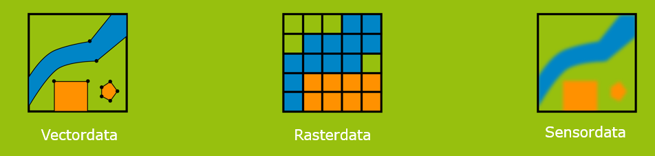
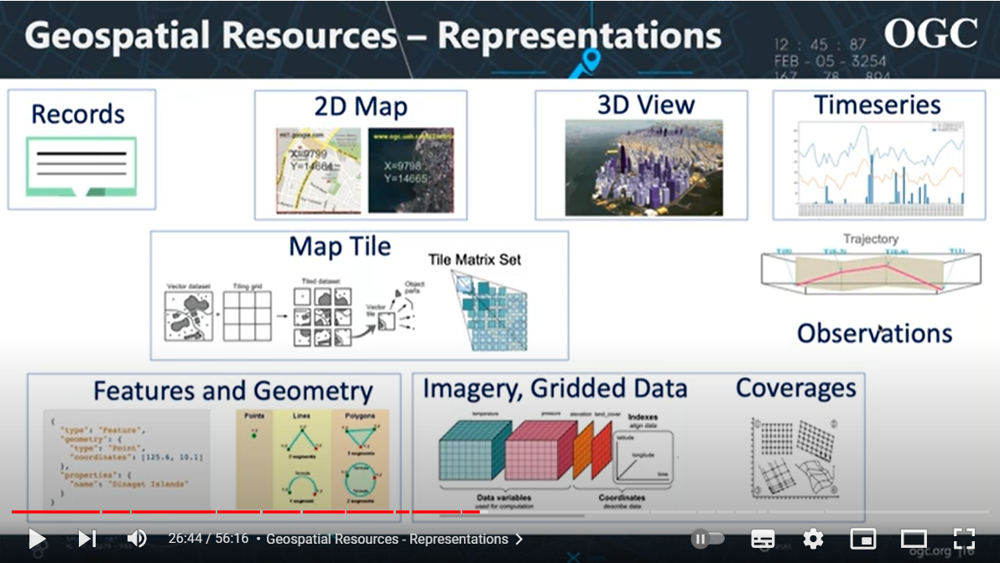
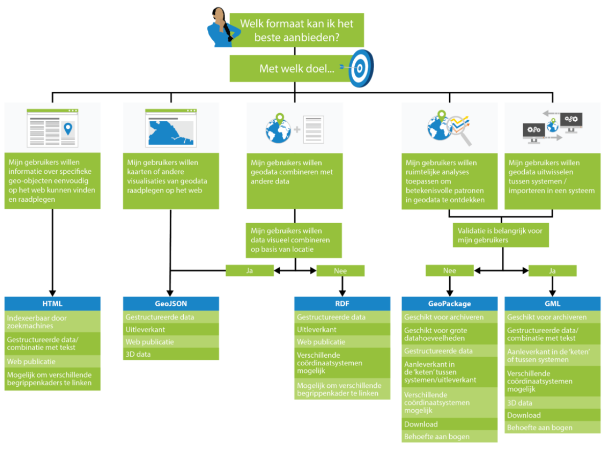

<<<<<<< HEAD
# Uitwisselformaten

**Op basis van de informatiemodellen worden uitwisselformaten gedefinieerd. Waar
een informatiemodel de semantiek bepaalt, beschrijft een uitwisselformaat de
vorm of syntax waarin geo-informatie op basis van een bepaald informatiemodel
wordt uitgewisseld. Er zijn verschillende manieren om geo-informatie te
representeren en uit te wisselen**

## Overzicht geostandaarden uitwisselformaten

### Vectordata uitwisselstandaarden

De vectorrepresentatie wordt gebruikt voor het vastleggen van discrete fenomenen
waarin de geometrie van een object wordt beschreven met behulp van primitieven
zoals: punt, lijn en vlak (2D) of met volvlakken (3D). De geometrische
basistypes voor vectorgegevens worden gedefinieerd in ISO 19107 middels een
geometrie model. In deze standaard worden ook primitieven gedefinieerd voor
topologisch modelleren waarbij de onderlinge relaties tussen geografische
objecten expliciet worden vastgelegd. ISO 19107 bevat een uitgebreid scala aan
geometrische types terwijl er in de praktijk doorgaans een zeer beperkte subset
gebruikt wordt. OGC heeft een subset, simple features profile, van ISO 19107
gedefinieerd die voor vrijwel alle toepassingen voldoende is. Ook binnen
Nederland is het simple features profile een zinnige inperking van ISO 19107.
Een uitzondering moet gemaakt worden voor cirkelbogen. Historisch worden veel
geo-objecten in Nederland met cirkelbogen beschreven terwijl cirkelbogen geen
deel uitmaken van het simple feature profile 3.1.1. Voor ISO 19136:2007 (GML
3.2.1) is er een simple features profile (OGC 10-100r3, 2011-05-24, version 2.0)
beschikbaar dat wel voldoet aan de eisen en wensen van Nederland (inclusief
bogen).

Tabel 3 – Uitwisselformaten standaarden en specificaties met betrekking tot
vectordata

| **Internationale standaarden/specificaties**                                                                                                                                                                                                                                                                                                                                                                                                                                                                                                                 | **Europese profielen**                                                                                                                                    | **Nederlandse profielen**                                                                                                                                                                                                                                                                                                    |
|--------------------------------------------------------------------------------------------------------------------------------------------------------------------------------------------------------------------------------------------------------------------------------------------------------------------------------------------------------------------------------------------------------------------------------------------------------------------------------------------------------------------------------------------------------------|-----------------------------------------------------------------------------------------------------------------------------------------------------------|------------------------------------------------------------------------------------------------------------------------------------------------------------------------------------------------------------------------------------------------------------------------------------------------------------------------------|
| ISO 19107 Geographic information - Spatial Schema **[ISO-19107-2003]**  OGC Geography Markup Language (GML) Encoding Specification, version 3.1.1. **[GML]**  OGC Geography Markup Language (GML) Encoding standard, version 3.2.1 (=ISO 19136) **[GML]**  OGC GeoPackage Encoding Standard, version 1.2. **[GeoPackage]**  [The GeoJSON Format](https://www.rfc-editor.org/rfc/rfc7946). **[RFC7946]**  HTML5. **[HTML5]**  [Resource Description Framework (RDF): Concepts and Abstract Syntax](https://www.w3.org/TR/rdf-concepts/). **[rdf-concepts]**   | INSPIRE Guidelines for the encoding of spatial data. **[INS EN]**  GeoPackage encoding of INSPIRE datasets. Inspire good practise. **[INSGPGeopackage]**  | Simple Features profile (OGC 10-100r3, 2011-05-24, version 2.0) op ISO 19136:2007 (GML 3.2.1).   Geography Markup Language (GML) Encoding standard, version 3.2.1 (=ISO 19136) **[GML]**  Geopackage, [OGC GeoPackage Encoding Standard](http://www.opengeospatial.org/standards/geopackage), version 1.2. **[GeoPackage]**  |

### 

### Rasterdata uitwisselstandaarden

De raster representatie wordt gebruik voor het vastleggen van fenomenen waarbij
aan ieder punt op het aardoppervlak een waarde uit een continu domein wordt
toegekend. Voorbeelden zijn de luchtdruk boven Nederland, waardes van een
schadelijke stof, temperatuurswaarden of – zoals bij een foto reflectiewaarden.
In OGC en ISO/TC 211 termen heet dit een coverage. Zo’n coverage wordt vaak
geïmplementeerd door over het terrein een regelmatig grid van punten te leggen
(het raster) en voor ieder punt een waarde op te nemen. Deze waarde is
bijvoorbeeld een hoogteaanduiding bepaald middels laser altimetrie of de
numerieke codering van een kleurenwaarde opgenomen in een satellietbeeld.

Er zijn verschillende geostandaarden voor rasterdata opgenomen in het raamwerk,
zoals NETCDF en HDF5. Ook GeoTIFF (Geo Tagged Image File Format), waarbij
georeferentie als tags in de file is opgenomen. GML geeft een mechanisme voor
het vastleggen van rasterdata. Daarnaast webstandaarden als JPEG2000 en PNG. De
laatste wordt vooral toegepast in WMS.

Tabel 4 - Uitwisselformaten standaarden en specificaties met betrekking tot
rasterdata

| **Internationale standaarden/specificaties**                                                                                                                                                                                                                                                                                                                                                                                                                                                                                                                               | **Europese profielen**                                            | **Nederlandse profielen** |
|----------------------------------------------------------------------------------------------------------------------------------------------------------------------------------------------------------------------------------------------------------------------------------------------------------------------------------------------------------------------------------------------------------------------------------------------------------------------------------------------------------------------------------------------------------------------------|-------------------------------------------------------------------|---------------------------|
| OGC Network Common Data Form (NetCDF) Core Encoding Standard version 1.0. **[NETCDF]**  Hierarchical Data Format **[HDF5]**  HDF-EOS, Hierarchical Data Format - Earth Observing System **[HDFEOS]** [OGC GeoTIFF Standard](http://docs.opengeospatial.org/is/19-008r4/19-008r4.html), version 1.1 **[GeoTIFF]**  ISO/IEC 12087-5:1998 - Basic Image Interchange Format (BIIF) **[BIIF]**  ISO 19136 - Geography Markup Language **[GML]**  ISO/IEC 15444-1:2019 - JPEG 2000 image coding system **[JPEG2000]**  ISO/IEC 15948:2004 - Portable Network Graphics **[PNG]**  | INSPIRE Guidelines for the encoding of spatial data. **[INSGEN]** |                           |

### 

### Sensordata uitwisselstandaarden

Met sensoren worden apparaten bedoeld voor het meten van stoffen in water,
grondsamenstellingen, grondwater, luchtverontreiniging, etc. Deze sensoren
hebben ook een positie en de resultaten van de metingen dienen uitgewisseld te
kunnen worden. Voor deze uitwisseling van observations en measurements bestaat
de volgende standaard (tabel ?).

Tabel ? – Uitwisselformaten standaarden en specificaties met betrekking tot
sensordata

| **Internationale standaarden/specificaties**                                  | **Europese profielen**                                            | **Nederlandse profielen** |
|-------------------------------------------------------------------------------|-------------------------------------------------------------------|---------------------------|
| OGC Observations & Measurement - XML implementation version 2.0 **[OaM XML]** | INSPIRE Guidelines for the encoding of spatial data. **[INSGEN]** |                           |

### 3D data uitwisselstandaarden

Tabel 5 – Uitwisselformaten standaarden en specificaties met betrekking tot 3D
data

| **Internationale standaarden/specificaties**                                                                                                                      | **Europese profielen** | **Nederlandse profielen** |
|-------------------------------------------------------------------------------------------------------------------------------------------------------------------|------------------------|---------------------------|
| City Geography Markup Language Encoding Standard, version 3.0. **[CityGML]**  CityJSON, A JSON-based encoding for 3D city models.  version 1.1.2 **[CityJSON]**   |                        |                           |

## Kwaliteit en uitwisselformaten

GML Validators

pm

Handreiking [Geometrie in
uitwisselingsformaten](https://geonovum.github.io/geox/) (Geonovum 2022).

## 

## Verkenning

n.v.t.
=======

# Uitwisselformaten

## Uitwisseling

Op basis van de informatiemodellen worden uitwisselformaten gedefinieerd. Waar
een informatiemodel de semantiek bepaalt, beschrijft een uitwisselformaat de
vorm of syntax waarin geo-informatie op basis van een bepaald informatiemodel
wordt uitgewisseld. Er zijn verschillende manieren om geo-informatie te
representeren en uit te wisselen. Drie manieren om geografische gegevens te
representeren worden onderscheiden: vector, raster en sensoren.

Een algemene onderverdeling is te maken in vectordata, rasterdata en sensordata.
Voor deze drie representatievormen zijn er verschillende standaard
uitwisselformaten beschikbaar.

Er zijn meer geografische datasoorten van belang (zie figuur OGC):

## Het gebruik van uitwisselformaten

Handreiking “[Geometrie in
uitwisselingsformaten](https://geonovum.github.io/geox/)”(Geonovum 2022).

## Overzicht standaarden uitwisselformaten

### Vector

De vectorrepresentatie wordt gebruikt voor het vastleggen van discrete fenomenen
waarin de geometrie van een object wordt beschreven met behulp van primitieven
zoals: punt, lijn en vlak (2D) of met volvlakken (3D). De geometrische
basistypes voor vectorgegevens worden gedefinieerd in ISO 19107 middels een
geometrie model. In deze standaard worden ook primitieven gedefinieerd voor
topologisch modelleren waarbij de onderlinge relaties tussen geografische
objecten expliciet worden vastgelegd. ISO 19107 bevat een uitgebreid scala aan
geometrische types terwijl er in de praktijk doorgaans een zeer beperkte subset
gebruikt wordt. OGC heeft een subset, simple features profile, van ISO 19107
gedefinieerd die voor vrijwel alle toepassingen voldoende is. Ook binnen
Nederland is het simple features profile een zinnige inperking van ISO 19107.
Een uitzondering moet gemaakt worden voor cirkelbogen. Historisch worden veel
geo-objecten in Nederland met cirkelbogen beschreven terwijl cirkelbogen geen
deel uitmaken van het simple feature profile 3.1.1. Voor ISO 19136:2007 (GML
3.2.1) is er een simple features profile (OGC 10-100r3, 2011-05-24, version 2.0)
beschikbaar dat wel voldoet aan de eisen en wensen van Nederland (inclusief
bogen).

Tabel 3 - Standaarden en specificaties met betrekking tot vectordata

| **Internationale standaarden/specificaties**                                                                                                                                                                    | **Europese profielen**                                                                          | **Nederlandse profielen**                                                                                                                                                                                                                                                                                                                                        |
|-----------------------------------------------------------------------------------------------------------------------------------------------------------------------------------------------------------------|-------------------------------------------------------------------------------------------------|------------------------------------------------------------------------------------------------------------------------------------------------------------------------------------------------------------------------------------------------------------------------------------------------------------------------------------------------------------------|
| ISO 19107 Geographic information - Spatial Schema OpenGIS Geography Markup Language (GML) Encoding Specification, version 3.1.1 OpenGIS Geography Markup Language (GML) Encoding standard, version 3.2.1 (=ISO  | [./media/image8.jpeg](./media/image8.jpeg) INSPIRE: Guidelines for the encoding of spatial data | Een Simple Feature profiel heeft vaak al voldoende functionaliteit en maakt het voor software ontwikkelaars een stuk eenvoudiger om te ondersteunen. Het wordt aanbevolen om het volgende Simple Feature profiel te gebruiken: Simple Features profile (OGC 10-100r3, 2011-05-24, version 2.0) op ISO 19136:2007 (GML 3.2.1). Dit profiel ondersteund ook bogen. |

19136)

OpenGIS City Geography Markup Language (CityGML) Encoding Standard, version 2.0

OGC Geopackage

W3C HTML

GeoJSON

W3C RDF

### Raster

De raster representatie wordt gebruik voor het vastleggen van fenomenen waarbij
aan ieder punt op het aardoppervlak een waarde uit een continu domein wordt
toegekend. Voorbeelden zijn de luchtdruk boven Nederland, waardes van een
schadelijke stof, temperatuurswaarden of – zoals bij een foto reflectiewaarden.
In OGC en ISO/TC 211 termen heet dit een coverage. Zo’n coverage wordt vaak
geïmplementeerd door over het terrein een regelmatig grid van punten te leggen
(het raster) en voor ieder punt een waarde op te nemen. Deze waarde is
bijvoorbeeld een hoogteaanduiding bepaald middels laser altimetrie of de
numerieke codering van een kleurenwaarde opgenomen in een satellietbeeld.

Tabel 4 - Standaarden en specificaties met betrekking tot rasterdata

| **Internationale standaarden/specificaties**                                                                                                                                                                                                                                                                                                                                                                                                                                                                                                                                                                                                                                                                                                                                                                                                                                         | **Europese profielen**                                                                          | **Nederlandse profielen**                                                                                |
|--------------------------------------------------------------------------------------------------------------------------------------------------------------------------------------------------------------------------------------------------------------------------------------------------------------------------------------------------------------------------------------------------------------------------------------------------------------------------------------------------------------------------------------------------------------------------------------------------------------------------------------------------------------------------------------------------------------------------------------------------------------------------------------------------------------------------------------------------------------------------------------|-------------------------------------------------------------------------------------------------|----------------------------------------------------------------------------------------------------------|
| Meest gebruikte: OGC Network Common Data Form (NetCDF) Core Encoding Standard version 1.0 HDF5 (bijvoorbeeld in ADAGUC) HDF-EOS, Hierarchical Data Format - Earth Observing System (http://www.nsidc.org/data/hdfeos/) GeoTIFF (Geo Tagged Image File Format) waarbij georeferentie als tags in de file is opgenomen, http://trac.osgeo.org/geotiff/ ISO Basic Image Interchange Format, BIIF, gebruikt door de Amerikaanse Nationale Imagery en Mapping Agency (NIMA), ISO/IEC 12087-5, Information technology — Computer graphics and image processing — Image Processing and Interchange (IPI) — Functional specification — Part 5: Basic Image Interchange Format (BIIF) ISO 19136 Geography Markup Language geeft een mechanisme voor het vastleggen van rasterdata JPEG2000, ISO/IEC 15444, Information technology — JPEG 2000 image coding system PNG vooral toegepast in WMS | [./media/image8.jpeg](./media/image8.jpeg) INSPIRE: Guidelines for the encoding of spatial data | ADAGUC is een Nederlands initiatief voor het uitwisselen van atmosferische data <http://adaguc.knmi.nl/> |

### Sensordata

Met sensoren worden apparaten bedoeld voor het meten van stoffen in water,
grondsamenstellingen, grondwater, luchtverontreiniging, etc. Deze sensoren
hebben ook een positie en de resultaten van de metingen dienen uitgewisseld te
kunnen worden.

Voor deze uitwisseling van observations en measurements bestaat de volgende
standaard.

Tabel 5 - Standaarden en specificaties met betrekking tot sensoren

| **Internationale standaarden/specificaties**               | **Europese profielen**                                                                          | **Nederlandse profielen** |
|------------------------------------------------------------|-------------------------------------------------------------------------------------------------|---------------------------|
| Observations & Measurement - XML implementation versie 2.0 | [./media/image8.jpeg](./media/image8.jpeg) INSPIRE: Guidelines for the encoding of spatial data |                           |

## Mijn data in voorspelbare uitwisselformaten aanbieden

We kennen in Nederland de formele geostandaarden toe voor de uitwisseling van
data:

\- GML

\- GeoPackage.

Alternatieven voor usecases waar standaarden n.v.t. zijn: keuzehulp lichtere
formaten:

\- HTML

\- GeoJSON

\- RDF

En 3D:

\- CityGML; 3D GML?

\- CityJSON als 3D GeoJSON?

### GML

**Wat is GML?**

Waar een informatiemodel de informatie-inhoud vastlegt is Geography Markup
Language (GML) een formaat voor het uitwisselen van data. GML is het bij het
Basismodel Geo-informatie behorende formaat voor uitwisseling. GML is een door
het Open Geospatial Consortium (OGC) opgestelde XML structuur voor de
representatie van geografische (ruimtelijke en plaatsgebonden) informatie. Het
definieert XML codering voor het overbrengen en opslaan van allerlei
geografische informatie zoals geometrie, topografie, coverages, sensor data,
enz. Het is bovendien te gebruiken als een modelleertaal voor geografische
objecten. Zowel de ruimtelijke als de niet-ruimtelijke eigenschappen van
geografische objecten kunnen worden beschreven. Geografische informatie heeft
als doel het representeren van de wereld in ruimtelijke zin, op een manier die
onafhankelijk is van de visualisatie van die informatie. Het gaat om het
vastleggen van de eigenschappen en geometrie van objecten uit de werkelijkheid.
Hoe we deze objecten op een kaart weergeven is hieraan ondergeschikt. Op basis
van GML is het vervolgens wel mogelijk om een kaartweergave te maken.

GML is gebaseerd op een abstract semantisch model van geografie waarin de wereld
wordt omschreven in termen van geografische entiteiten ('features'). Deze
entiteiten hebben eigenschappen en geometrie. De geometrie bestaat uit
eenvoudige bouwstenen zoals punten, lijnen, bogen en vlakken, die door middel
van coördinaten worden gerelateerd aan het aardoppervlak.

Het is mogelijk om zelf dit abstracte model concreet in te vullen in een GML
Application Schema. Dit is een toepassing van GML voor een specifiek
kennisdomein of sector, waarin bijvoorbeeld het abstracte object feature wordt
geconcretiseerd naar domeinspecifieke objecttypen zoals Gebouw. Zo is het
semantisch model van NEN3610 een toepassing van GML voor het domein van publieke
Nederlandse geo-informatie.

GML kan worden gebruikt voor bestandsuitwisseling maar ook binnen web services,
zoals de Web Feature Service. Omdat het gebaseerd is op XML, is een GML bestand
zowel leesbaar voor een mens als voor een computersysteem. Bovendien is een GML
bestand hierdoor eenvoudig controleerbaar met behulp van generieke, algemeen
beschikbare tools.

Sinds enkele jaren werken de twee belangrijkste organisaties voor standaarden
van geo-informatie ISO/TC 211 en het Open Geospatial Consortium (OGC) samen en
hebben ze hun bestaande standaarden waaronder GML geharmoniseerd.

GML is daarom gekozen als het uitwisselingsformaat van het Basismodel. De
geldende versie is GML 3.2.1. GML 3.1.1, de voorlaatste versie van GML, wordt
ook nog ondersteund, waarbij de overstap naar GML 3.2.1 gemaakt dient te worden.
GML 3.2.1, ook bekend als ISO 19136, is de versie waar de komende jaren op
gestandaardiseerd wordt. GML 3.3 bevat enkele uitbreidingen die ieder op zich
kunnen worden gebruikt in combinatie met GML 3.2.1.

GML 3.2.1 is een uitgebreide standaard, ontwikkeld door het Open Geospatial
Consortium (OGC) en biedt oplossingen voor een groot aantal situaties en
variaties voor het uitwisselen van geo-informatie. Variaties zijn er in
geometrietypen maar ook in complexiteit van datastructuren. Om verschillende
niveaus van toepassing van GML 3.2.1 mogelijk te maken zijn er door OGC
zogenaamde profielen gemaakt. De ontwikkeling van de profielen is voortgekomen
uit een behoefte van onder meer softwareleveranciers om verschillende niveaus
van complexiteit te ondersteunen. Operabiliteit kan daarmee beter gegarandeerd
worden. De profielen omvatten elk een subset van de totale GML 3.2.1 standaard.
De standaardprofielen zijn Simple Features Profile 0, Simple Features Profile 1
en Simple Features Profile 2 (afgekort tot respectievelijk SF0, SF1, en SF2).
Deze profielen hebben een toenemende complexiteit en bieden ook een toenemende
functionaliteit. SF0 is dus het eenvoudigst, en SF2 het meest uitgebreid.

Een profiel dat meer complexiteit en functionaliteit toestaat, biedt meer
mogelijkheden voor datamodellering of geometriebeschrijvingen, maar is ook
moeilijker toe te passen in software. Deze complexiteit kan de uitwisseling
tussen verschillende softwareplatforms bemoeilijken. Een eenvoudig profiel
daarentegen biedt minder mogelijkheden voor datamodellering maar is wel
eenvoudiger toe te passen in generieke software. Het is daarom van belang voor-
en nadelen tegen elkaar af te wegen.

CityGML ??????

**GML standaarden en profielen voor Nederland**

De belangrijkste GML profielen voor Nederland zijn:

\- [GML
3.2.2](https://www.geonovum.nl/geo-standaarden/geography-markup-language-gml/opengisr-gml-encoding-standard-321) is
gestandaardiseerd bij het OGC en, daar OGC en ISO met elkaar samenwerken, ook
gestandaardiseerd als ISO 19136:**2020**. Inhoudelijk is dit dezelfde standaard.
De [ISO variant](https://www.iso.org/standard/75676.html) is opgenomen als
nationale standaard in
de [Pas-toe-of-leg-uit-lijst](https://www.forumstandaardisatie.nl/lijst-open-standaarden) van
het Forum Standaardisatie.

\- De** **[GML Encoding Standard
3.3](https://www.geonovum.nl/geo-standaarden/geography-markup-language-gml/opengisr-gml-encoding-standard-33)** **is
een uitbreiding op deze versie. De diverse onderdelen uit de 3.3 versie zijn
modulair toe te passen en backwards compatible met versie 3.2.1

\- Het [GML Simple Features
Profile](https://www.geonovum.nl/geo-standaarden/geography-markup-language-gml/opengisr-gml-simple-features-profile) beschrijft
de verschillende levels van GML. In Nederland hanteren we als profiel op de
GML-standaard het GML Simple Feature Profile **level 2**.

**-** [GML
3.1.1](https://www.geonovum.nl/geo-standaarden/geography-markup-language-gml/opengisr-gml-311)** **is
een oude versie van de GML standaard die nog wel ondersteund wordt omdat CityGML
2.0 er gebruik van maakt en daarmee het BGT\|IMGeo model.

Om de toepassing van GML te ondersteunen, stellen we verschillende tools
beschikbaar.

**Handreiking Geometrie in model en GML**

De handreiking ‘[Geometrie in model en
GML](https://docs.geostandaarden.nl/nen3610/gimeg/)’ beschrijft de toepassing
van geometrie in informatiemodellering en de implementatie daarvan in GML. Het
is een hulpmiddel bij de toepassing van NEN 3610 en GML. De handreiking licht
toe welke geometrieën er zijn en gaat in op Simple feature profielen en
transformatieregels voor het kunnen generen van GML uit UML.

**Validatie GML**

Geonovum biedt twee GML validators aan. Met de **GML3.2 Simple Features
validator** kan je controleren of een GML 3.2 bestand voldoet aan het GML 3.2
Simple Feature profile, level 2. Dit betekent dat slechts een deel van alle
geometrietypen die GML kent, zijn toegestaan. Deze validator controleert niet op
conformiteit van de geometrieën zelf tegen ISO 19107 (Spatial Schema). Daarvoor
kan je de validator voor 2D geometrie gebruiken.

De **validator voor GML 2D geometrie** controleert of de 2D geometrieën in een
GML 3.x bestand conform ISO 19107 (Spatial Schema) zijn. Deze validator maakt
gebruik van de Java Topology Suite. Voor de specificaties hiervan
zie [http://www.vividsolutions.com/jts/doc.htm. ](http://www.vividsolutions.com/jts/doc.htm.%C2%A0)

[GML 3.2 Simple Feature
validator](http://validatie.geostandaarden.nl/gml/simple-features)

[GML 2D geometrie](http://validatie.geostandaarden.nl/gml/geometrie-2d)

We hebben geen validator voor controle tegen het algemene GML schema. De reden
hiervoor is dat het GML schema abstract is. Er is altijd een GML Application
Schema vereist waarin de regels voor een specifiek domein worden
geïmplementeerd. Op dat niveau kan je dan valideren. Dat gebeurt bijvoorbeeld in
deIMGeo GML validator en de RO standaarden validator. Er is ook geen validator
voor Simple Features in combinatie met de eerdere versie van GML, 3.1.x, omdat
het Open Geospatial Consortium hier geen schema voor biedt.

### GeoPackage

**Wat is Geopackage?**

Geopackage is een op SQLite gebaseerde internationale open standaard waarmee je
geografische informatie kunt uitwisselen. In 2019 is deze standaard opgenomen op
de Nederlandse Pas-toe-of-leg-uit-lijst. Dit betekent dat Nederlandse
overheidsorganisaties bij het aanbieden van een download van hun data naast GML
ook het GeoPackage formaat moeten kunnen leveren. GeoPackage biedt het voordeel
dat het makkelijk en zonder veel achtergrondkennis te gebruiken is. Hiermee
brengt het de toepassing van geografische informatie binnen bereik van een
grotere groep gebruikers. Zie ook de animatie: [Wat is
GeoPackage?](https://www.youtube.com/watch?v=9WwGN4UIztQ&feature=emb_logo)

**Geopackage standaarden voor Nederland**

De Geopackage standaard voor Nederland is:

Om de toepassing van GML te ondersteunen, stellen we verschillende tools
beschikbaar.

### HTML

pm

### GeoJSON

JSON is een codering voor gegevens in een op JavaScript gebaseerd formaat. Vaak
wordt JSON als alternatief voor XML gebruikt om gestructureerd gegevens te
coderen en te versturen.

GeoJSON gebruikt JSON om geografische gegevens te coderen. GeoJSON kent naast
verschillende geometrietypes ook FeatureCollections en Features, enigszins
vergelijkbaar met GML.

GeoJSON is ontstaan als informele community standaard, opgesteld in een internet
werkgroep. Ondersteuning voor GeoJSON is vrij breed aanwezig in geografische
databases, softwarepakketten, bibliotheken en in web APIs van bijvoorbeeld
Google, Yahoo en Twitter.

JSON is een codering voor gegevens in een op JavaScript gebaseerd formaat. Vaak
wordt JSON als alternatief voor XML gebruikt om gestructureerd gegevens te
coderen en te versturen.

GeoJSON gebruikt JSON om geografische gegevens te coderen. GeoJSON kent naast
verschillende geometrietypes ook FeatureCollections en Features, enigszins
vergelijkbaar met GML. Een voorbeeld van gegevens in GeoJSON staat hieronder,
ontleend aan <http://geojson.org/geojson-spec.html>.

{ "type": "FeatureCollection",

"features": [

{ "type": "Feature",

"geometry": {"type": "Point", "coordinates": [102.0, 0.5]},

"properties": {"prop0": "value0"}

},

{ "type": "Feature",

"geometry": {

"type": "LineString",

"coordinates": [

[102.0, 0.0], [103.0, 1.0], [104.0, 0.0], [105.0, 1.0]

]

},

"properties": {

"prop0": "value0",

"prop1": 0.0

}

},

{ "type": "Feature",

"geometry": {

"type": "Polygon",

"coordinates": [

[ [100.0, 0.0], [101.0, 0.0], [101.0, 1.0],

[100.0, 1.0], [100.0, 0.0] ]

]

},

"properties": {

"prop0": "value0",

"prop1": {"this": "that"}

}

}

]

}

De specificatie is te vinden op <http://geojson.org/>. De specificatie is
opgesteld in een internet werkgroep (niet door het OGC). Ondersteuning voor
GeoJSON is vrij breed aanwezig in geografische databases, softwarepakketten,
bibliotheken en in web APIs van bijvoorbeeld Google, Yahoo en Twitter (zie o.a.
<http://wiki.geojson.org/Users>).

Zie ook

de GeoJSON specificatie.

De GeoJSON Wikipedia page

More than you ever wanted to know about GeoJSON

Tools, voorbeelddata etc.: awesome GeoJSON

### RDF

Linked Data is een essentieel onderdeel van het semantische web. Door Tim
Berners-Lee in 2006 al beschreven als een component van web 3.0. Web 3.0 is de
derde fase in de ontwikkeling van het World Wide Web, gebaseerd op het idee dat
internet de verschillende opgeslagen informatie ‘begrijpt’ en daardoor logische
connecties kan maken tussen informatie. Door deze connecties (links) te
gebruiken en hierop te vertrouwen is het niet meer nodig om data continue te
kopiëren op het web. Dit is de basis van het semantisch web.

Linked Data, Semantisch web, web 3.0 worden weleens als synoniemen gebruikt,
alhoewel linked data gebruikt wordt als term voor een methode voor het
publiceren van data in een structuur zodat het linkbaar en bruikbaar wordt.

Als je in een willekeurige webbrowser naar ‘s Gravenhage zoekt, vind je geen
resultaten waarin 'Den Haag' voorkomt, terwijl beide woorden naar dezelfde stad
verwijzen. Dat komt doordat webdocumenten met elkaar verlinkt zijn, maar de
inhoud zelf niet. Een zoekmachine kan zo alleen maar op woorden zoeken. Linked
Data biedt een oplossing voor dit probleem door woorden als concepten uniek te
maken en te beschrijven in één of liefst meerdere subject – predicaat –
objectrelaties. Een stad wordt daarmee een concept en kan meerdere attributen
krijgen, waarvan elk attribuut ook weer een eigen concept is. Zowel subject, als
predicaat en object zijn dus op zichzelf weer unieke concepten. Elk concept wint
aan betekenis naarmate er meer beschrijvingen aan gelinkt worden. Op deze manier
wordt de inhoud van webdocumenten betekenisvol en worden zoekresultaten
nauwkeuriger. Uiteindelijk bereik je zo taalonafhankelijkheid omdat het dus niet
meer uitmaakt of je naar 'The Hague' of 'Den Haag' zoekt.

Een combinatie van het type [x relatie y] heet een triple. Een triple bestaat
altijd uit drie onderdelen: een subject (x in het voorbeeld), een eigenschap
(benoemt de aard van de relatie, bijvoorbeeld is de schrijver van), en een
waarde (y in het voorbeeld). De triples worden gecodeerd volgens het RDF model
(Resource Description Framework). RDF is een W3C standaard voor het vastleggen
en uitwisselen van gegevens.

| SUBJECT      | EIGENSCHAP | WAARDE       |              |                     |
|--------------|------------|--------------|--------------|---------------------|
| J.K. Rowling | bedacht    | Harry Potter |              |                     |
|              |            | Harry Potter | komt voor in | De steen der Wijzen |
|              |            | SUBJECT      | EIGENSCHAP   | WAARDE              |

In dit voorbeeld is Harry Potter een waarde in de eerste triple, maar het
subject in de volgende triple. Op deze manier kunnen concepten aan elkaar
gekoppeld worden, en zo ontstaat een ‘web’ van gerelateerde begrippen. Dit web
kan eenvoudig worden uitgebreid met nieuwe concepten en relaties, zolang ze maar
geformuleerd zijn in RDF.

De drie onderdelen van een triple krijgen elk een unieke naam in de vorm van een
URI: een Uniform Resource Identifier. Deze URI geeft niet alleen een unieke naam
aan een concept, maar bevat ook informatie over de herkomst van de data, d.w.z.
uit welke dataset het concept afkomstig is.

In aanvulling op RDF kan RDFS gebruikt worden. Met behulp van RDFS kunnen
‘klassen’ van resources aangemaakt worden, en tevens beperkingen gelegd worden
op de verschillende relaties die mogelijk zijn tussen instanties van deze
klassen. Hiermee zou je bijvoorbeeld vast kunnen leggen dat de relatie (lees:
predicate) ‘is getrouwd met’ alleen gelegd kan worden tussen twee resources van
het type ‘persoon’.

Gelukkig hoeven we het wiel niet opnieuw uit te vinden. Er zijn al veel
standaard definities beschikbaar van resource- en relatietypes. Deze zijn
vastgelegd in zogenaamde ontologieën.

Een ontologie is typisch een datastructuur die alle relevante entiteiten en hun
onderlinge relaties en regels binnen een domein bevat, en kunnen gebruikt worden
als vocabulaire. Voorbeelden van veelgebruikte ontologieën zijn SKOS (Simple
Knowledge Organization System) voor het opstellen van vocabulaires en thesauri,
en FOAF (Friend-of-a-friend). SKOS bevat zaken als ‘broader’, ‘narrower’ en
‘alternative label’. FOAF bevat zaken als ‘Person’ en ‘email’.

De geo-informatie heeft een gestructureerde manier in het beschrijven van de
informatie (informatiemodellen) waardoor het zeer geschikt is voor publicatie in
linked data.

RDF beschrijft het algemene principe achter triples, en schrijft bijvoorbeeld
het gebruik van URI’s voor. Het technische formaat (de syntax) waarin triples
worden vastgelegd en uitgewisseld wordt echter vrijgelaten. Hiervoor zijn
verschillende technische formaten beschikbaar zoals RDF/XML, Turtle, N3 en
(Geo)JSON. Met elk van deze formaten kunnen triples vastgelegd worden. De
formaten verschillen enerzijds in syntax, en anderzijds in een aantal
toevoegingen bovenop RDF. Triples kunnen ook opgeslagen worden in een database,
ook wel ‘triple store’ genoemd. Om een triple store te bevragen is een speciale
taal ontwikkeld (analoog aan SQL voor relationele database): SPARQL (SPARQL
Protocol and RDF Query Language).

Linked Data moet aan de volgende vier principes (vrij naar Tim Berners Lee)
voldoen (REF11):

1.  Gebruik URI’s om dingen te identificeren.

2.  Gebruik HTTP URI’s zodat er naar deze dingen kan worden verwezen en dat ze
    kunnen worden opgezocht door zowel mensen als machines.

3.  Leg de informatie over het concept vast in een ‘triple’ (subject-predicaat-
    objectrelatie) en leg die triple vast en maak het beschikbaar op basis van
    standaarden zoals RDF en SPARQL.

4.  Neem links naar andere, gerelateerde, open data concepten op in de
    beschrijving om het ontdekken van gerelateerde informatie op het web te
    verbeteren.

Een URI betekent in feite het toekennen van een unieke string om data-objecten
uniek identificeerbaar te maken. Doormiddel van HTTP URI’s wordt er verwezen
naar een unieke plek op het internet waardoor informatie over het object
vindbaar wordt. Linked Data zijn datasets in RDF-formaat, met URI's en met links
tussen de datasets.

Linked data is een grote belofte als zijnde de manier om data op het web te
publiceren. Om deze reden is er een pilot Linked Data geweest. Zie:
<http://www.geonovum.nl/onderwerpen/linked-en-open-data>.

In deze pilot is kennis en ervaring opgedaan met Linked Data en zijn de volgende
zaken ontwikkeld en onderzocht die van belang zijn voor het raamwerk van
geo-standaarden:

-   URI-strategie Nederland

>   Op basis van de URI-strategie UK, URI-strategie Inspire en bevindingen pilot
>   is een URI-strategie ontwikkeld voor Nederland. Bij het publiceren van
>   Linked Data dient deze gehanteerd te worden. Zie:
>   <http://www.geonovum.nl/onderwerpen/linked-en-open-data/linked-open-data-uri-strategie>

-   Is GeoSPARQL[^8] nader onderzocht. Met GeoSPARQL kunnen ruimtelijke vragen
    aan RDF worden gesteld.

    [^8]: <http://www.opengeospatial.org/standards/geosparql>

De pilot heeft veel gebracht maar een aantal zaken zijn nog niet afgerond of
onduidelijk. Denk hierbij aan:

-   Dient de GeoSPARQL uitwerking van OGC geen onderdeel te zijn van SPARQL
    zoals vastgelegd bij W3C?,

>   hiermee wordt GeoSPARQL door alle partijen ondersteund ipv een beperkt
>   aantal geo-partijen

-   Dient RDF niet uitgebreid te worden met een standaard aantal geometrie typen
    (zoals punten, lijnen, vlakken)?,

>   dit is nu niet gedefinieerd waardoor iedere data eigenaar dit op zijn eigen
>   manier implementeert en nog steeds geen ruimtelijke vragen mogelijk zijn
>   over meerdere triples van verschillende eigenaren.

Dit zijn issues die in de 2e fase van de pilot worden opgepakt (november 2013 -
juni 2014).

### CityGML en CityJSON (3D)

Om het toepassen van 3D geo-informatie gemakkelijker te maken, hebben het
Kadaster, de Nederlandse Commissie voor Geodesie (NCG), het toenmalig Ministerie
van Infrastructuur en Milieu en Geonovum in 2010 het initiatief genomen tot een
3D standaard voor geo-informatie.

De internationale standaard voor de opslag en uitwisseling van 3D geo-informatie
is OpenGIS® CityGML. In 2012 is deze internationale standaard in Nederland
geïntegreerd in het Informatiemodel voor Geografie (IMGeo). Hierdoor is het
mogelijk IMGeo-objecten in 2.5D- en 3D uitwisselen. In de [Gegevenscatalogus
IMGeo](https://docs.geostandaarden.nl/imgeo/catalogus/imgeo/) vind je een
technische uitleg over de integratie tussen CityGML en IMGeo. Geonovum beheert
de BGT\|IMGeo standaard met daarin de 3D componenten.

De ervaringen in de 3D Pilot[^9] toonden al snel de noodzaak aan voor een 3D
geo-informatie standaard die aansluit op het Nederlandse standaardenstelsel en
internationale 3D standaarden. Na een vergelijk van de belangrijkste 3D GIS en
CAD standaarden (DXF, SHP, VRML, X3D, KML, Collada, IFC[^10], CityGML en 3D PDF)
bleek dat de OGC standaard CityGML het beste uitgangspunt is voor de 3D
standaard NL. CityGML biedt de beste ondersteuning voor wat betreft semantiek,
objecten, attributen, georeferentie en gebruik via het Web.

[^9]: <http://www.geonovum.nl/onderwerpen/3d-geo-informatie>

[^10]: IFC is geschikt voor gebouw informatiemodellen (BIM) en CityGML voor
stads/omgevingsmodellen

CityGML is een rijke standaard en vanuit data opgebouwd in CityGML is het
daarmee ook eenvoudig om bijvoorbeeld KML (een minder rijke standaard) data te
genereren voor visualisatie.

De OGC standaard CityGML kent zijn oorsprong als uitwisselingsformaat. Maar het
is ook - en vooral - een informatiemodel voor het weergeven van 3D-ruimtelijke
objecten. CityGML onderscheidt zowel op geometrisch als semantisch niveau
thematische concepten (gebouwen, vegetatie, water, landgebruik, straatmeubilair
etc.). Daarnaast ondersteunt CityGML verschillende detailniveaus per object, de
zogenaamde Levels of Detail (LODs). Een gebouw-object kan bijvoorbeeld variëren
van een eenvoudig blok model (LOD1), met dakvormen (LOD2), met ramen, deuren en
andere uiterlijke kenmerken (LOD3) tot een volledig gedetailleerd interieur
model (LOD4) met of zonder textuur informatie.

CityGML is gebaseerd op GML en heeft daarmee dezelfde geometriemogelijkheden als
GML. Veel informatiemodellen voor geo-informatie definiëren hun geometrie
volgens GML, maar beperken zich tot de geometrieën gerepresenteerd door alleen
x,y coördinaten. GML bevat echter klassen voor 0D tot 3D geometrische
primitieven die dan ook in CityGML worden ondersteund. Dit zijn 1D-3D “composite
geometries” zoals *CompositeSurface* (surfaces verbonden langs
gemeenschappelijke grenzen) en 0D-3D “geometry aggregates” (niet verbonden en
dus zonder samenhang) zoals *MultiSurface* of *MultiSolid*.

Door de integratie van IMGeo met CityGML is een optionele uitbreiding naar 2.5D
en 3D representaties van IMGeo objecten mogelijk gemaakt. In deze integratie is
IMGeo gecodeerd als extensie van CityGML. Hierdoor wordt 3D IMGeo-data
ondersteund in software die voldoet aan de CityGML standaard en is IMGeo
optimaal geprepareerd voor 3D. Deze methode kan ook gebruikt worden voor de
andere informatiemodellen.

<http://www.geonovum.nl/onderwerpen/3d-geo-informatie>

IFC is geschikt voor gebouw informatiemodellen (BIM) en CityGML voor
stads/omgevingsmodellen

### CityJSON

pm

## Welk formaat kan ik het beste aanbieden?

**GML en GeoPackage naast elkaar op de pas-toe-leg-uit lijst**

GeoPackage staat naast GML als uitwisselformaat op de Pas-toe-leg-uit lijst.
Voordelen van het uitwisselen van data in GeoPackage is dat je een GeoPackage
direct kunt openen, zonder de data te converteren. Ook is de bestandsomvang
kleiner dan een GML bestand. De ondersteuning van GeoPackage in verschillende
softwarepakketten is ook goed. Door de beperkte bestandsomvang en snelheid is
een GeoPackage voor dataleveringen aan derden of aan PDOK vaak een praktischer
formaat dan een GML.

GML is daarentegen het optimale formaat als het gaat om validatie en
specialistische uitwisseling van data zoals 3D geometrie. Daar waar het gaat om
het uitwisselen van data tussen bronhouder en een landelijke voorziening is het
van belang dat het uitwisselformaat validatie mogelijk maakt. In zo’n geval
blijft GML (en de bijbehorende xsd-schema’s) het meest geschikte formaat.
GeoPackage is dus geen vervanging van de berichtenuitwisseling op basis van GML
of anderszins tussen bijvoorbeeld gemeenten en landelijke voorzieningen zoals
StufGeo berichten. Bekijk de standaard
op [Geopackage.org](http://www.geopackage.org/).
>>>>>>> 3c4b0b3b1194288963c50719b71616ff743152dd
